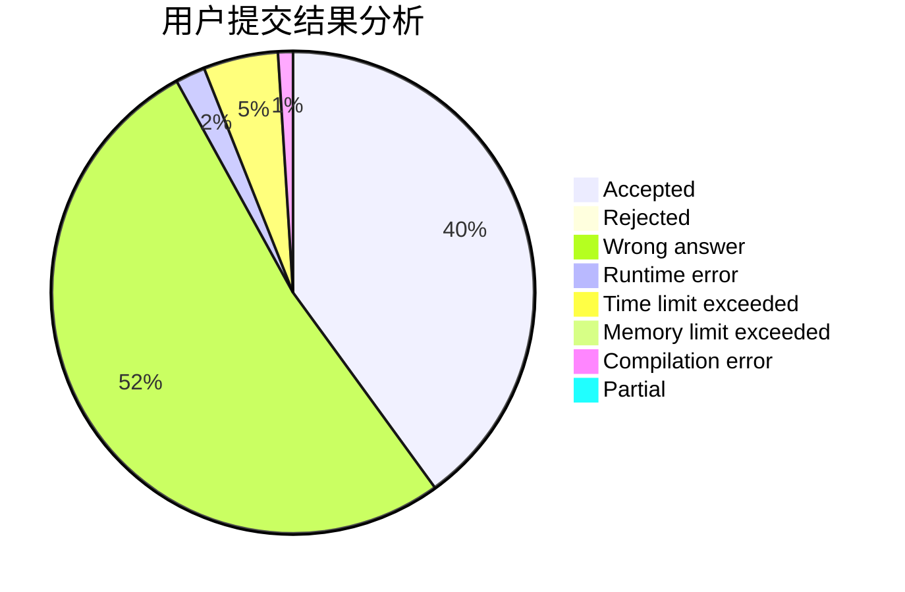
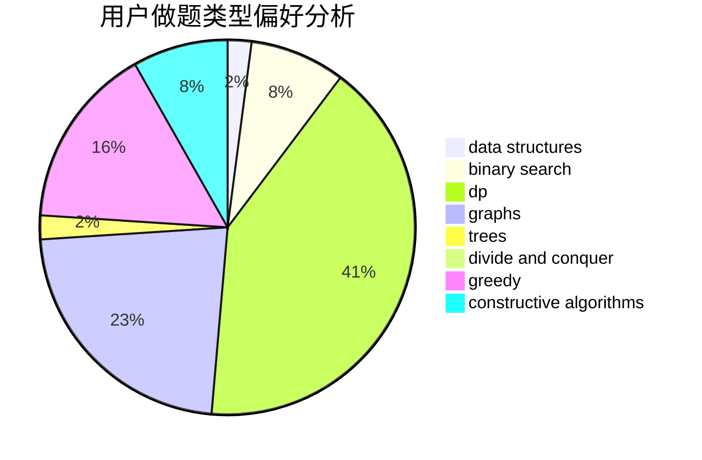

# 774269903

<!-- tabs:start -->

#### **用户提交结果分析**

#### **用户做题类型偏好分析**

#### **用户错题知识点分析**

<!-- tabs:end -->
# 推荐题目
[1060B](https://codeforces.com/contest/1060/problem/B)		greedy		  
[1354C2](https://codeforces.com/contest/1354C/problem/2)		binary search,
                        brute force,
                        geometry,
                        math		  
[1241B](https://codeforces.com/contest/1241/problem/B)		dsu,graphs,sortings,trees		  
[1179B](https://codeforces.com/contest/1179/problem/B)		constructive algorithms		  
[1118D1](https://codeforces.com/contest/1118D/problem/1)		brute force,
                        greedy		  
[1092D1](https://codeforces.com/contest/1092D/problem/1)		greedy,
                        implementation,
                        math		  
[1420A](https://codeforces.com/contest/1420/problem/A)		math,
                        sortings		  
[1420C1](https://codeforces.com/contest/1420C/problem/1)		constructive algorithms,
                        dp,
                        greedy		  
[1421D](https://codeforces.com/contest/1421/problem/D)		brute force,
                        constructive algorithms,
                        greedy,
                        implementation,
                        math,
                        shortest paths		  
[1036B](https://codeforces.com/contest/1036/problem/B)		math		  
