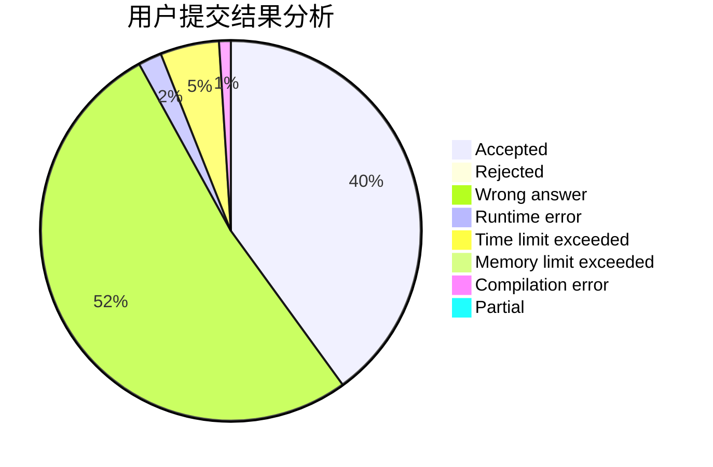
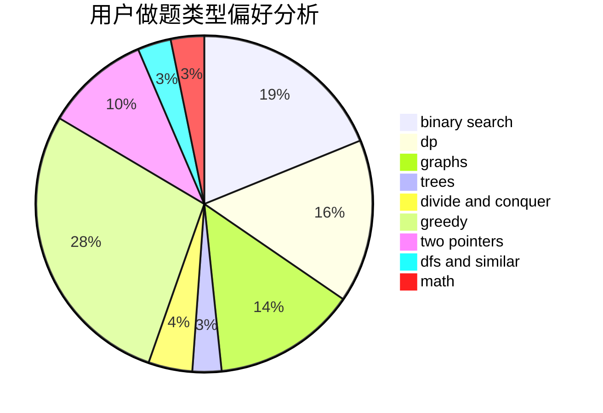

# 774269903

<!-- tabs:start -->

#### **用户提交结果分析**

#### **用户做题类型偏好分析**

<!-- tabs:end -->
# 推荐题目
[1060E](https://codeforces.com/contest/1060/problem/E)
[1360H](https://codeforces.com/contest/1360/problem/H)
[1246F](https://codeforces.com/contest/1246/problem/F)
[1182A](https://codeforces.com/contest/1182/problem/A)
[1120A](https://codeforces.com/contest/1120/problem/A)
[1092F](https://codeforces.com/contest/1092/problem/F)
[1427H](https://codeforces.com/contest/1427/problem/H)
[14282](https://codeforces.com/contest/1428/problem/2)
[1428H](https://codeforces.com/contest/1428/problem/H)
[1036E](https://codeforces.com/contest/1036/problem/E)
