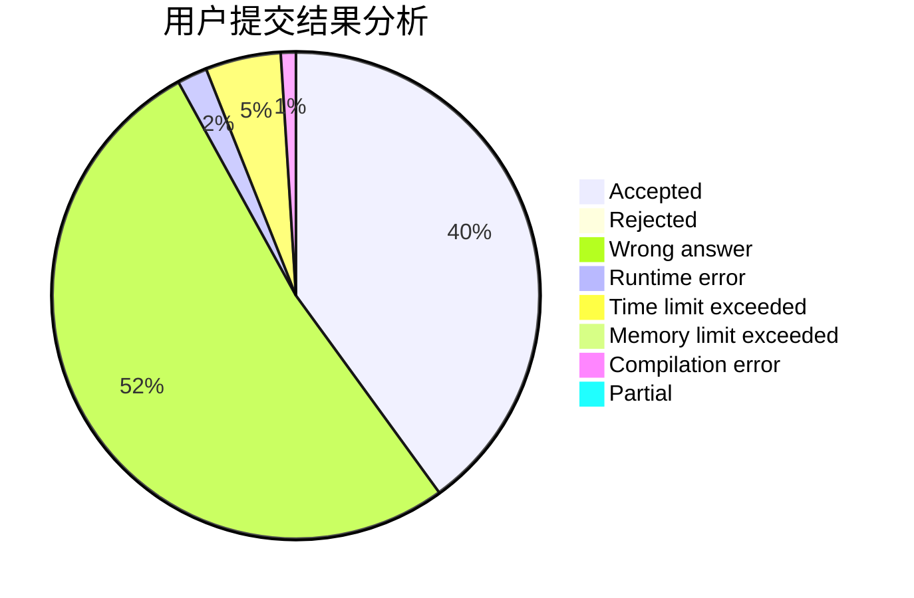
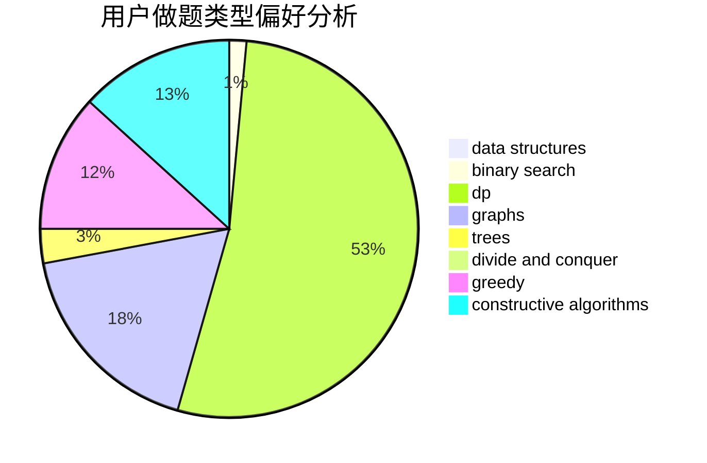

# 774269903

<!-- tabs:start -->

#### **用户提交结果分析**

#### **用户做题类型偏好分析**

#### **用户错题知识点分析**

<!-- tabs:end -->
# 推荐题目
[1060E](https://codeforces.com/contest/1060/problem/E)		dfs and similar,
                        dp,
                        trees		  
[1360H](https://codeforces.com/contest/1360/problem/H)		binary search,
                        bitmasks,
                        brute force,
                        constructive algorithms		  
[1246F](https://codeforces.com/contest/1246/problem/F)		nan		  
[1182A](https://codeforces.com/contest/1182/problem/A)		dp,
                        math		  
[1120A](https://codeforces.com/contest/1120/problem/A)		greedy,
                        implementation,
                        two pointers		  
[1092F](https://codeforces.com/contest/1092/problem/F)		dfs and similar,
                        dp,
                        trees		  
[1427H](https://codeforces.com/contest/1427/problem/H)		binary search,
                        games,
                        geometry,
                        ternary search		  
[14282](https://codeforces.com/contest/1428/problem/2)		dsu,graphs,sortings,trees		  
[1428H](https://codeforces.com/contest/1428/problem/H)		binary search,
                        interactive		  
[1036E](https://codeforces.com/contest/1036/problem/E)		fft,
                        geometry,
                        number theory		  
