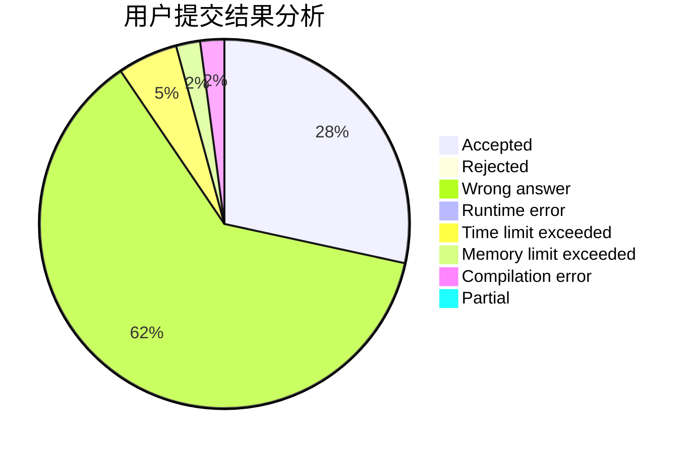
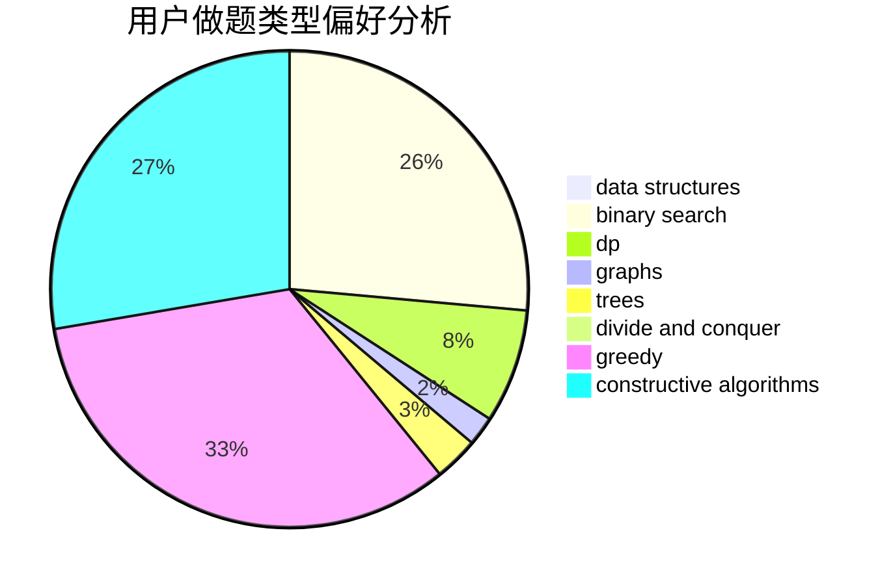
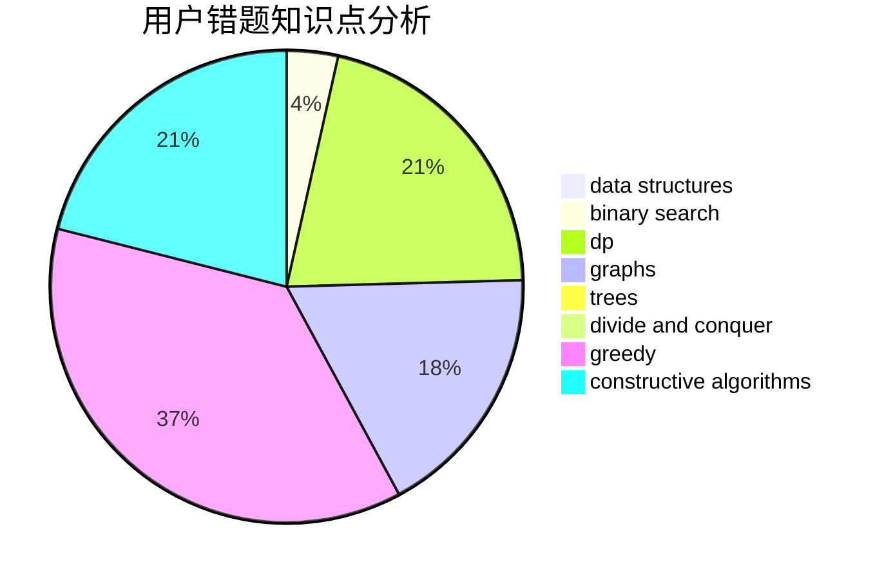

# MDK_L

<!-- tabs:start -->

#### **用户提交结果分析**

#### **用户做题类型偏好分析**

#### **用户错题知识点分析**

<!-- tabs:end -->
# 推荐题目
[144D](https://codeforces.com/contest/144/problem/D)		data structures,
                        dfs and similar,
                        graphs,
                        shortest paths		  
[947A](https://codeforces.com/contest/947/problem/A)		dsu,graphs,sortings,trees		  
[477E](https://codeforces.com/contest/477/problem/E)		data structures		  
[1511F](https://codeforces.com/contest/1511/problem/F)		brute force,
                        data structures,
                        dp,
                        matrices,
                        string suffix structures,
                        strings		  
[852A](https://codeforces.com/contest/852/problem/A)		brute force,
                        implementation,
                        math		  
[957E](https://codeforces.com/contest/957/problem/E)		dsu,graphs,sortings,trees		  
[629C](https://codeforces.com/contest/629/problem/C)		dp,
                        strings		  
[160C](https://codeforces.com/contest/160/problem/C)		implementation,
                        math,
                        sortings		  
[1164N](https://codeforces.com/contest/1164/problem/N)		dsu,graphs,sortings,trees		  
[283D](https://codeforces.com/contest/283/problem/D)		dp,
                        math,
                        number theory		  
