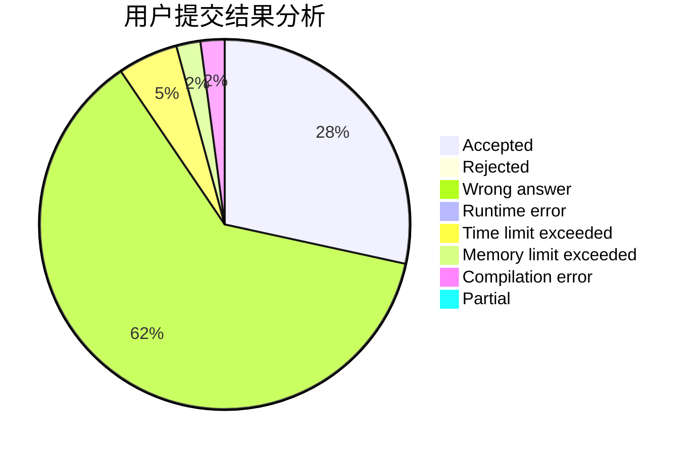
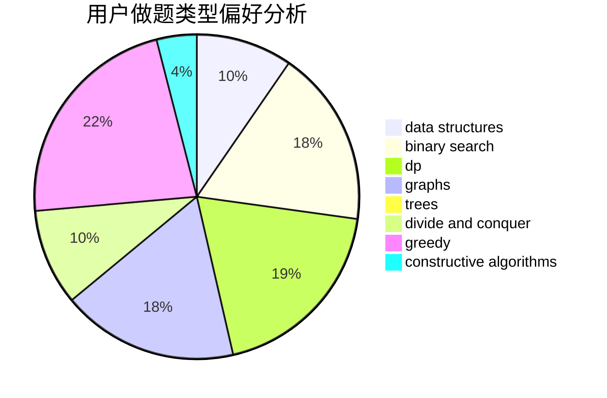
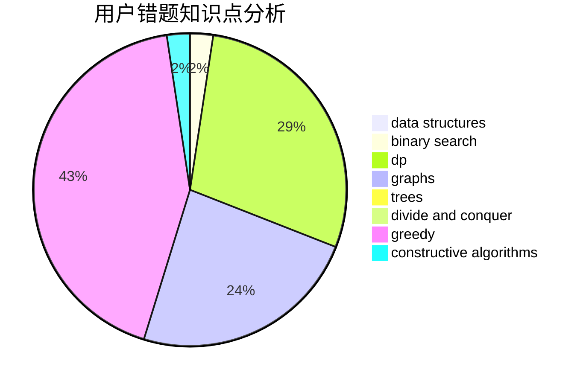

# MDK_L

<!-- tabs:start -->

#### **用户提交结果分析**

#### **用户做题类型偏好分析**

#### **用户错题知识点分析**

<!-- tabs:end -->
# 推荐题目
[1458A](https://codeforces.com/contest/1458/problem/A)		math,
                        number theory		  
[963E](https://codeforces.com/contest/963/problem/E)		math		  
[497E](https://codeforces.com/contest/497/problem/E)		dp,
                        matrices		  
[16C](https://codeforces.com/contest/16/problem/C)		binary search,
                        number theory		  
[870B](https://codeforces.com/contest/870/problem/B)		greedy		  
[979A](https://codeforces.com/contest/979/problem/A)		math		  
[659B](https://codeforces.com/contest/659/problem/B)		constructive algorithms,
                        sortings		  
[185E](https://codeforces.com/contest/185/problem/E)		binary search,
                        data structures		  
[1166E](https://codeforces.com/contest/1166/problem/E)		bitmasks,
                        brute force,
                        constructive algorithms,
                        math,
                        number theory		  
[29D](https://codeforces.com/contest/29/problem/D)		constructive algorithms,
                        dfs and similar,
                        trees		  
