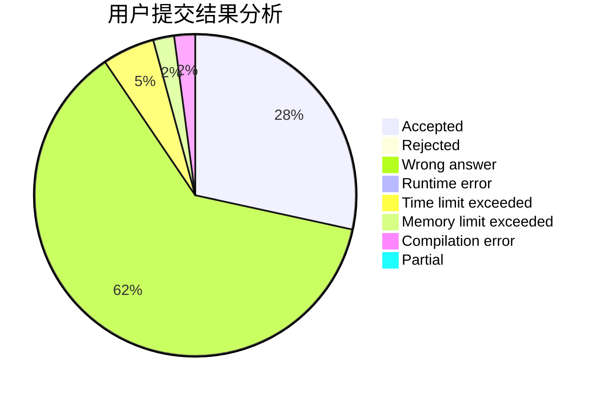
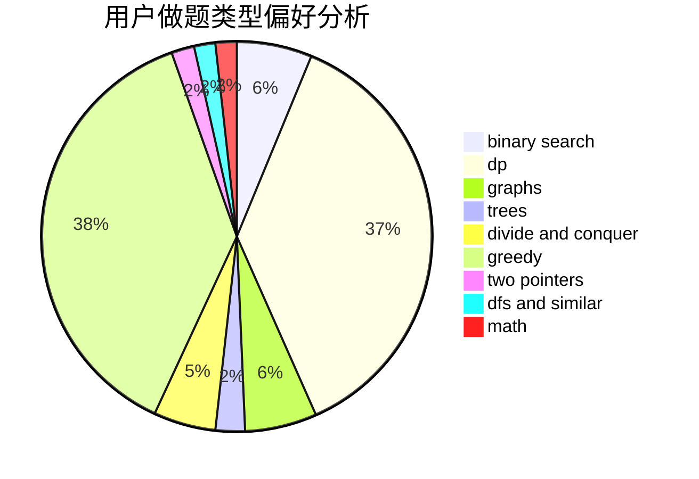

# MDK_L

<!-- tabs:start -->

#### **用户提交结果分析**

#### **用户做题类型偏好分析**

<!-- tabs:end -->
# 推荐题目
[1458A](https://codeforces.com/contest/1458/problem/A)
[963E](https://codeforces.com/contest/963/problem/E)
[497E](https://codeforces.com/contest/497/problem/E)
[16C](https://codeforces.com/contest/16/problem/C)
[870B](https://codeforces.com/contest/870/problem/B)
[979A](https://codeforces.com/contest/979/problem/A)
[659B](https://codeforces.com/contest/659/problem/B)
[185E](https://codeforces.com/contest/185/problem/E)
[1166E](https://codeforces.com/contest/1166/problem/E)
[29D](https://codeforces.com/contest/29/problem/D)
