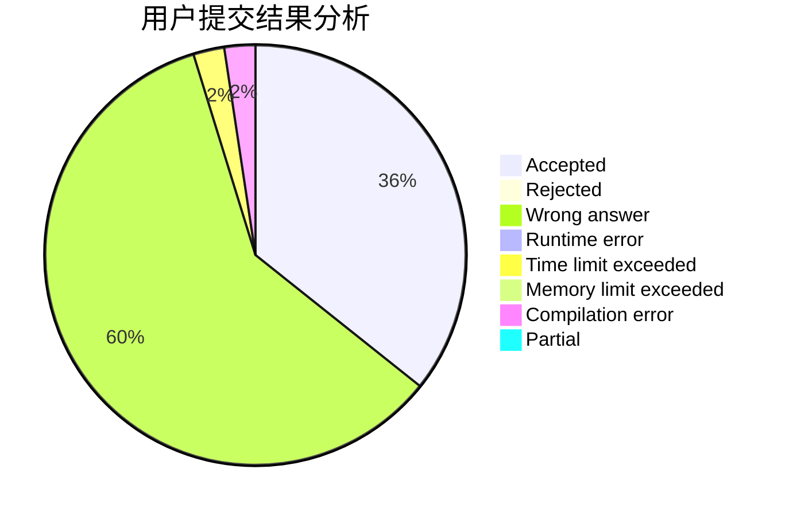
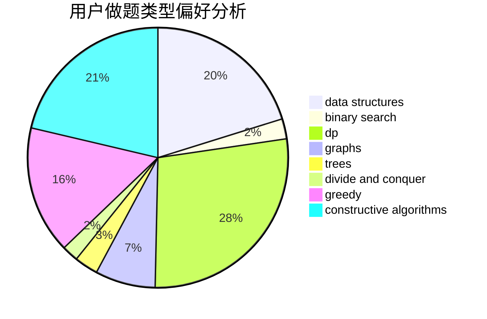
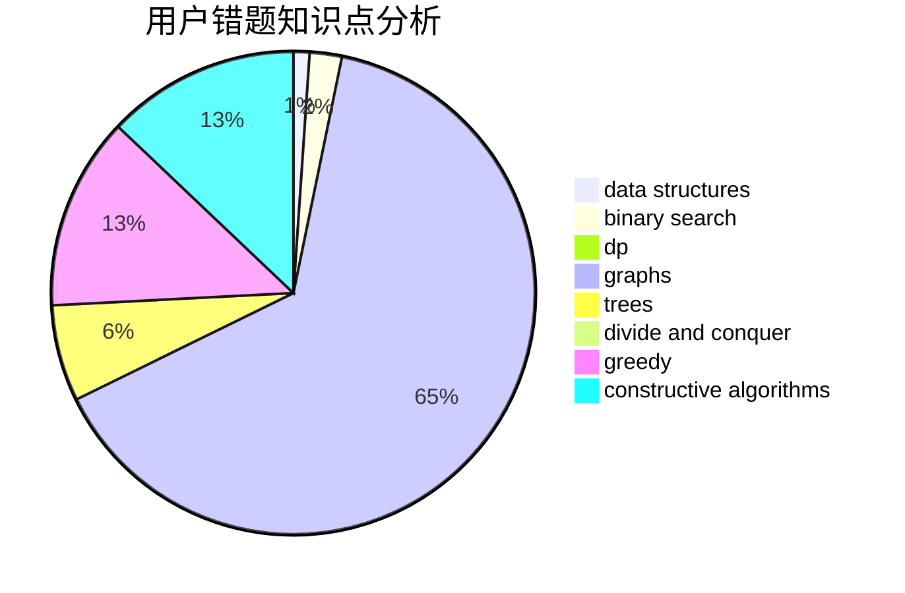

# MMMich

<!-- tabs:start -->

#### **用户提交结果分析**

#### **用户做题类型偏好分析**

#### **用户错题知识点分析**

<!-- tabs:end -->
# 推荐题目
[25A](https://codeforces.com/contest/25/problem/A)		brute force		  
[825F](https://codeforces.com/contest/825/problem/F)		dp,
                        hashing,
                        string suffix structures,
                        strings		  
[933A](https://codeforces.com/contest/933/problem/A)		dp		  
[208A](https://codeforces.com/contest/208/problem/A)		strings		  
[447A](https://codeforces.com/contest/447/problem/A)		implementation		  
[535B](https://codeforces.com/contest/535/problem/B)		bitmasks,
                        brute force,
                        combinatorics,
                        implementation		  
[628C](https://codeforces.com/contest/628/problem/C)		greedy,
                        strings		  
[754C](https://codeforces.com/contest/754/problem/C)		brute force,
                        constructive algorithms,
                        dp,
                        implementation,
                        strings		  
[978G](https://codeforces.com/contest/978/problem/G)		greedy,
                        implementation,
                        sortings		  
[627C](https://codeforces.com/contest/627/problem/C)		data structures,
                        divide and conquer,
                        greedy		  
