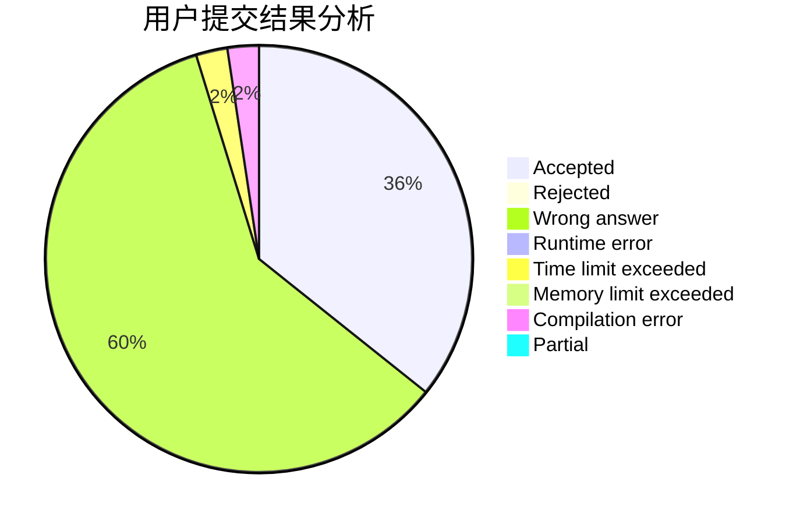
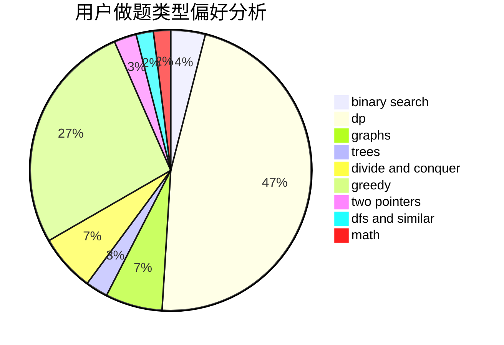

# MMMich

<!-- tabs:start -->

#### **用户提交结果分析**

#### **用户做题类型偏好分析**

<!-- tabs:end -->
# 推荐题目
[25A](https://codeforces.com/contest/25/problem/A)
[825F](https://codeforces.com/contest/825/problem/F)
[933A](https://codeforces.com/contest/933/problem/A)
[208A](https://codeforces.com/contest/208/problem/A)
[447A](https://codeforces.com/contest/447/problem/A)
[535B](https://codeforces.com/contest/535/problem/B)
[628C](https://codeforces.com/contest/628/problem/C)
[754C](https://codeforces.com/contest/754/problem/C)
[978G](https://codeforces.com/contest/978/problem/G)
[627C](https://codeforces.com/contest/627/problem/C)
