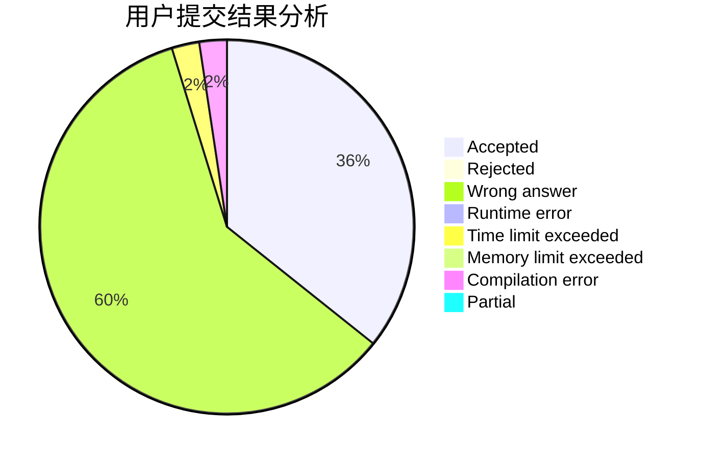
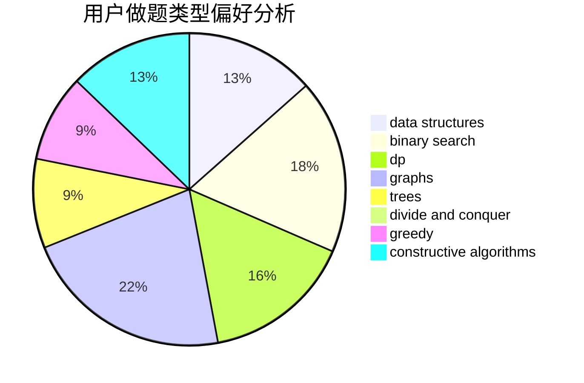
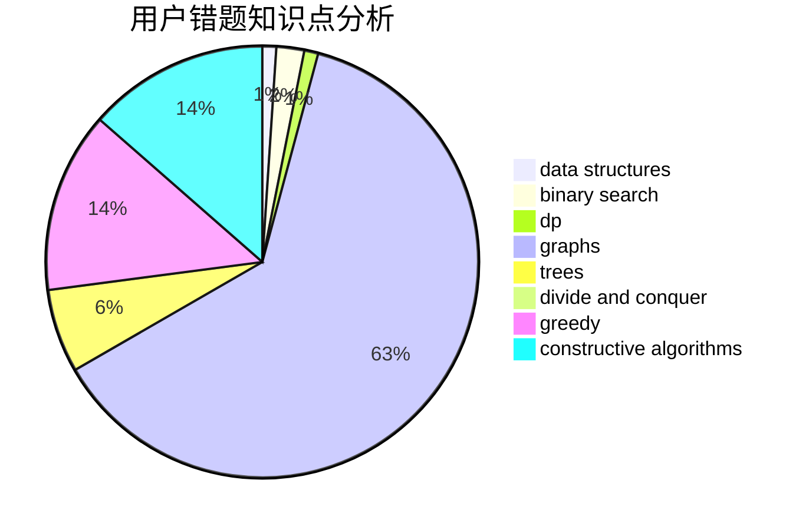

# MMMich
<!-- tabs:start -->
#### **用户提交结果分析**

#### **用户做题类型偏好分析**

#### **用户错题知识点分析**

<!-- tabs:end -->
# 推荐题目
[Let's Play Osu!](https://codeforces.com/contest/236/problem/D)		dp,
                        math,
                        probabilities		  
[Load Balancing](http://codeforces.com/problemset/problem/609/C)		implementation,
                        math		  
[Triple Flips](https://codeforces.com/contest/1071/problem/C)		constructive algorithms		  
[Rock-Paper-Scissors](http://codeforces.com/problemset/problem/173/A)		implementation,
                        math		  
[Greg and Graph](https://codeforces.com/contest/296/problem/D)		dp,
                        graphs,
                        shortest paths		  
[Brand New Problem](http://codeforces.com/problemset/problem/201/D)		bitmasks,
                        brute force,
                        dp		  
[Minimum Difficulty](http://codeforces.com/problemset/problem/496/A)		brute force,
                        implementation,
                        math		  
[Anton and Danik](http://codeforces.com/problemset/problem/734/A)		implementation,
                        strings		  
[Arpa’s overnight party and Mehrdad’s silent entering](https://codeforces.com/contest/742/problem/E)		constructive algorithms,
                        dfs and similar,
                        graphs		  
[Megacity](http://codeforces.com/problemset/problem/424/B)		binary search,
                        greedy,
                        implementation,
                        sortings		  
<!-- tabs:start -->
#### **data structures**
[Let's Play Osu!](https://codeforces.com/contest/957/problem/D)		data structures,
                        dp,
                        greedy		  
[Load Balancing](https://codeforces.com/contest/1240/problem/D)		data structures,
                        divide and conquer,
                        dp,
                        hashing		  
[Triple Flips](http://codeforces.com/problemset/problem/818/E)		binary search,
                        data structures,
                        number theory,
                        two pointers		  
[Rock-Paper-Scissors](http://codeforces.com/problemset/problem/1386/C)		*special problem,
                        bitmasks,
                        data structures,
                        divide and conquer,
                        dsu		  
[Greg and Graph](http://codeforces.com/problemset/problem/821/C)		data structures,
                        greedy,
                        trees		  
[Brand New Problem](http://codeforces.com/problemset/problem/1313/C2)		data structures,
                        dp,
                        greedy		  
[Minimum Difficulty](https://codeforces.com/contest/1484/problem/E)		data structures,
                        divide and conquer,
                        dp		  
[Anton and Danik](http://codeforces.com/problemset/problem/1492/C)		binary search,
                        data structures,
                        dp,
                        greedy,
                        two pointers		  
[Arpa’s overnight party and Mehrdad’s silent entering](http://codeforces.com/problemset/problem/1490/G)		binary search,
                        data structures,
                        math		  
[Megacity](http://codeforces.com/problemset/problem/1479/D)		binary search,
                        bitmasks,
                        brute force,
                        data structures,
                        probabilities,
                        trees		  
#### **binary search**
[Let's Play Osu!](http://codeforces.com/problemset/problem/424/B)		binary search,
                        greedy,
                        implementation,
                        sortings		  
[Load Balancing](http://codeforces.com/problemset/problem/1011/B)		binary search,
                        brute force,
                        implementation		  
[Triple Flips](http://codeforces.com/problemset/problem/818/E)		binary search,
                        data structures,
                        number theory,
                        two pointers		  
[Rock-Paper-Scissors](http://codeforces.com/problemset/problem/1492/C)		binary search,
                        data structures,
                        dp,
                        greedy,
                        two pointers		  
[Greg and Graph](http://codeforces.com/problemset/problem/1463/D)		binary search,
                        constructive algorithms,
                        greedy,
                        two pointers		  
[Brand New Problem](http://codeforces.com/problemset/problem/1490/G)		binary search,
                        data structures,
                        math		  
[Minimum Difficulty](http://codeforces.com/problemset/problem/1479/D)		binary search,
                        bitmasks,
                        brute force,
                        data structures,
                        probabilities,
                        trees		  
[Anton and Danik](http://codeforces.com/problemset/problem/1436/E)		binary search,
                        data structures,
                        two pointers		  
[Arpa’s overnight party and Mehrdad’s silent entering](http://codeforces.com/problemset/problem/1461/D)		binary search,
                        brute force,
                        data structures,
                        divide and conquer,
                        implementation,
                        sortings		  
[Megacity](http://codeforces.com/problemset/problem/1493/C)		binary search,
                        brute force,
                        constructive algorithms,
                        greedy,
                        strings		  
#### **dp**
[Let's Play Osu!](https://codeforces.com/contest/236/problem/D)		dp,
                        math,
                        probabilities		  
[Load Balancing](https://codeforces.com/contest/296/problem/D)		dp,
                        graphs,
                        shortest paths		  
[Triple Flips](http://codeforces.com/problemset/problem/201/D)		bitmasks,
                        brute force,
                        dp		  
[Rock-Paper-Scissors](https://codeforces.com/contest/957/problem/D)		data structures,
                        dp,
                        greedy		  
[Greg and Graph](https://codeforces.com/contest/544/problem/C)		dp		  
[Brand New Problem](https://codeforces.com/contest/512/problem/B)		bitmasks,
                        brute force,
                        dp,
                        math		  
[Minimum Difficulty](https://codeforces.com/contest/1240/problem/D)		data structures,
                        divide and conquer,
                        dp,
                        hashing		  
[Anton and Danik](http://codeforces.com/problemset/problem/1452/D)		combinatorics,
                        dp,
                        math		  
[Arpa’s overnight party and Mehrdad’s silent entering](http://codeforces.com/problemset/problem/808/G)		dp,
                        strings		  
[Megacity](https://codeforces.com/contest/918/problem/C)		dp,
                        greedy,
                        implementation,
                        math		  
#### **graph**
[Let's Play Osu!](https://codeforces.com/contest/296/problem/D)		dp,
                        graphs,
                        shortest paths		  
[Load Balancing](https://codeforces.com/contest/742/problem/E)		constructive algorithms,
                        dfs and similar,
                        graphs		  
[Triple Flips](http://codeforces.com/problemset/problem/86/B)		constructive algorithms,
                        graph matchings,
                        greedy,
                        math		  
[Rock-Paper-Scissors](https://codeforces.com/contest/1064/problem/D)		graphs,
                        shortest paths		  
[Greg and Graph](http://codeforces.com/problemset/problem/1169/B)		graphs,
                        implementation		  
[Brand New Problem](http://codeforces.com/problemset/problem/1487/C)		brute force,
                        constructive algorithms,
                        dfs and similar,
                        graphs,
                        greedy,
                        implementation,
                        math		  
[Minimum Difficulty](http://codeforces.com/problemset/problem/1437/C)		dp,
                        flows,
                        graph matchings,
                        greedy,
                        math,
                        sortings		  
[Anton and Danik](http://codeforces.com/problemset/problem/1470/D)		constructive algorithms,
                        dfs and similar,
                        graph matchings,
                        graphs,
                        greedy		  
[Arpa’s overnight party and Mehrdad’s silent entering](http://codeforces.com/problemset/problem/1476/C)		dp,
                        graphs,
                        greedy		  
[Megacity](http://codeforces.com/problemset/problem/1304/D)		constructive algorithms,
                        graphs,
                        greedy,
                        two pointers		  
#### **trees**
[Let's Play Osu!](http://codeforces.com/problemset/problem/821/C)		data structures,
                        greedy,
                        trees		  
[Load Balancing](http://codeforces.com/problemset/problem/348/E)		dfs and similar,
                        dp,
                        trees		  
[Triple Flips](http://codeforces.com/problemset/problem/1479/D)		binary search,
                        bitmasks,
                        brute force,
                        data structures,
                        probabilities,
                        trees		  
[Rock-Paper-Scissors](http://codeforces.com/problemset/problem/1511/C)		brute force,
                        data structures,
                        implementation,
                        trees		  
[Greg and Graph](http://codeforces.com/problemset/problem/1499/F)		combinatorics,
                        dfs and similar,
                        dp,
                        trees		  
[Brand New Problem](http://codeforces.com/problemset/problem/1491/E)		brute force,
                        dfs and similar,
                        divide and conquer,
                        number theory,
                        trees		  
[Minimum Difficulty](http://codeforces.com/problemset/problem/1466/D)		data structures,
                        greedy,
                        sortings,
                        trees		  
[Anton and Danik](http://codeforces.com/problemset/problem/1495/D)		combinatorics,
                        dfs and similar,
                        graphs,
                        math,
                        shortest paths,
                        trees		  
[Arpa’s overnight party and Mehrdad’s silent entering](http://codeforces.com/problemset/problem/1303/G)		data structures,
                        divide and conquer,
                        geometry,
                        trees		  
[Megacity](http://codeforces.com/problemset/problem/1454/E)		combinatorics,
                        dfs and similar,
                        graphs,
                        trees		  
#### **divide and conquer**
[Let's Play Osu!](https://codeforces.com/contest/1240/problem/D)		data structures,
                        divide and conquer,
                        dp,
                        hashing		  
[Load Balancing](http://codeforces.com/problemset/problem/1386/C)		*special problem,
                        bitmasks,
                        data structures,
                        divide and conquer,
                        dsu		  
[Triple Flips](https://codeforces.com/contest/1484/problem/E)		data structures,
                        divide and conquer,
                        dp		  
[Rock-Paper-Scissors](http://codeforces.com/problemset/problem/1461/D)		binary search,
                        brute force,
                        data structures,
                        divide and conquer,
                        implementation,
                        sortings		  
[Greg and Graph](http://codeforces.com/problemset/problem/1466/G)		combinatorics,
                        divide and conquer,
                        hashing,
                        math,
                        string suffix structures,
                        strings		  
[Brand New Problem](http://codeforces.com/problemset/problem/1490/D)		dfs and similar,
                        divide and conquer,
                        implementation		  
[Minimum Difficulty](https://codeforces.com/contest/1483/problem/C)		data structures,
                        divide and conquer,
                        dp		  
[Anton and Danik](http://codeforces.com/problemset/problem/1491/E)		brute force,
                        dfs and similar,
                        divide and conquer,
                        number theory,
                        trees		  
[Arpa’s overnight party and Mehrdad’s silent entering](http://codeforces.com/problemset/problem/1303/G)		data structures,
                        divide and conquer,
                        geometry,
                        trees		  
[Megacity](http://codeforces.com/problemset/problem/1494/D)		constructive algorithms,
                        data structures,
                        dfs and similar,
                        divide and conquer,
                        dsu,
                        greedy,
                        sortings,
                        trees		  
#### **greedy**
[Let's Play Osu!](http://codeforces.com/problemset/problem/424/B)		binary search,
                        greedy,
                        implementation,
                        sortings		  
[Load Balancing](http://codeforces.com/problemset/problem/180/D)		greedy,
                        strings		  
[Triple Flips](https://codeforces.com/contest/957/problem/D)		data structures,
                        dp,
                        greedy		  
[Rock-Paper-Scissors](http://codeforces.com/problemset/problem/86/B)		constructive algorithms,
                        graph matchings,
                        greedy,
                        math		  
[Greg and Graph](http://codeforces.com/problemset/problem/914/B)		games,
                        greedy,
                        implementation		  
[Brand New Problem](https://codeforces.com/contest/918/problem/C)		dp,
                        greedy,
                        implementation,
                        math		  
[Minimum Difficulty](http://codeforces.com/problemset/problem/821/C)		data structures,
                        greedy,
                        trees		  
[Anton and Danik](http://codeforces.com/problemset/problem/1416/B)		constructive algorithms,
                        greedy,
                        math		  
[Arpa’s overnight party and Mehrdad’s silent entering](http://codeforces.com/problemset/problem/1454/C)		greedy,
                        implementation		  
[Megacity](http://codeforces.com/problemset/problem/1313/C2)		data structures,
                        dp,
                        greedy		  
#### **constructive algorithms**
[Let's Play Osu!](https://codeforces.com/contest/1071/problem/C)		constructive algorithms		  
[Load Balancing](https://codeforces.com/contest/742/problem/E)		constructive algorithms,
                        dfs and similar,
                        graphs		  
[Triple Flips](http://codeforces.com/problemset/problem/86/B)		constructive algorithms,
                        graph matchings,
                        greedy,
                        math		  
[Rock-Paper-Scissors](http://codeforces.com/problemset/problem/1355/D)		constructive algorithms,
                        math		  
[Greg and Graph](http://codeforces.com/problemset/problem/1045/E)		constructive algorithms,
                        geometry		  
[Brand New Problem](http://codeforces.com/problemset/problem/1416/B)		constructive algorithms,
                        greedy,
                        math		  
[Minimum Difficulty](http://codeforces.com/problemset/problem/1493/A)		constructive algorithms,
                        greedy		  
[Anton and Danik](http://codeforces.com/problemset/problem/1463/D)		binary search,
                        constructive algorithms,
                        greedy,
                        two pointers		  
[Arpa’s overnight party and Mehrdad’s silent entering](https://codeforces.com/contest/1456/problem/B)		bitmasks,
                        brute force,
                        constructive algorithms		  
[Megacity](http://codeforces.com/problemset/problem/1492/D)		bitmasks,
                        constructive algorithms,
                        greedy,
                        math		  
#### **sortings**
[Let's Play Osu!](http://codeforces.com/problemset/problem/424/B)		binary search,
                        greedy,
                        implementation,
                        sortings		  
[Load Balancing](http://codeforces.com/problemset/problem/1478/C)		implementation,
                        math,
                        sortings		  
[Triple Flips](https://codeforces.com/contest/1496/problem/C)		geometry,
                        greedy,
                        math,
                        sortings		  
[Rock-Paper-Scissors](http://codeforces.com/problemset/problem/1495/A)		geometry,
                        greedy,
                        math,
                        sortings		  
[Greg and Graph](http://codeforces.com/problemset/problem/1497/A)		brute force,
                        data structures,
                        greedy,
                        sortings		  
[Brand New Problem](http://codeforces.com/problemset/problem/1427/A)		math,
                        sortings		  
[Minimum Difficulty](http://codeforces.com/problemset/problem/1461/D)		binary search,
                        brute force,
                        data structures,
                        divide and conquer,
                        implementation,
                        sortings		  
[Anton and Danik](http://codeforces.com/problemset/problem/1437/C)		dp,
                        flows,
                        graph matchings,
                        greedy,
                        math,
                        sortings		  
[Arpa’s overnight party and Mehrdad’s silent entering](http://codeforces.com/problemset/problem/1473/A)		greedy,
                        implementation,
                        math,
                        sortings		  
[Megacity](http://codeforces.com/problemset/problem/1486/B)		binary search,
                        geometry,
                        shortest paths,
                        sortings		  
<!-- tabs:end -->
