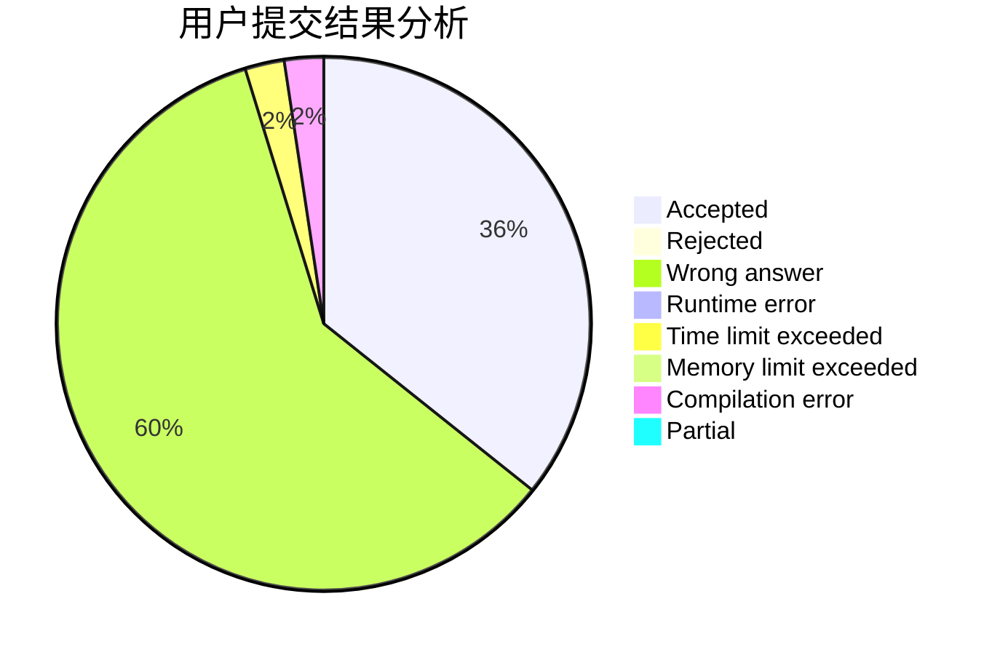
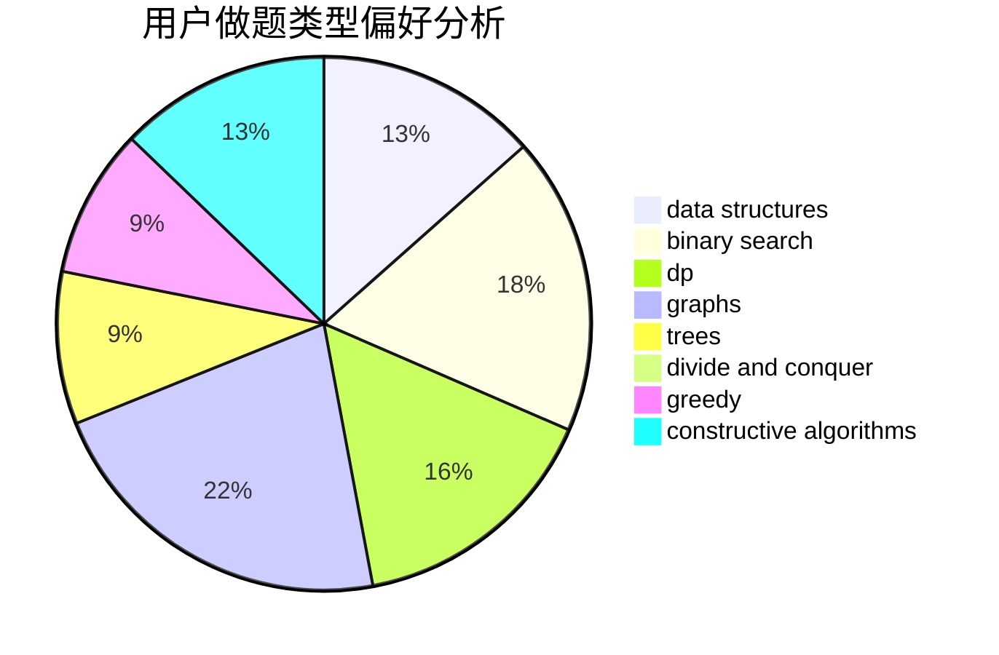
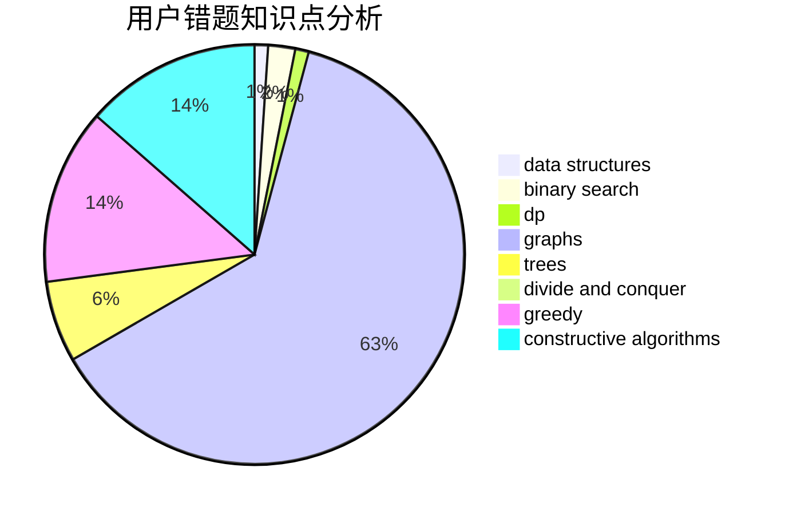

# MMMich

<!-- tabs:start -->

#### **用户提交结果分析**

#### **用户做题类型偏好分析**

#### **用户错题知识点分析**

<!-- tabs:end -->
# 推荐题目
[236D](https://codeforces.com/contest/236/problem/D)		dsu,graphs,sortings,trees		  
[808G](https://codeforces.com/contest/808/problem/G)		dp,
                        strings		  
[914B](https://codeforces.com/contest/914/problem/B)		games,
                        greedy,
                        implementation		  
[180D](https://codeforces.com/contest/180/problem/D)		greedy,
                        strings		  
[424B](https://codeforces.com/contest/424/problem/B)		binary search,
                        greedy,
                        implementation,
                        sortings		  
[512B](https://codeforces.com/contest/512/problem/B)		dsu,graphs,sortings,trees		  
[609C](https://codeforces.com/contest/609/problem/C)		implementation,
                        math		  
[734A](https://codeforces.com/contest/734/problem/A)		implementation,
                        strings		  
[957D](https://codeforces.com/contest/957/problem/D)		dsu,graphs,sortings,trees		  
[608B](https://codeforces.com/contest/608/problem/B)		combinatorics,
                        strings		  
