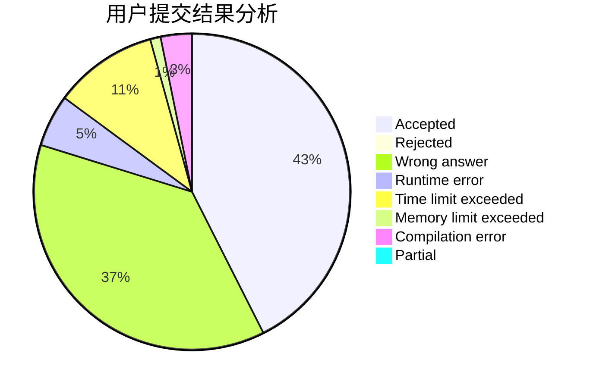
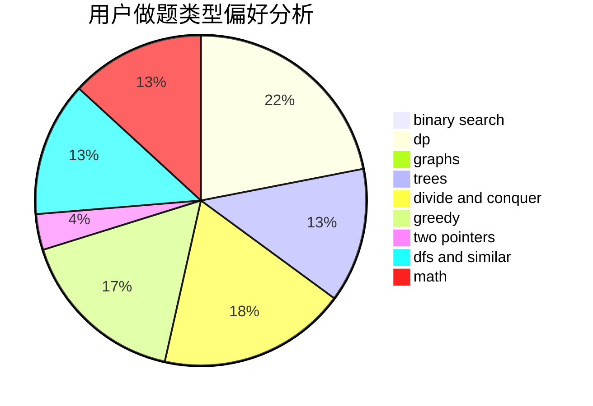

# MQFLLY

<!-- tabs:start -->

#### **用户提交结果分析**

#### **用户做题类型偏好分析**

<!-- tabs:end -->
# 推荐题目
[1157G](https://codeforces.com/contest/1157/problem/G)
[526F](https://codeforces.com/contest/526/problem/F)
[471D](https://codeforces.com/contest/471/problem/D)
[979C](https://codeforces.com/contest/979/problem/C)
[348E](https://codeforces.com/contest/348/problem/E)
[1316E](https://codeforces.com/contest/1316/problem/E)
[848B](https://codeforces.com/contest/848/problem/B)
[1456B](https://codeforces.com/contest/1456/problem/B)
[1490C](https://codeforces.com/contest/1490/problem/C)
[1497B](https://codeforces.com/contest/1497/problem/B)
