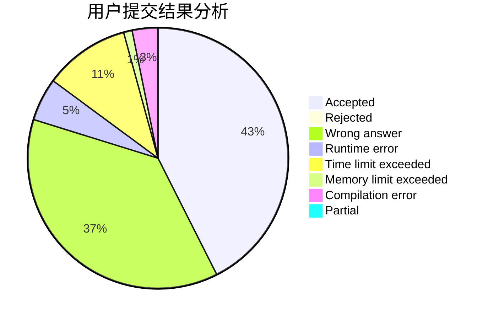
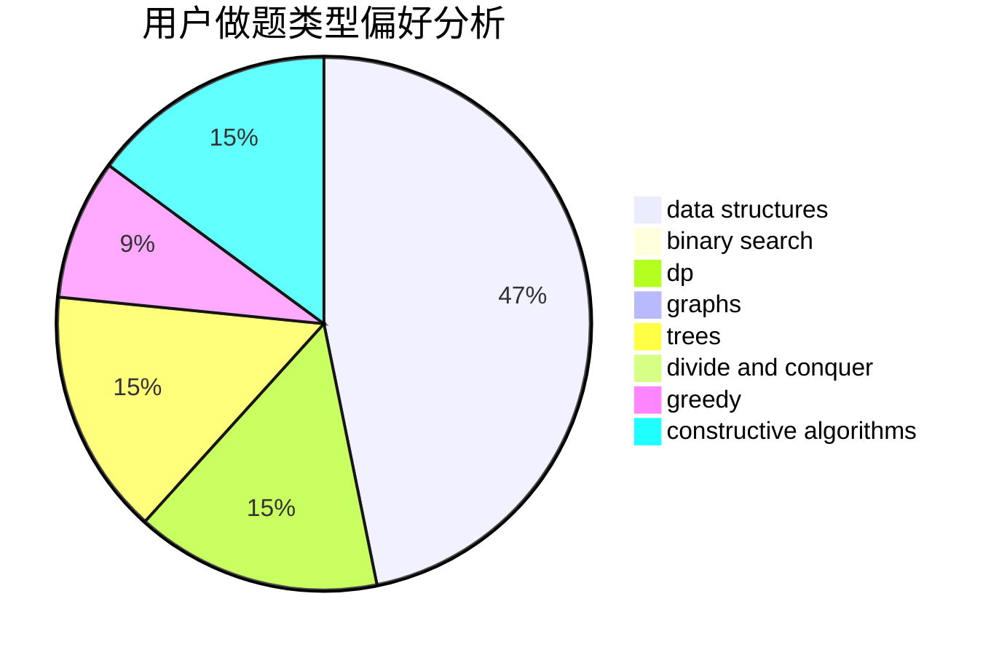

# MQFLLY

<!-- tabs:start -->

#### **用户提交结果分析**

#### **用户做题类型偏好分析**

#### **用户错题知识点分析**

<!-- tabs:end -->
# 推荐题目
[1157G](https://codeforces.com/contest/1157/problem/G)		brute force,
                        constructive algorithms		  
[526F](https://codeforces.com/contest/526/problem/F)		data structures,
                        divide and conquer		  
[471D](https://codeforces.com/contest/471/problem/D)		string suffix structures,
                        strings		  
[979C](https://codeforces.com/contest/979/problem/C)		dfs and similar,
                        trees		  
[348E](https://codeforces.com/contest/348/problem/E)		dfs and similar,
                        dp,
                        trees		  
[1316E](https://codeforces.com/contest/1316/problem/E)		bitmasks,
                        dp,
                        greedy,
                        sortings		  
[848B](https://codeforces.com/contest/848/problem/B)		constructive algorithms,
                        data structures,
                        geometry,
                        implementation,
                        sortings,
                        two pointers		  
[1456B](https://codeforces.com/contest/1456/problem/B)		dsu,graphs,sortings,trees		  
[1490C](https://codeforces.com/contest/1490/problem/C)		binary search,
                        brute force,
                        brute force,
                        math		  
[1497B](https://codeforces.com/contest/1497/problem/B)		constructive algorithms,
                        greedy,
                        math		  
