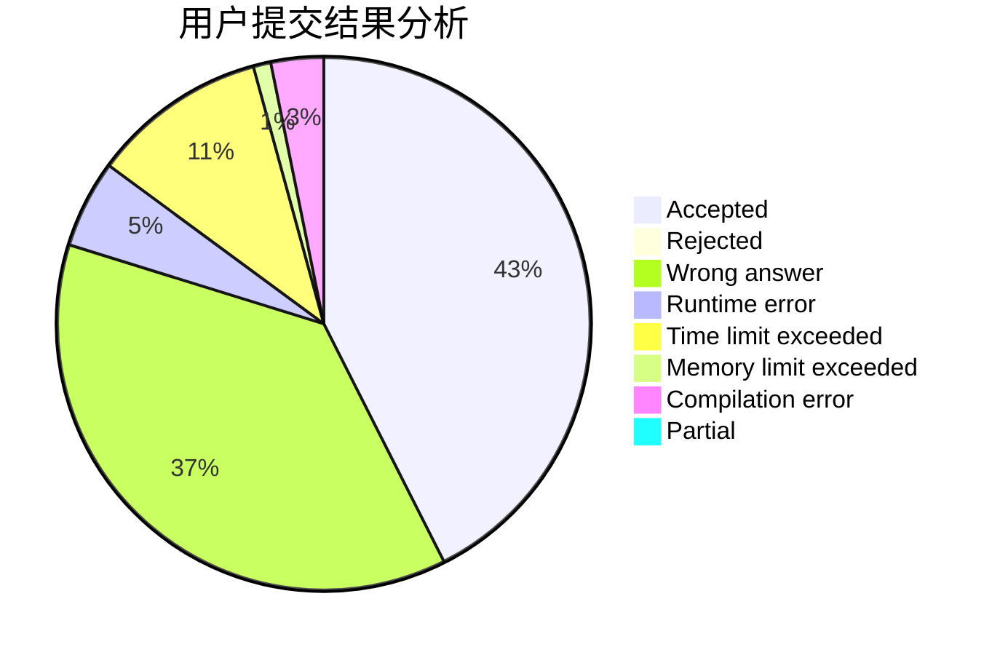
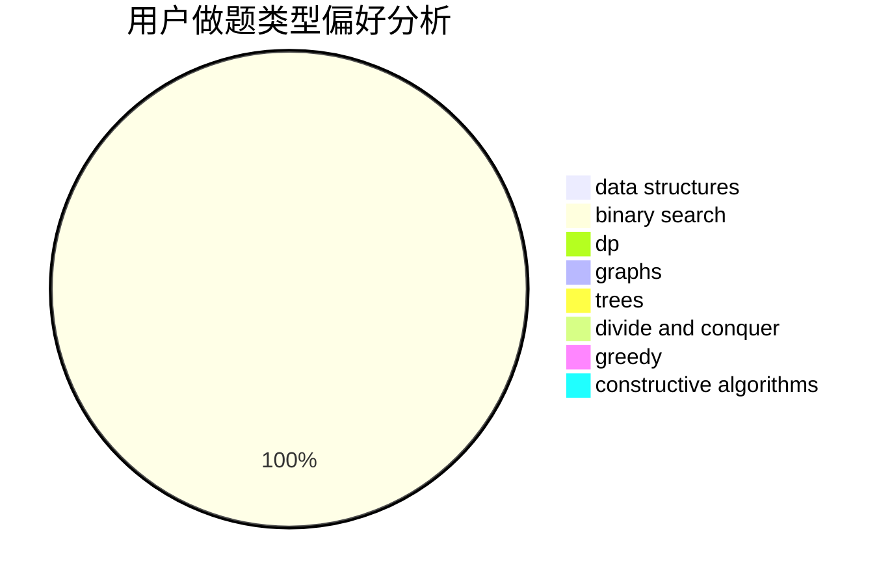

# MQFLLY

<!-- tabs:start -->

#### **用户提交结果分析**

#### **用户做题类型偏好分析**

#### **用户错题知识点分析**

<!-- tabs:end -->
# 推荐题目
[1156B](https://codeforces.com/contest/1156/problem/B)		dfs and similar,
                        greedy,
                        implementation,
                        sortings,
                        strings		  
[506C](https://codeforces.com/contest/506/problem/C)		dsu,graphs,sortings,trees		  
[44E](https://codeforces.com/contest/44/problem/E)		dp		  
[958A2](https://codeforces.com/contest/958A/problem/2)		hashing,
                        strings		  
[318D](https://codeforces.com/contest/318/problem/D)		dsu,graphs,sortings,trees		  
[1310B](https://codeforces.com/contest/1310/problem/B)		dp,
                        implementation		  
[830B](https://codeforces.com/contest/830/problem/B)		data structures,
                        implementation,
                        sortings		  
[1446F](https://codeforces.com/contest/1446/problem/F)		binary search,
                        data structures,
                        geometry		  
[1482E](https://codeforces.com/contest/1482/problem/E)		data structures,
                        divide and conquer,
                        dp		  
[1489D](https://codeforces.com/contest/1489/problem/D)		dsu,graphs,sortings,trees		  
