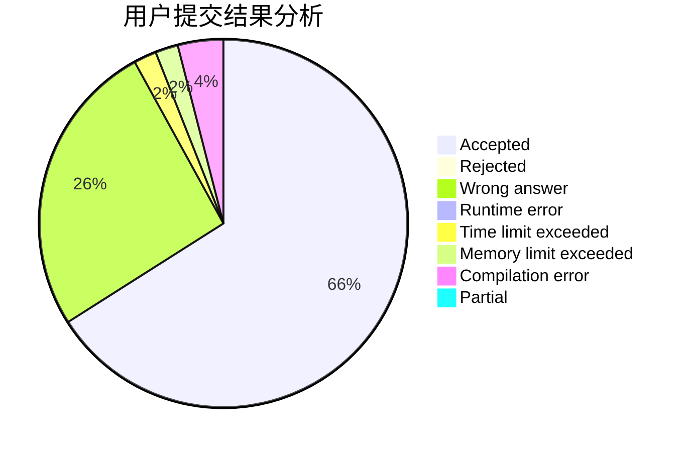
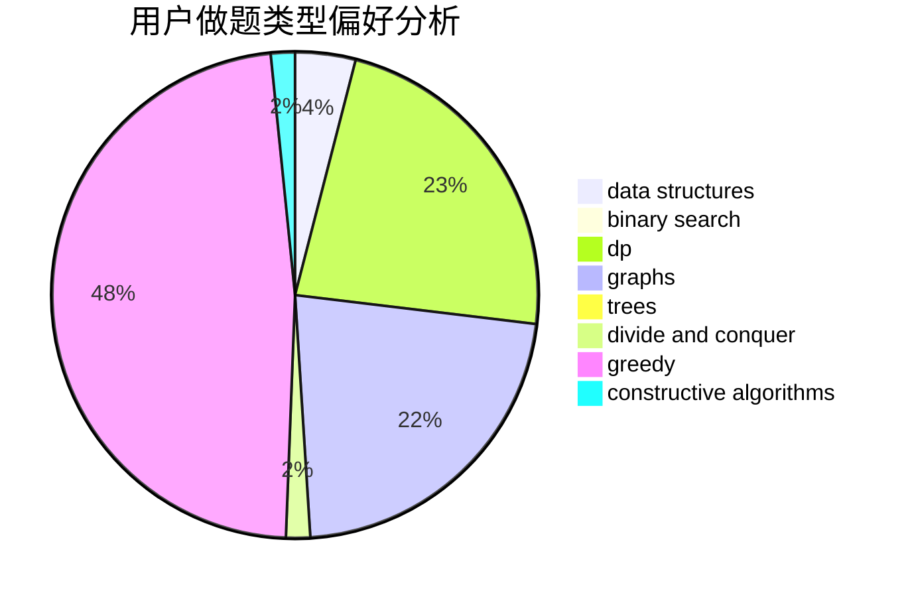
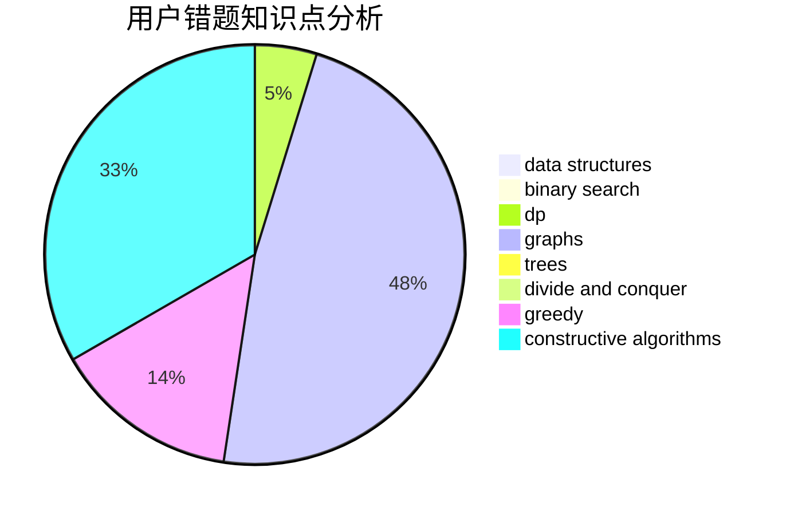

# MV.KIRTONKHOLA-10

<!-- tabs:start -->

#### **用户提交结果分析**

#### **用户做题类型偏好分析**

#### **用户错题知识点分析**

<!-- tabs:end -->
# 推荐题目
[1237F](https://codeforces.com/contest/1237/problem/F)		combinatorics,
                        dp		  
[1009C](https://codeforces.com/contest/1009/problem/C)		greedy,
                        math		  
[668A](https://codeforces.com/contest/668/problem/A)		dsu,graphs,sortings,trees		  
[11301](https://codeforces.com/contest/1130/problem/1)		dsu,graphs,sortings,trees		  
[278C](https://codeforces.com/contest/278/problem/C)		dsu,graphs,sortings,trees		  
[1057B](https://codeforces.com/contest/1057/problem/B)		*special problem,
                        brute force		  
[534F](https://codeforces.com/contest/534/problem/F)		bitmasks,
                        dp,
                        hashing,
                        meet-in-the-middle		  
[1261E](https://codeforces.com/contest/1261/problem/E)		dsu,graphs,sortings,trees		  
[38B](https://codeforces.com/contest/38/problem/B)		brute force,
                        implementation,
                        math		  
[1194A](https://codeforces.com/contest/1194/problem/A)		math		  
