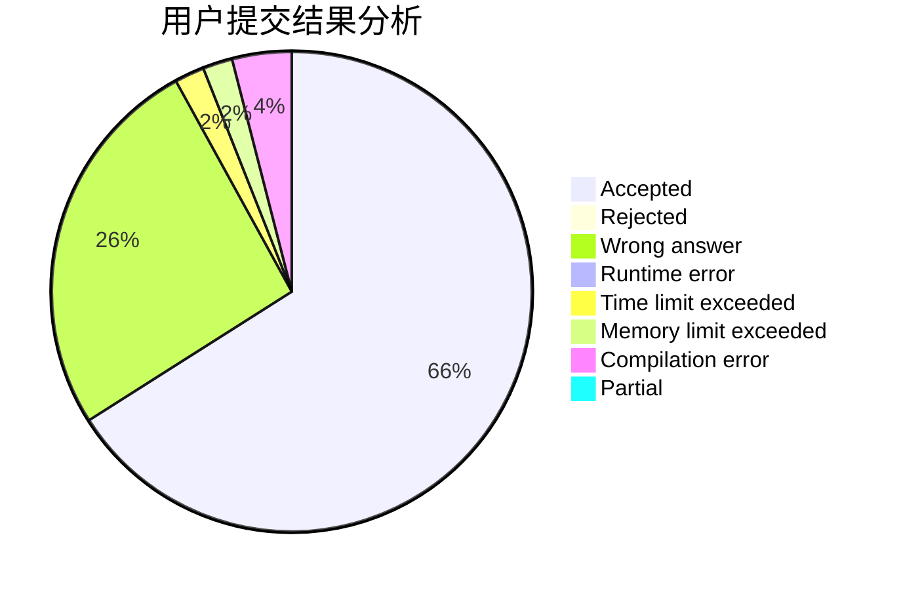
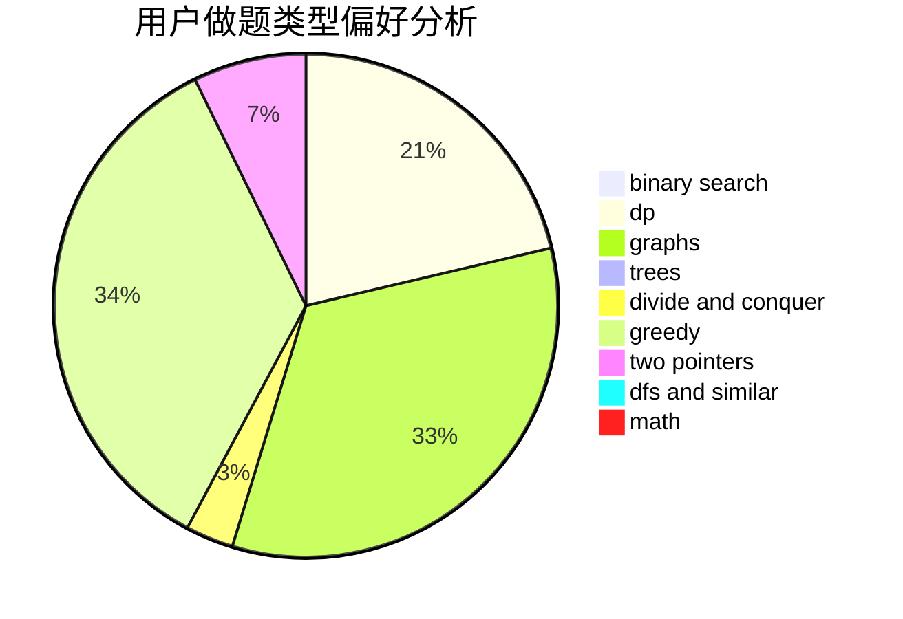

# MV.KIRTONKHOLA-10

<!-- tabs:start -->

#### **用户提交结果分析**

#### **用户做题类型偏好分析**

<!-- tabs:end -->
# 推荐题目
[1237F](https://codeforces.com/contest/1237/problem/F)
[1009C](https://codeforces.com/contest/1009/problem/C)
[668A](https://codeforces.com/contest/668/problem/A)
[11301](https://codeforces.com/contest/1130/problem/1)
[278C](https://codeforces.com/contest/278/problem/C)
[1057B](https://codeforces.com/contest/1057/problem/B)
[534F](https://codeforces.com/contest/534/problem/F)
[1261E](https://codeforces.com/contest/1261/problem/E)
[38B](https://codeforces.com/contest/38/problem/B)
[1194A](https://codeforces.com/contest/1194/problem/A)
