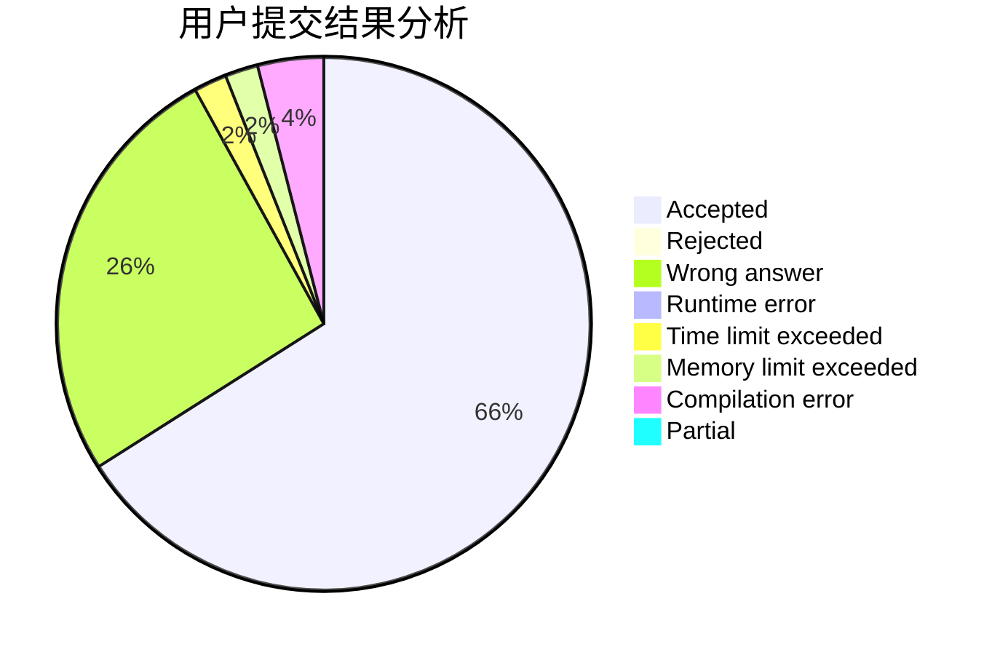
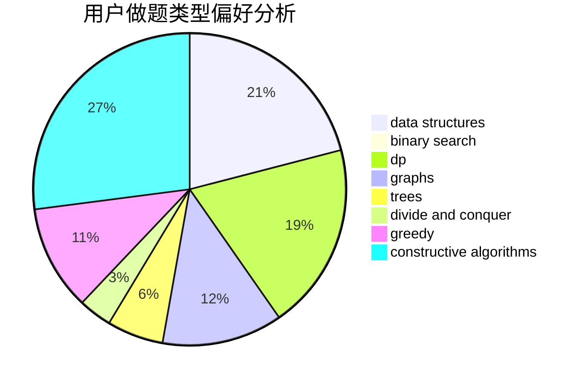
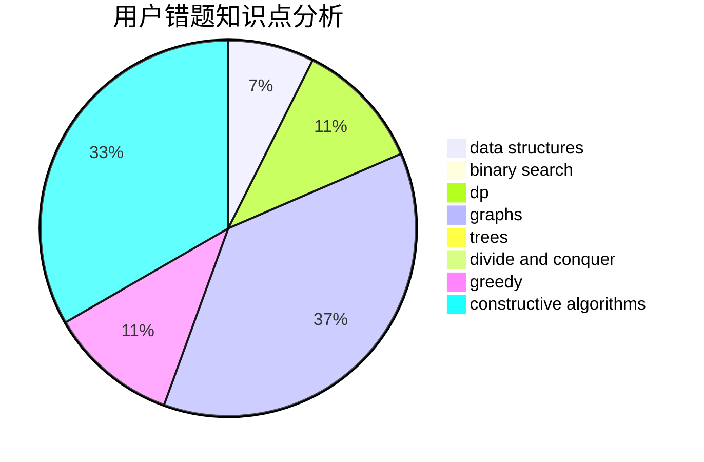

# MV.KIRTONKHOLA-10

<!-- tabs:start -->

#### **用户提交结果分析**

#### **用户做题类型偏好分析**

#### **用户错题知识点分析**

<!-- tabs:end -->
# 推荐题目
[1229B](https://codeforces.com/contest/1229/problem/B)		dsu,graphs,sortings,trees		  
[1008E](https://codeforces.com/contest/1008/problem/E)		dsu,graphs,sortings,trees		  
[637B](https://codeforces.com/contest/637/problem/B)		*special problem,
                        binary search,
                        constructive algorithms,
                        data structures,
                        sortings		  
[1120D](https://codeforces.com/contest/1120/problem/D)		dfs and similar,
                        dp,
                        dsu,
                        graphs,
                        greedy,
                        trees		  
[260B](https://codeforces.com/contest/260/problem/B)		brute force,
                        implementation,
                        strings		  
[1056F](https://codeforces.com/contest/1056/problem/F)		binary search,
                        dp,
                        math		  
[510E](https://codeforces.com/contest/510/problem/E)		flows		  
[1254B2](https://codeforces.com/contest/1254B/problem/2)		constructive algorithms,
                        greedy,
                        math,
                        number theory,
                        ternary search,
                        two pointers		  
[363C](https://codeforces.com/contest/363/problem/C)		greedy,
                        implementation		  
[1188D](https://codeforces.com/contest/1188/problem/D)		dp		  
