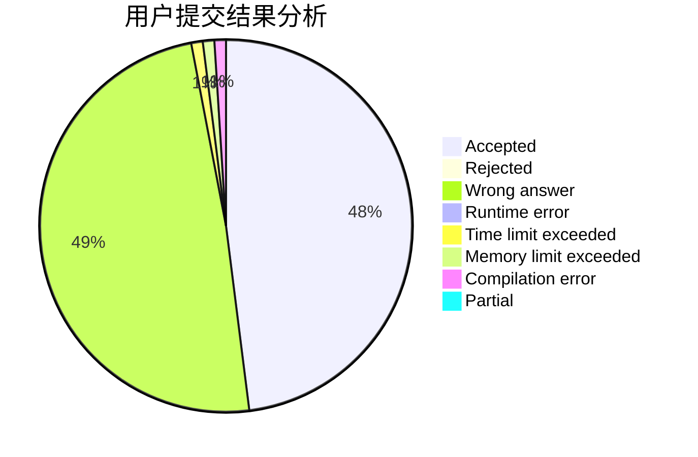
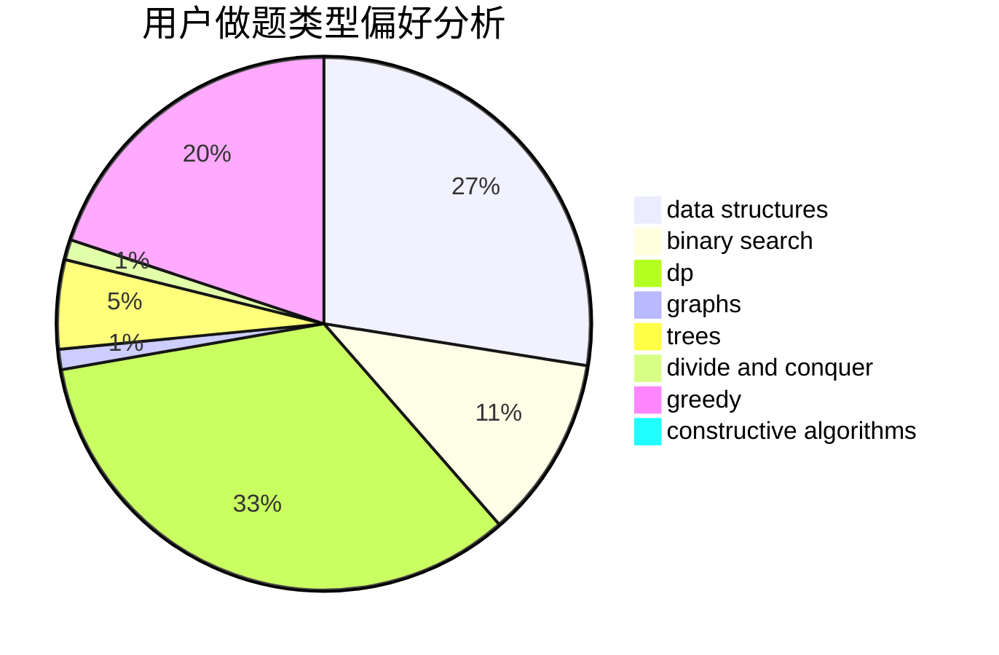
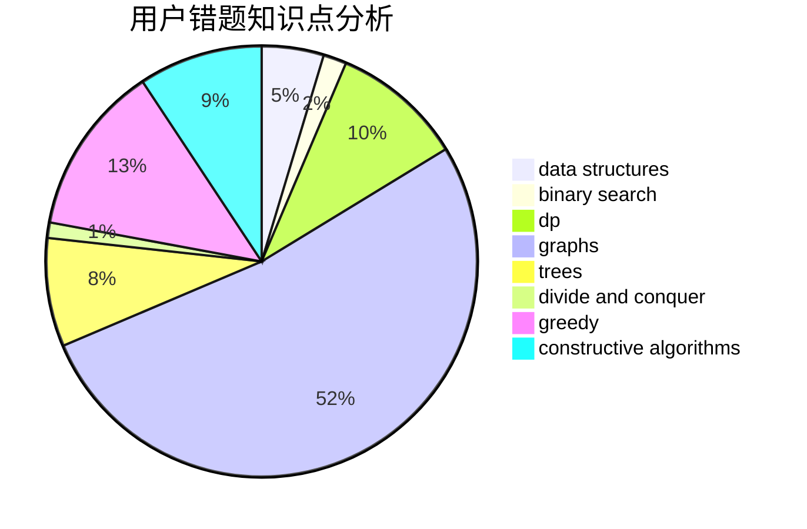

# MY_Lee
<!-- tabs:start -->
#### **用户提交结果分析**

#### **用户做题类型偏好分析**

#### **用户错题知识点分析**

<!-- tabs:end -->
# 推荐题目
[Palindromic Paths](http://codeforces.com/problemset/problem/1205/C)		implementation,
                        interactive		  
[Logistical Questions](http://codeforces.com/problemset/problem/566/C)		dfs and similar,
                        divide and conquer,
                        trees		  
[Coffee Break](http://codeforces.com/problemset/problem/1041/C)		binary search,
                        data structures,
                        greedy,
                        two pointers		  
[Three Garlands](http://codeforces.com/problemset/problem/911/C)		brute force,
                        constructive algorithms		  
[Long Recovery](http://codeforces.com/problemset/problem/1446/E)		constructive algorithms,
                        dfs and similar		  
[Love Rescue](http://codeforces.com/problemset/problem/939/D)		dfs and similar,
                        dsu,
                        graphs,
                        greedy,
                        strings		  
[Vanya and Field](http://codeforces.com/problemset/problem/492/E)		math		  
[Palindrome Dance](http://codeforces.com/problemset/problem/1040/A)		greedy		  
[Greg and Array](http://codeforces.com/problemset/problem/295/A)		data structures,
                        implementation		  
[El Toll Caves](http://codeforces.com/problemset/problem/868/G)		math		  
<!-- tabs:start -->
#### **data structures**
[Palindromic Paths](http://codeforces.com/problemset/problem/1041/C)		binary search,
                        data structures,
                        greedy,
                        two pointers		  
[Logistical Questions](http://codeforces.com/problemset/problem/295/A)		data structures,
                        implementation		  
[Coffee Break](http://codeforces.com/problemset/problem/622/C)		data structures,
                        implementation		  
[Three Garlands](http://codeforces.com/problemset/problem/356/A)		data structures,
                        dsu		  
[Long Recovery](https://codeforces.com/contest/1008/problem/C)		combinatorics,
                        data structures,
                        math,
                        sortings,
                        two pointers		  
[Love Rescue](http://codeforces.com/problemset/problem/165/D)		data structures,
                        dsu,
                        trees		  
[Vanya and Field](http://codeforces.com/problemset/problem/799/E)		data structures,
                        greedy,
                        two pointers		  
[Palindrome Dance](http://codeforces.com/problemset/problem/644/B)		*special problem,
                        constructive algorithms,
                        data structures,
                        two pointers		  
[Greg and Array](http://codeforces.com/problemset/problem/1380/F)		data structures,
                        dp,
                        matrices		  
[El Toll Caves](http://codeforces.com/problemset/problem/1492/C)		binary search,
                        data structures,
                        dp,
                        greedy,
                        two pointers		  
#### **binary search**
[Palindromic Paths](http://codeforces.com/problemset/problem/1041/C)		binary search,
                        data structures,
                        greedy,
                        two pointers		  
[Logistical Questions](http://codeforces.com/problemset/problem/360/B)		binary search,
                        dp		  
[Coffee Break](http://codeforces.com/problemset/problem/1486/E)		binary search,
                        brute force,
                        constructive algorithms,
                        dp,
                        flows,
                        graphs,
                        shortest paths		  
[Three Garlands](http://codeforces.com/problemset/problem/889/E)		binary search,
                        dp,
                        math		  
[Long Recovery](http://codeforces.com/problemset/problem/1492/C)		binary search,
                        data structures,
                        dp,
                        greedy,
                        two pointers		  
[Love Rescue](http://codeforces.com/problemset/problem/1463/D)		binary search,
                        constructive algorithms,
                        greedy,
                        two pointers		  
[Vanya and Field](http://codeforces.com/problemset/problem/1490/G)		binary search,
                        data structures,
                        math		  
[Palindrome Dance](http://codeforces.com/problemset/problem/1479/D)		binary search,
                        bitmasks,
                        brute force,
                        data structures,
                        probabilities,
                        trees		  
[Greg and Array](http://codeforces.com/problemset/problem/1436/E)		binary search,
                        data structures,
                        two pointers		  
[El Toll Caves](http://codeforces.com/problemset/problem/1461/D)		binary search,
                        brute force,
                        data structures,
                        divide and conquer,
                        implementation,
                        sortings		  
#### **dp**
[Palindromic Paths](http://codeforces.com/problemset/problem/360/B)		binary search,
                        dp		  
[Logistical Questions](http://codeforces.com/problemset/problem/1149/D)		brute force,
                        dp,
                        graphs,
                        greedy		  
[Coffee Break](http://codeforces.com/problemset/problem/107/D)		dp,
                        graphs,
                        matrices		  
[Three Garlands](http://codeforces.com/problemset/problem/838/E)		dp		  
[Long Recovery](http://codeforces.com/problemset/problem/1380/F)		data structures,
                        dp,
                        matrices		  
[Love Rescue](http://codeforces.com/problemset/problem/1486/E)		binary search,
                        brute force,
                        constructive algorithms,
                        dp,
                        flows,
                        graphs,
                        shortest paths		  
[Vanya and Field](http://codeforces.com/problemset/problem/889/E)		binary search,
                        dp,
                        math		  
[Palindrome Dance](http://codeforces.com/problemset/problem/1472/F)		brute force,
                        dp,
                        graph matchings,
                        greedy,
                        sortings		  
[Greg and Array](http://codeforces.com/problemset/problem/1476/D)		dfs and similar,
                        dp,
                        dsu,
                        implementation		  
[El Toll Caves](http://codeforces.com/problemset/problem/1492/C)		binary search,
                        data structures,
                        dp,
                        greedy,
                        two pointers		  
#### **graph**
[Palindromic Paths](http://codeforces.com/problemset/problem/939/D)		dfs and similar,
                        dsu,
                        graphs,
                        greedy,
                        strings		  
[Logistical Questions](http://codeforces.com/problemset/problem/107/A)		dfs and similar,
                        graphs		  
[Coffee Break](https://codeforces.com/contest/108/problem/C)		dfs and similar,
                        graphs		  
[Three Garlands](http://codeforces.com/problemset/problem/1149/D)		brute force,
                        dp,
                        graphs,
                        greedy		  
[Long Recovery](http://codeforces.com/problemset/problem/107/D)		dp,
                        graphs,
                        matrices		  
[Love Rescue](http://codeforces.com/problemset/problem/1486/E)		binary search,
                        brute force,
                        constructive algorithms,
                        dp,
                        flows,
                        graphs,
                        shortest paths		  
[Vanya and Field](http://codeforces.com/problemset/problem/1472/F)		brute force,
                        dp,
                        graph matchings,
                        greedy,
                        sortings		  
[Palindrome Dance](http://codeforces.com/problemset/problem/1487/C)		brute force,
                        constructive algorithms,
                        dfs and similar,
                        graphs,
                        greedy,
                        implementation,
                        math		  
[Greg and Array](http://codeforces.com/problemset/problem/1437/C)		dp,
                        flows,
                        graph matchings,
                        greedy,
                        math,
                        sortings		  
[El Toll Caves](http://codeforces.com/problemset/problem/1470/D)		constructive algorithms,
                        dfs and similar,
                        graph matchings,
                        graphs,
                        greedy		  
#### **trees**
[Palindromic Paths](http://codeforces.com/problemset/problem/566/C)		dfs and similar,
                        divide and conquer,
                        trees		  
[Logistical Questions](http://codeforces.com/problemset/problem/165/D)		data structures,
                        dsu,
                        trees		  
[Coffee Break](http://codeforces.com/problemset/problem/1479/D)		binary search,
                        bitmasks,
                        brute force,
                        data structures,
                        probabilities,
                        trees		  
[Three Garlands](http://codeforces.com/problemset/problem/1511/C)		brute force,
                        data structures,
                        implementation,
                        trees		  
[Long Recovery](http://codeforces.com/problemset/problem/1499/F)		combinatorics,
                        dfs and similar,
                        dp,
                        trees		  
[Love Rescue](http://codeforces.com/problemset/problem/1491/E)		brute force,
                        dfs and similar,
                        divide and conquer,
                        number theory,
                        trees		  
[Vanya and Field](http://codeforces.com/problemset/problem/1466/D)		data structures,
                        greedy,
                        sortings,
                        trees		  
[Palindrome Dance](http://codeforces.com/problemset/problem/1495/D)		combinatorics,
                        dfs and similar,
                        graphs,
                        math,
                        shortest paths,
                        trees		  
[Greg and Array](http://codeforces.com/problemset/problem/1303/G)		data structures,
                        divide and conquer,
                        geometry,
                        trees		  
[El Toll Caves](http://codeforces.com/problemset/problem/1454/E)		combinatorics,
                        dfs and similar,
                        graphs,
                        trees		  
#### **divide and conquer**
[Palindromic Paths](http://codeforces.com/problemset/problem/566/C)		dfs and similar,
                        divide and conquer,
                        trees		  
[Logistical Questions](http://codeforces.com/problemset/problem/1461/D)		binary search,
                        brute force,
                        data structures,
                        divide and conquer,
                        implementation,
                        sortings		  
[Coffee Break](http://codeforces.com/problemset/problem/1466/G)		combinatorics,
                        divide and conquer,
                        hashing,
                        math,
                        string suffix structures,
                        strings		  
[Three Garlands](http://codeforces.com/problemset/problem/1490/D)		dfs and similar,
                        divide and conquer,
                        implementation		  
[Long Recovery](https://codeforces.com/contest/1483/problem/C)		data structures,
                        divide and conquer,
                        dp		  
[Love Rescue](http://codeforces.com/problemset/problem/1491/E)		brute force,
                        dfs and similar,
                        divide and conquer,
                        number theory,
                        trees		  
[Vanya and Field](http://codeforces.com/problemset/problem/1303/G)		data structures,
                        divide and conquer,
                        geometry,
                        trees		  
[Palindrome Dance](http://codeforces.com/problemset/problem/1494/D)		constructive algorithms,
                        data structures,
                        dfs and similar,
                        divide and conquer,
                        dsu,
                        greedy,
                        sortings,
                        trees		  
[Greg and Array](http://codeforces.com/problemset/problem/1482/E)		data structures,
                        divide and conquer,
                        dp		  
[El Toll Caves](http://codeforces.com/problemset/problem/566/C)		dfs and similar,
                        divide and conquer,
                        trees		  
#### **greedy**
[Palindromic Paths](http://codeforces.com/problemset/problem/1041/C)		binary search,
                        data structures,
                        greedy,
                        two pointers		  
[Logistical Questions](http://codeforces.com/problemset/problem/939/D)		dfs and similar,
                        dsu,
                        graphs,
                        greedy,
                        strings		  
[Coffee Break](http://codeforces.com/problemset/problem/1040/A)		greedy		  
[Three Garlands](http://codeforces.com/problemset/problem/479/B)		brute force,
                        constructive algorithms,
                        greedy,
                        implementation,
                        sortings		  
[Long Recovery](http://codeforces.com/problemset/problem/799/E)		data structures,
                        greedy,
                        two pointers		  
[Love Rescue](http://codeforces.com/problemset/problem/1149/D)		brute force,
                        dp,
                        graphs,
                        greedy		  
[Vanya and Field](http://codeforces.com/problemset/problem/92/B)		greedy		  
[Palindrome Dance](https://codeforces.com/contest/516/problem/A)		greedy,
                        math,
                        sortings		  
[Greg and Array](http://codeforces.com/problemset/problem/1437/A)		brute force,
                        constructive algorithms,
                        greedy,
                        math		  
[El Toll Caves](http://codeforces.com/problemset/problem/1509/B)		greedy		  
#### **constructive algorithms**
[Palindromic Paths](http://codeforces.com/problemset/problem/911/C)		brute force,
                        constructive algorithms		  
[Logistical Questions](http://codeforces.com/problemset/problem/1446/E)		constructive algorithms,
                        dfs and similar		  
[Coffee Break](http://codeforces.com/problemset/problem/479/B)		brute force,
                        constructive algorithms,
                        greedy,
                        implementation,
                        sortings		  
[Three Garlands](https://codeforces.com/contest/304/problem/C)		constructive algorithms,
                        implementation,
                        math		  
[Long Recovery](http://codeforces.com/problemset/problem/644/B)		*special problem,
                        constructive algorithms,
                        data structures,
                        two pointers		  
[Love Rescue](http://codeforces.com/problemset/problem/1335/B)		constructive algorithms		  
[Vanya and Field](http://codeforces.com/problemset/problem/305/A)		brute force,
                        constructive algorithms,
                        implementation		  
[Palindrome Dance](http://codeforces.com/problemset/problem/1437/A)		brute force,
                        constructive algorithms,
                        greedy,
                        math		  
[Greg and Array](http://codeforces.com/problemset/problem/1486/E)		binary search,
                        brute force,
                        constructive algorithms,
                        dp,
                        flows,
                        graphs,
                        shortest paths		  
[El Toll Caves](http://codeforces.com/problemset/problem/1493/A)		constructive algorithms,
                        greedy		  
#### **sortings**
[Palindromic Paths](https://codeforces.com/contest/1008/problem/C)		combinatorics,
                        data structures,
                        math,
                        sortings,
                        two pointers		  
[Logistical Questions](http://codeforces.com/problemset/problem/479/B)		brute force,
                        constructive algorithms,
                        greedy,
                        implementation,
                        sortings		  
[Coffee Break](https://codeforces.com/contest/516/problem/A)		greedy,
                        math,
                        sortings		  
[Three Garlands](http://codeforces.com/problemset/problem/1472/F)		brute force,
                        dp,
                        graph matchings,
                        greedy,
                        sortings		  
[Long Recovery](https://codeforces.com/contest/1496/problem/C)		geometry,
                        greedy,
                        math,
                        sortings		  
[Love Rescue](http://codeforces.com/problemset/problem/1495/A)		geometry,
                        greedy,
                        math,
                        sortings		  
[Vanya and Field](http://codeforces.com/problemset/problem/1497/A)		brute force,
                        data structures,
                        greedy,
                        sortings		  
[Palindrome Dance](http://codeforces.com/problemset/problem/1427/A)		math,
                        sortings		  
[Greg and Array](http://codeforces.com/problemset/problem/1461/D)		binary search,
                        brute force,
                        data structures,
                        divide and conquer,
                        implementation,
                        sortings		  
[El Toll Caves](http://codeforces.com/problemset/problem/1437/C)		dp,
                        flows,
                        graph matchings,
                        greedy,
                        math,
                        sortings		  
<!-- tabs:end -->
