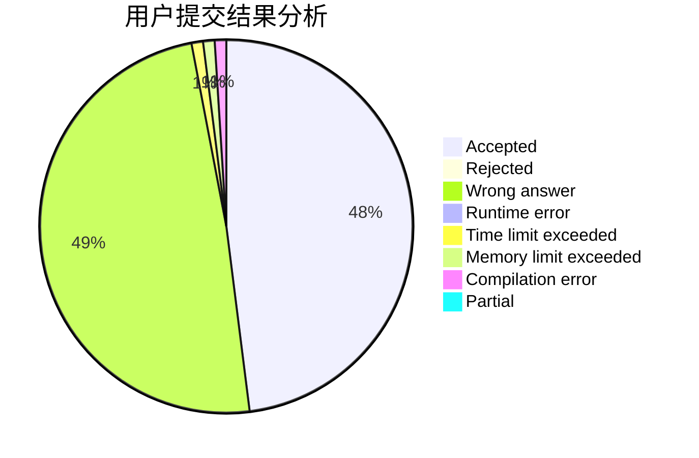
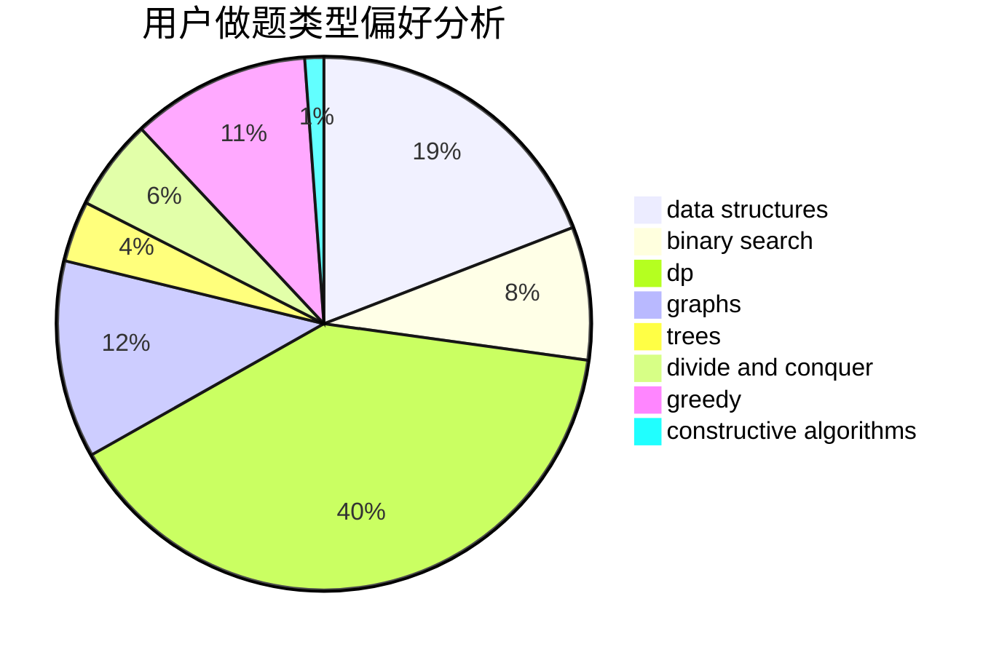
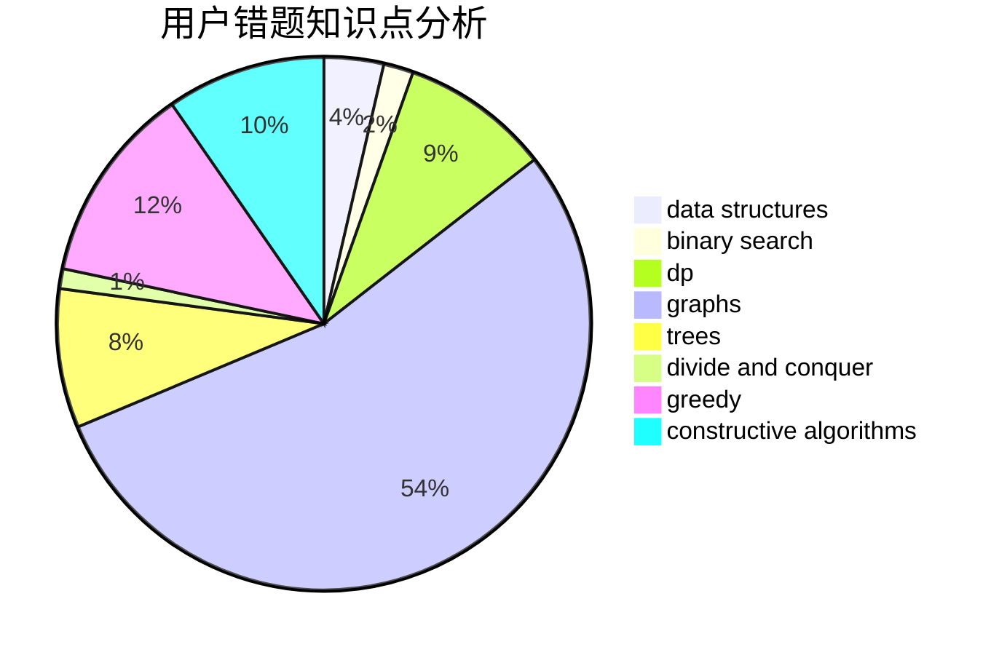

# MY_Lee

<!-- tabs:start -->

#### **用户提交结果分析**

#### **用户做题类型偏好分析**

#### **用户错题知识点分析**

<!-- tabs:end -->
# 推荐题目
[960G](https://codeforces.com/contest/960/problem/G)		combinatorics,
                        dp,
                        fft,
                        math		  
[928B](https://codeforces.com/contest/928/problem/B)		*special problem,
                        dp		  
[1041F](https://codeforces.com/contest/1041/problem/F)		data structures,
                        divide and conquer,
                        dp,
                        math		  
[585B](https://codeforces.com/contest/585/problem/B)		dfs and similar,
                        graphs,
                        shortest paths		  
[325A](https://codeforces.com/contest/325/problem/A)		implementation		  
[650C](https://codeforces.com/contest/650/problem/C)		dfs and similar,
                        dp,
                        dsu,
                        graphs,
                        greedy		  
[49A](https://codeforces.com/contest/49/problem/A)		implementation		  
[94B](https://codeforces.com/contest/94/problem/B)		graphs,
                        implementation,
                        math		  
[69A](https://codeforces.com/contest/69/problem/A)		implementation,
                        math		  
[1041A](https://codeforces.com/contest/1041/problem/A)		greedy,
                        implementation,
                        sortings		  
