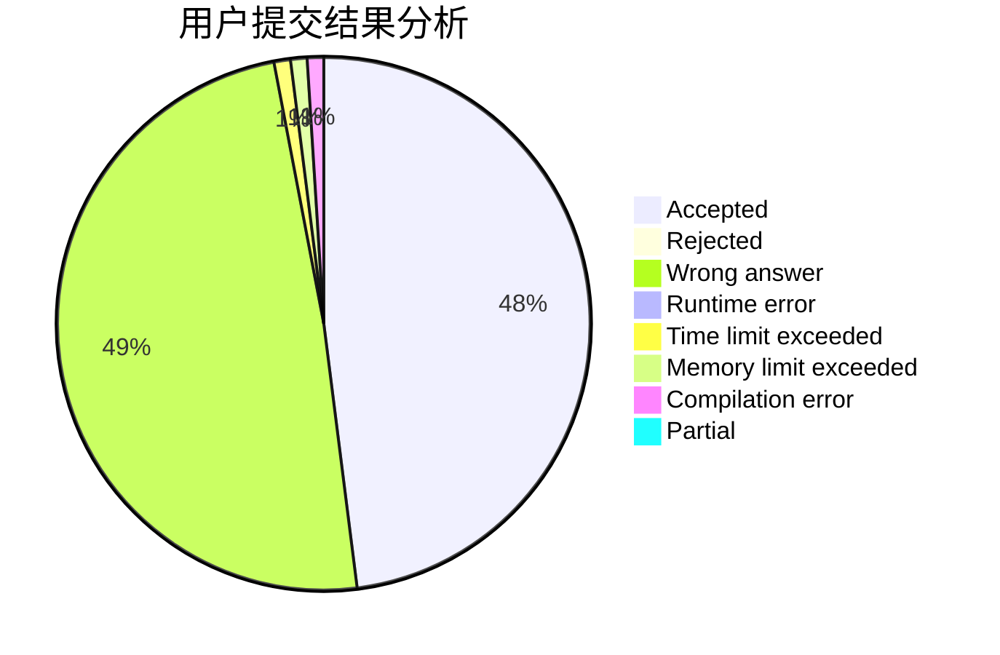
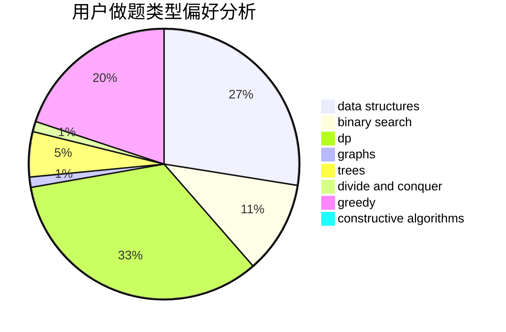
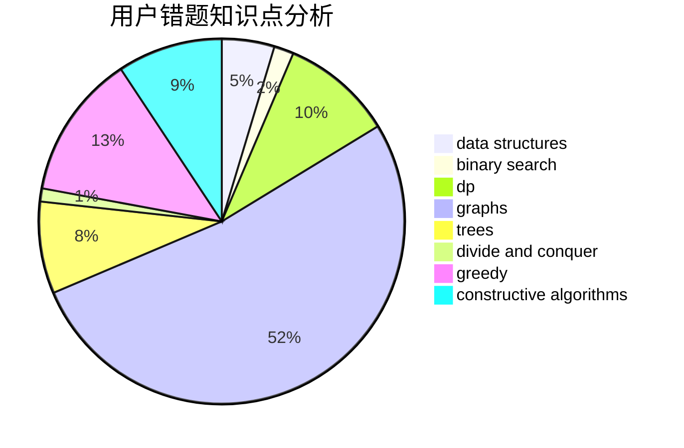

# MY_Lee

<!-- tabs:start -->

#### **用户提交结果分析**

#### **用户做题类型偏好分析**

#### **用户错题知识点分析**

<!-- tabs:end -->
# 推荐题目
[939D](https://codeforces.com/contest/939/problem/D)		dfs and similar,
                        dsu,
                        graphs,
                        greedy,
                        strings		  
[911C](https://codeforces.com/contest/911/problem/C)		brute force,
                        constructive algorithms		  
[1041C](https://codeforces.com/contest/1041/problem/C)		binary search,
                        data structures,
                        greedy,
                        two pointers		  
[566C](https://codeforces.com/contest/566/problem/C)		dfs and similar,
                        divide and conquer,
                        trees		  
[304C](https://codeforces.com/contest/304/problem/C)		dsu,graphs,sortings,trees		  
[622C](https://codeforces.com/contest/622/problem/C)		data structures,
                        implementation		  
[479B](https://codeforces.com/contest/479/problem/B)		brute force,
                        constructive algorithms,
                        greedy,
                        implementation,
                        sortings		  
[92B](https://codeforces.com/contest/92/problem/B)		greedy		  
[675A](https://codeforces.com/contest/675/problem/A)		math		  
[1040A](https://codeforces.com/contest/1040/problem/A)		greedy		  
