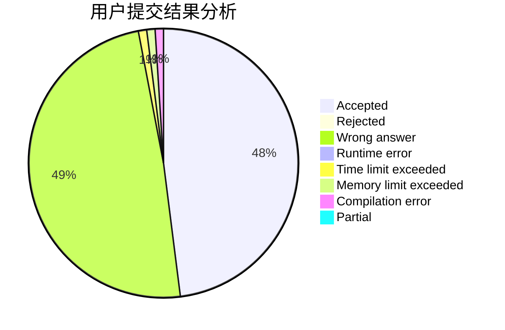
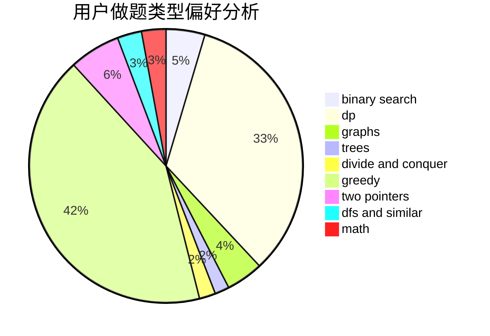

# MY_Lee

<!-- tabs:start -->

#### **用户提交结果分析**

#### **用户做题类型偏好分析**

<!-- tabs:end -->
# 推荐题目
[960G](https://codeforces.com/contest/960/problem/G)
[928B](https://codeforces.com/contest/928/problem/B)
[1041F](https://codeforces.com/contest/1041/problem/F)
[585B](https://codeforces.com/contest/585/problem/B)
[325A](https://codeforces.com/contest/325/problem/A)
[650C](https://codeforces.com/contest/650/problem/C)
[49A](https://codeforces.com/contest/49/problem/A)
[94B](https://codeforces.com/contest/94/problem/B)
[69A](https://codeforces.com/contest/69/problem/A)
[1041A](https://codeforces.com/contest/1041/problem/A)
