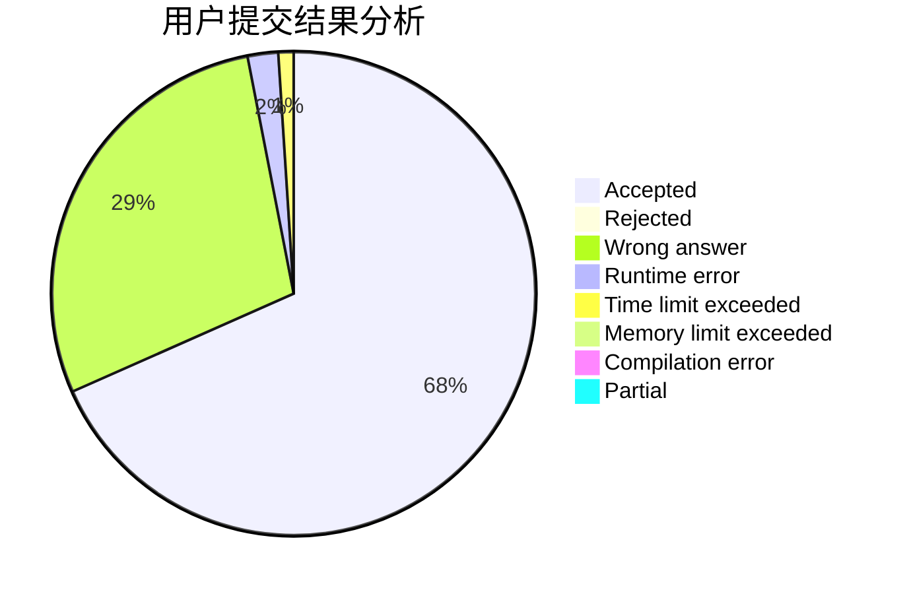
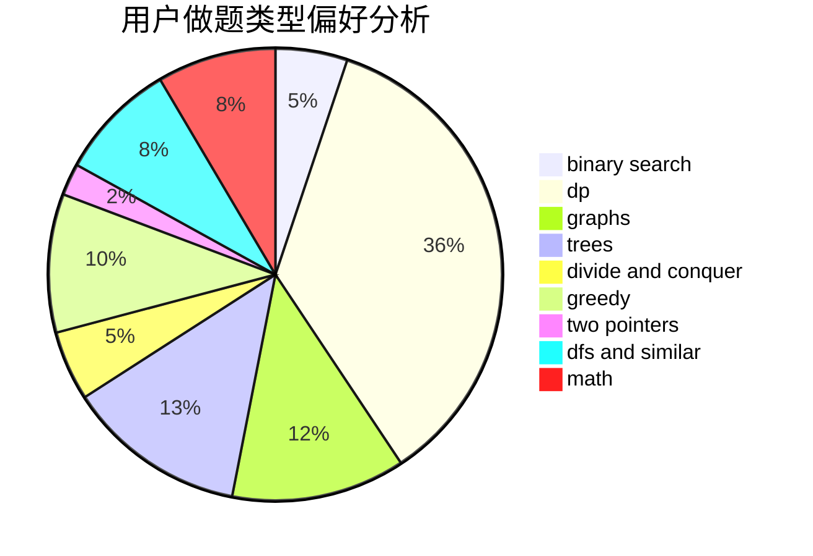

# M_sea

<!-- tabs:start -->

#### **用户提交结果分析**

#### **用户做题类型偏好分析**

<!-- tabs:end -->
# 推荐题目
[1241D](https://codeforces.com/contest/1241/problem/D)
[14621](https://codeforces.com/contest/1462/problem/1)
[923E](https://codeforces.com/contest/923/problem/E)
[1396C](https://codeforces.com/contest/1396/problem/C)
[1012B](https://codeforces.com/contest/1012/problem/B)
[359B](https://codeforces.com/contest/359/problem/B)
[12272](https://codeforces.com/contest/1227/problem/2)
[461A](https://codeforces.com/contest/461/problem/A)
[696B](https://codeforces.com/contest/696/problem/B)
[834C](https://codeforces.com/contest/834/problem/C)
