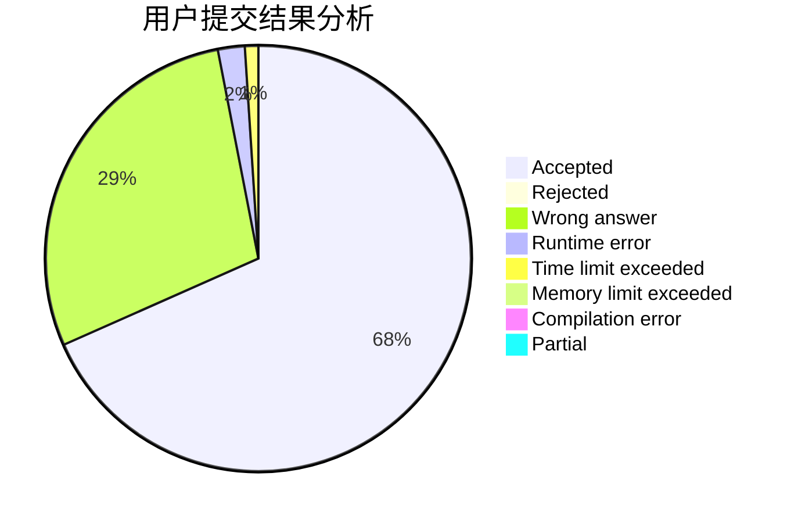
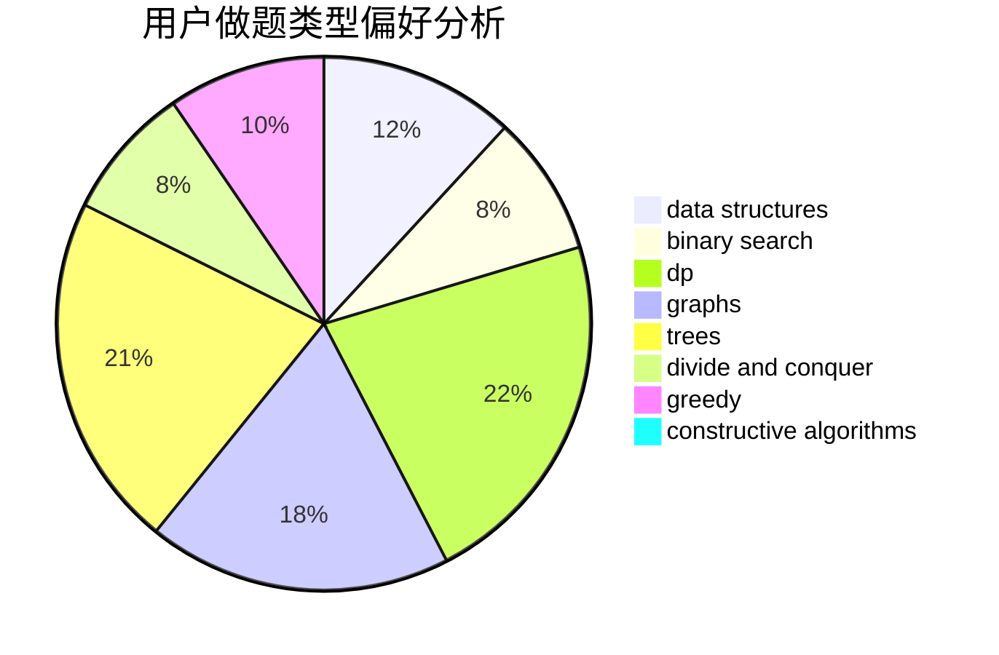
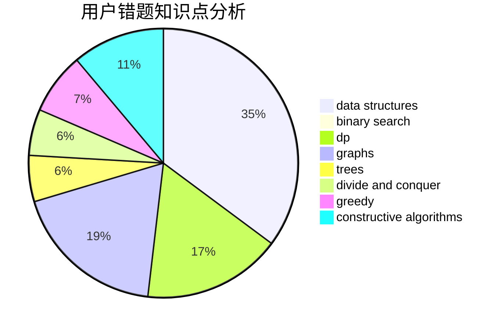

# M_sea

<!-- tabs:start -->

#### **用户提交结果分析**

#### **用户做题类型偏好分析**

#### **用户错题知识点分析**

<!-- tabs:end -->
# 推荐题目
[1241D](https://codeforces.com/contest/1241/problem/D)		dsu,graphs,sortings,trees		  
[14621](https://codeforces.com/contest/1462/problem/1)		dsu,graphs,sortings,trees		  
[923E](https://codeforces.com/contest/923/problem/E)		fft,
                        math,
                        matrices		  
[1396C](https://codeforces.com/contest/1396/problem/C)		dp,
                        greedy,
                        implementation		  
[1012B](https://codeforces.com/contest/1012/problem/B)		constructive algorithms,
                        dfs and similar,
                        dsu,
                        graphs,
                        matrices		  
[359B](https://codeforces.com/contest/359/problem/B)		constructive algorithms,
                        dp,
                        math		  
[12272](https://codeforces.com/contest/1227/problem/2)		dsu,graphs,sortings,trees		  
[461A](https://codeforces.com/contest/461/problem/A)		greedy,
                        sortings		  
[696B](https://codeforces.com/contest/696/problem/B)		dfs and similar,
                        math,
                        probabilities,
                        trees		  
[834C](https://codeforces.com/contest/834/problem/C)		dsu,graphs,sortings,trees		  
