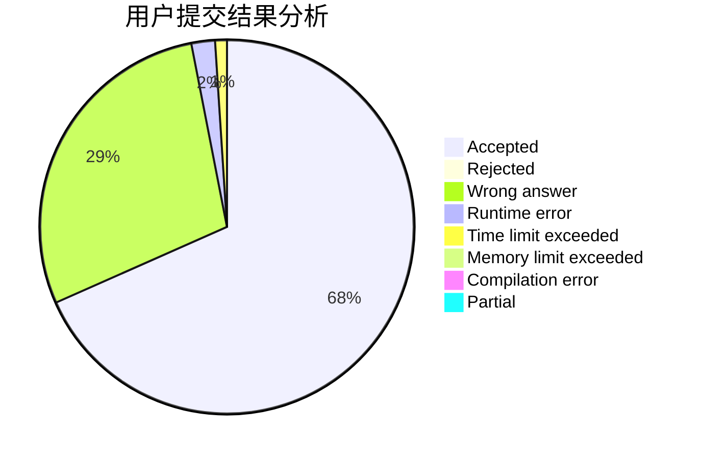
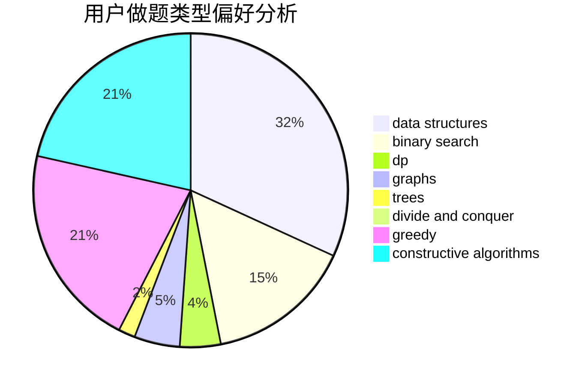
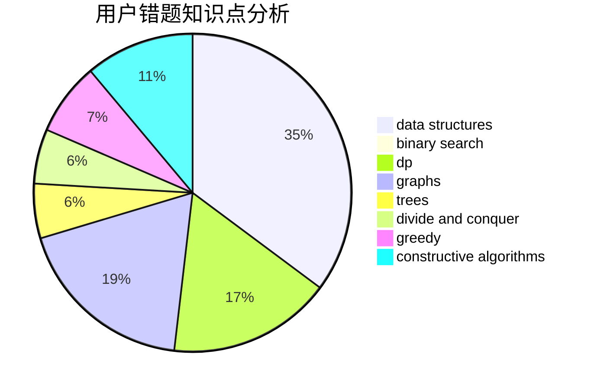

# M_sea
<!-- tabs:start -->
#### **用户提交结果分析**

#### **用户做题类型偏好分析**

#### **用户错题知识点分析**

<!-- tabs:end -->
# 推荐题目
[Radio Towers](http://codeforces.com/problemset/problem/1452/D)		combinatorics,
                        dp,
                        math		  
[Partial Replacement](http://codeforces.com/problemset/problem/1506/B)		greedy,
                        implementation		  
[Mixture](http://codeforces.com/problemset/problem/1386/B)		*special problem,
                        data structures,
                        geometry,
                        math,
                        sortings		  
[Segments](http://codeforces.com/problemset/problem/909/B)		constructive algorithms,
                        math		  
[Replace To Make Regular Bracket Sequence](http://codeforces.com/problemset/problem/612/C)		data structures,
                        expression parsing,
                        math		  
[The Great Julya Calendar](http://codeforces.com/problemset/problem/331/C1)		dp		  
[Magic Powder - 1](http://codeforces.com/problemset/problem/670/D1)		binary search,
                        brute force,
                        implementation		  
[Karen and Supermarket](http://codeforces.com/problemset/problem/815/C)		brute force,
                        dp,
                        trees		  
[Tree Diameter](http://codeforces.com/problemset/problem/1146/C)		bitmasks,
                        graphs,
                        interactive		  
[Bear and Friendship Condition](https://codeforces.com/contest/791/problem/B)		dfs and similar,
                        dsu,
                        graphs		  
<!-- tabs:start -->
#### **data structures**
[Radio Towers](http://codeforces.com/problemset/problem/1386/B)		*special problem,
                        data structures,
                        geometry,
                        math,
                        sortings		  
[Partial Replacement](http://codeforces.com/problemset/problem/612/C)		data structures,
                        expression parsing,
                        math		  
[Mixture](http://codeforces.com/problemset/problem/1070/B)		data structures,
                        greedy		  
[Segments](http://codeforces.com/problemset/problem/260/E)		binary search,
                        brute force,
                        data structures		  
[Replace To Make Regular Bracket Sequence](http://codeforces.com/problemset/problem/600/B)		binary search,
                        data structures,
                        sortings,
                        two pointers		  
[The Great Julya Calendar](http://codeforces.com/problemset/problem/1109/F)		data structures,
                        trees		  
[Magic Powder - 1](http://codeforces.com/problemset/problem/1490/E)		binary search,
                        data structures,
                        greedy		  
[Karen and Supermarket](http://codeforces.com/problemset/problem/1142/B)		data structures,
                        dfs and similar,
                        dp,
                        math,
                        trees		  
[Tree Diameter](http://codeforces.com/problemset/problem/342/E)		data structures,
                        divide and conquer,
                        trees		  
[Bear and Friendship Condition](http://codeforces.com/problemset/problem/1172/E)		data structures		  
#### **binary search**
[Radio Towers](http://codeforces.com/problemset/problem/670/D1)		binary search,
                        brute force,
                        implementation		  
[Partial Replacement](http://codeforces.com/problemset/problem/260/E)		binary search,
                        brute force,
                        data structures		  
[Mixture](http://codeforces.com/problemset/problem/600/B)		binary search,
                        data structures,
                        sortings,
                        two pointers		  
[Segments](http://codeforces.com/problemset/problem/1490/E)		binary search,
                        data structures,
                        greedy		  
[Replace To Make Regular Bracket Sequence](http://codeforces.com/problemset/problem/1492/C)		binary search,
                        data structures,
                        dp,
                        greedy,
                        two pointers		  
[The Great Julya Calendar](http://codeforces.com/problemset/problem/1463/D)		binary search,
                        constructive algorithms,
                        greedy,
                        two pointers		  
[Magic Powder - 1](http://codeforces.com/problemset/problem/1490/G)		binary search,
                        data structures,
                        math		  
[Karen and Supermarket](http://codeforces.com/problemset/problem/1479/D)		binary search,
                        bitmasks,
                        brute force,
                        data structures,
                        probabilities,
                        trees		  
[Tree Diameter](http://codeforces.com/problemset/problem/1436/E)		binary search,
                        data structures,
                        two pointers		  
[Bear and Friendship Condition](http://codeforces.com/problemset/problem/1461/D)		binary search,
                        brute force,
                        data structures,
                        divide and conquer,
                        implementation,
                        sortings		  
#### **dp**
[Radio Towers](http://codeforces.com/problemset/problem/1452/D)		combinatorics,
                        dp,
                        math		  
[Partial Replacement](http://codeforces.com/problemset/problem/331/C1)		dp		  
[Mixture](http://codeforces.com/problemset/problem/815/C)		brute force,
                        dp,
                        trees		  
[Segments](http://codeforces.com/problemset/problem/264/D)		dp,
                        two pointers		  
[Replace To Make Regular Bracket Sequence](http://codeforces.com/problemset/problem/1353/F)		brute force,
                        dp		  
[The Great Julya Calendar](http://codeforces.com/problemset/problem/894/E)		dp,
                        graphs		  
[Magic Powder - 1](http://codeforces.com/problemset/problem/439/E)		combinatorics,
                        dp,
                        math		  
[Karen and Supermarket](https://codeforces.com/contest/871/problem/A)		dp,
                        greedy,
                        math,
                        number theory		  
[Tree Diameter](http://codeforces.com/problemset/problem/1142/B)		data structures,
                        dfs and similar,
                        dp,
                        math,
                        trees		  
[Bear and Friendship Condition](http://codeforces.com/problemset/problem/1172/C1)		dp,
                        probabilities		  
#### **graph**
[Radio Towers](http://codeforces.com/problemset/problem/1146/C)		bitmasks,
                        graphs,
                        interactive		  
[Partial Replacement](https://codeforces.com/contest/791/problem/B)		dfs and similar,
                        dsu,
                        graphs		  
[Mixture](http://codeforces.com/problemset/problem/269/C)		constructive algorithms,
                        flows,
                        graphs,
                        greedy		  
[Segments](http://codeforces.com/problemset/problem/240/E)		dfs and similar,
                        graphs,
                        greedy		  
[Replace To Make Regular Bracket Sequence](http://codeforces.com/problemset/problem/894/E)		dp,
                        graphs		  
[The Great Julya Calendar](http://codeforces.com/problemset/problem/1487/C)		brute force,
                        constructive algorithms,
                        dfs and similar,
                        graphs,
                        greedy,
                        implementation,
                        math		  
[Magic Powder - 1](http://codeforces.com/problemset/problem/1437/C)		dp,
                        flows,
                        graph matchings,
                        greedy,
                        math,
                        sortings		  
[Karen and Supermarket](http://codeforces.com/problemset/problem/1470/D)		constructive algorithms,
                        dfs and similar,
                        graph matchings,
                        graphs,
                        greedy		  
[Tree Diameter](http://codeforces.com/problemset/problem/1476/C)		dp,
                        graphs,
                        greedy		  
[Bear and Friendship Condition](http://codeforces.com/problemset/problem/1304/D)		constructive algorithms,
                        graphs,
                        greedy,
                        two pointers		  
#### **trees**
[Radio Towers](http://codeforces.com/problemset/problem/815/C)		brute force,
                        dp,
                        trees		  
[Partial Replacement](http://codeforces.com/problemset/problem/1109/F)		data structures,
                        trees		  
[Mixture](http://codeforces.com/problemset/problem/1142/B)		data structures,
                        dfs and similar,
                        dp,
                        math,
                        trees		  
[Segments](http://codeforces.com/problemset/problem/342/E)		data structures,
                        divide and conquer,
                        trees		  
[Replace To Make Regular Bracket Sequence](http://codeforces.com/problemset/problem/1479/D)		binary search,
                        bitmasks,
                        brute force,
                        data structures,
                        probabilities,
                        trees		  
[The Great Julya Calendar](http://codeforces.com/problemset/problem/1511/C)		brute force,
                        data structures,
                        implementation,
                        trees		  
[Magic Powder - 1](http://codeforces.com/problemset/problem/1499/F)		combinatorics,
                        dfs and similar,
                        dp,
                        trees		  
[Karen and Supermarket](http://codeforces.com/problemset/problem/1491/E)		brute force,
                        dfs and similar,
                        divide and conquer,
                        number theory,
                        trees		  
[Tree Diameter](http://codeforces.com/problemset/problem/1466/D)		data structures,
                        greedy,
                        sortings,
                        trees		  
[Bear and Friendship Condition](http://codeforces.com/problemset/problem/1495/D)		combinatorics,
                        dfs and similar,
                        graphs,
                        math,
                        shortest paths,
                        trees		  
#### **divide and conquer**
[Radio Towers](http://codeforces.com/problemset/problem/342/E)		data structures,
                        divide and conquer,
                        trees		  
[Partial Replacement](http://codeforces.com/problemset/problem/1461/D)		binary search,
                        brute force,
                        data structures,
                        divide and conquer,
                        implementation,
                        sortings		  
[Mixture](http://codeforces.com/problemset/problem/1466/G)		combinatorics,
                        divide and conquer,
                        hashing,
                        math,
                        string suffix structures,
                        strings		  
[Segments](http://codeforces.com/problemset/problem/1490/D)		dfs and similar,
                        divide and conquer,
                        implementation		  
[Replace To Make Regular Bracket Sequence](https://codeforces.com/contest/1483/problem/C)		data structures,
                        divide and conquer,
                        dp		  
[The Great Julya Calendar](http://codeforces.com/problemset/problem/1491/E)		brute force,
                        dfs and similar,
                        divide and conquer,
                        number theory,
                        trees		  
[Magic Powder - 1](http://codeforces.com/problemset/problem/1303/G)		data structures,
                        divide and conquer,
                        geometry,
                        trees		  
[Karen and Supermarket](http://codeforces.com/problemset/problem/1494/D)		constructive algorithms,
                        data structures,
                        dfs and similar,
                        divide and conquer,
                        dsu,
                        greedy,
                        sortings,
                        trees		  
[Tree Diameter](http://codeforces.com/problemset/problem/1482/E)		data structures,
                        divide and conquer,
                        dp		  
[Bear and Friendship Condition](http://codeforces.com/problemset/problem/566/C)		dfs and similar,
                        divide and conquer,
                        trees		  
#### **greedy**
[Radio Towers](http://codeforces.com/problemset/problem/1506/B)		greedy,
                        implementation		  
[Partial Replacement](http://codeforces.com/problemset/problem/269/C)		constructive algorithms,
                        flows,
                        graphs,
                        greedy		  
[Mixture](http://codeforces.com/problemset/problem/240/E)		dfs and similar,
                        graphs,
                        greedy		  
[Segments](http://codeforces.com/problemset/problem/1070/B)		data structures,
                        greedy		  
[Replace To Make Regular Bracket Sequence](http://codeforces.com/problemset/problem/58/B)		greedy		  
[The Great Julya Calendar](https://codeforces.com/contest/871/problem/A)		dp,
                        greedy,
                        math,
                        number theory		  
[Magic Powder - 1](http://codeforces.com/problemset/problem/1490/E)		binary search,
                        data structures,
                        greedy		  
[Karen and Supermarket](http://codeforces.com/problemset/problem/1401/B)		constructive algorithms,
                        greedy,
                        math		  
[Tree Diameter](http://codeforces.com/problemset/problem/1492/C)		binary search,
                        data structures,
                        dp,
                        greedy,
                        two pointers		  
[Bear and Friendship Condition](https://codeforces.com/contest/1496/problem/C)		geometry,
                        greedy,
                        math,
                        sortings		  
#### **constructive algorithms**
[Radio Towers](http://codeforces.com/problemset/problem/909/B)		constructive algorithms,
                        math		  
[Partial Replacement](http://codeforces.com/problemset/problem/269/C)		constructive algorithms,
                        flows,
                        graphs,
                        greedy		  
[Mixture](http://codeforces.com/problemset/problem/316/F3)		constructive algorithms,
                        dfs and similar,
                        implementation		  
[Segments](http://codeforces.com/problemset/problem/1401/B)		constructive algorithms,
                        greedy,
                        math		  
[Replace To Make Regular Bracket Sequence](http://codeforces.com/problemset/problem/1339/B)		constructive algorithms,
                        sortings		  
[The Great Julya Calendar](http://codeforces.com/problemset/problem/1493/A)		constructive algorithms,
                        greedy		  
[Magic Powder - 1](http://codeforces.com/problemset/problem/1463/D)		binary search,
                        constructive algorithms,
                        greedy,
                        two pointers		  
[Karen and Supermarket](https://codeforces.com/contest/1456/problem/B)		bitmasks,
                        brute force,
                        constructive algorithms		  
[Tree Diameter](http://codeforces.com/problemset/problem/1492/D)		bitmasks,
                        constructive algorithms,
                        greedy,
                        math		  
[Bear and Friendship Condition](https://codeforces.com/contest/1504/problem/D)		constructive algorithms,
                        games,
                        interactive		  
#### **sortings**
[Radio Towers](http://codeforces.com/problemset/problem/1386/B)		*special problem,
                        data structures,
                        geometry,
                        math,
                        sortings		  
[Partial Replacement](http://codeforces.com/problemset/problem/160/C)		implementation,
                        math,
                        sortings		  
[Mixture](http://codeforces.com/problemset/problem/600/B)		binary search,
                        data structures,
                        sortings,
                        two pointers		  
[Segments](http://codeforces.com/problemset/problem/1339/B)		constructive algorithms,
                        sortings		  
[Replace To Make Regular Bracket Sequence](http://codeforces.com/problemset/problem/1237/B)		data structures,
                        sortings,
                        two pointers		  
[The Great Julya Calendar](https://codeforces.com/contest/1496/problem/C)		geometry,
                        greedy,
                        math,
                        sortings		  
[Magic Powder - 1](http://codeforces.com/problemset/problem/1495/A)		geometry,
                        greedy,
                        math,
                        sortings		  
[Karen and Supermarket](http://codeforces.com/problemset/problem/1497/A)		brute force,
                        data structures,
                        greedy,
                        sortings		  
[Tree Diameter](http://codeforces.com/problemset/problem/1427/A)		math,
                        sortings		  
[Bear and Friendship Condition](http://codeforces.com/problemset/problem/1461/D)		binary search,
                        brute force,
                        data structures,
                        divide and conquer,
                        implementation,
                        sortings		  
<!-- tabs:end -->
