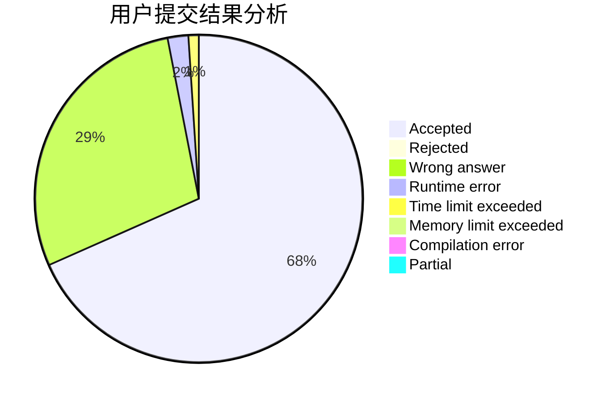
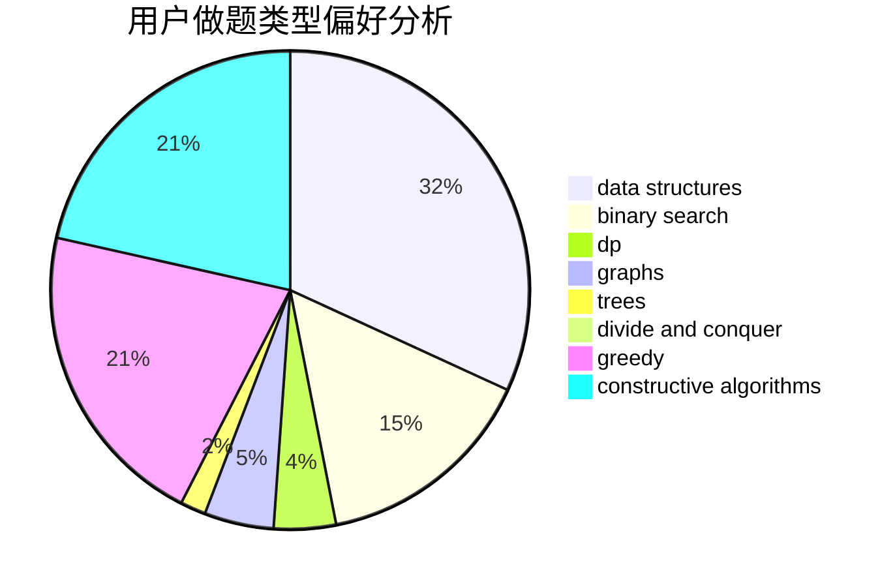
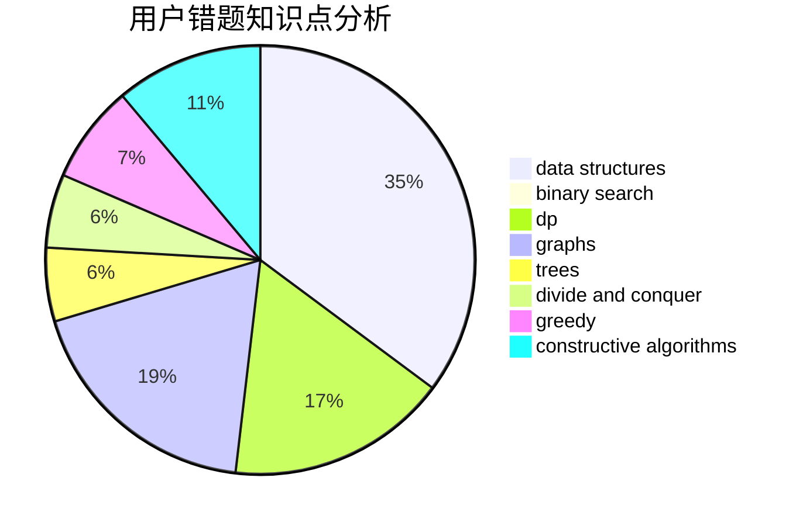

# M_sea

<!-- tabs:start -->

#### **用户提交结果分析**

#### **用户做题类型偏好分析**

#### **用户错题知识点分析**

<!-- tabs:end -->
# 推荐题目
[1237B](https://codeforces.com/contest/1237/problem/B)		data structures,
                        sortings,
                        two pointers		  
[1452D](https://codeforces.com/contest/1452/problem/D)		combinatorics,
                        dp,
                        math		  
[909B](https://codeforces.com/contest/909/problem/B)		constructive algorithms,
                        math		  
[1386B](https://codeforces.com/contest/1386/problem/B)		*special problem,
                        data structures,
                        geometry,
                        math,
                        sortings		  
[1011E](https://codeforces.com/contest/1011/problem/E)		dsu,graphs,sortings,trees		  
[331C1](https://codeforces.com/contest/331C/problem/1)		dp		  
[1219C](https://codeforces.com/contest/1219/problem/C)		implementation,
                        strings		  
[439E](https://codeforces.com/contest/439/problem/E)		combinatorics,
                        dp,
                        math		  
[670D1](https://codeforces.com/contest/670D/problem/1)		binary search,
                        brute force,
                        implementation		  
[815C](https://codeforces.com/contest/815/problem/C)		brute force,
                        dp,
                        trees		  
