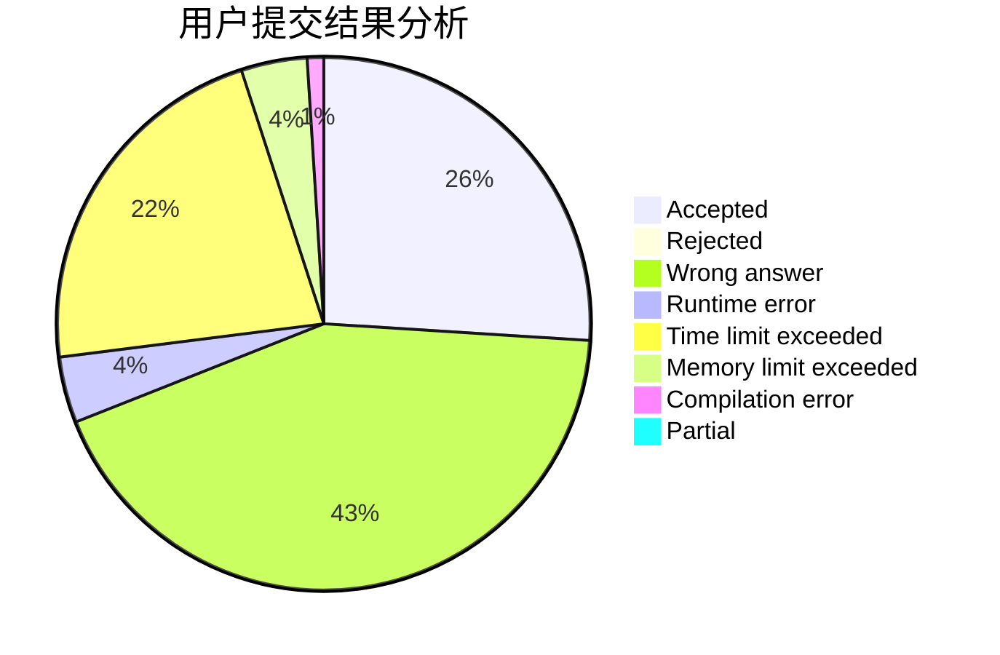
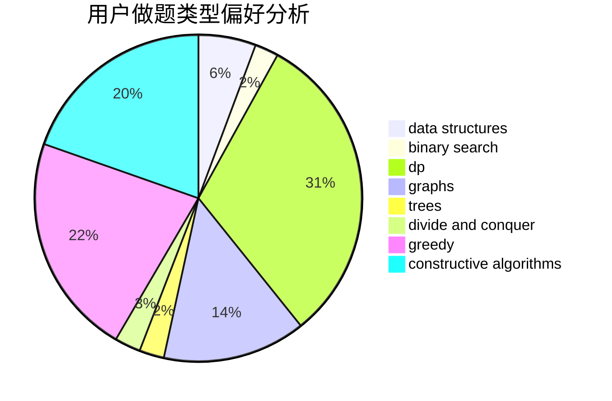
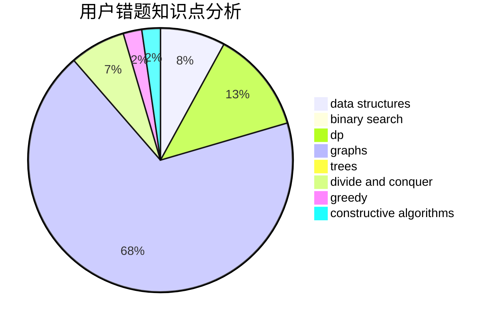

# Macaron_lin
<!-- tabs:start -->
#### **用户提交结果分析**

#### **用户做题类型偏好分析**

#### **用户错题知识点分析**

<!-- tabs:end -->
# 推荐题目
[Into Blocks (easy version)](http://codeforces.com/problemset/problem/1209/G1)		data structures,
                        dsu,
                        greedy,
                        implementation,
                        two pointers		  
[Quasi-palindrome](http://codeforces.com/problemset/problem/863/A)		brute force,
                        implementation		  
[Multithreading (Easy Version)](http://codeforces.com/problemset/problem/1450/H1)		combinatorics,
                        fft,
                        math		  
[K-Dominant Character](http://codeforces.com/problemset/problem/888/C)		binary search,
                        implementation,
                        two pointers		  
[Jumping on Walls](https://codeforces.com/contest/199/problem/D)		shortest paths		  
[Average Sleep Time](http://codeforces.com/problemset/problem/808/B)		data structures,
                        implementation,
                        math		  
[Biridian Forest](http://codeforces.com/problemset/problem/329/B)		dfs and similar,
                        shortest paths		  
[Three States](http://codeforces.com/problemset/problem/590/C)		dfs and similar,
                        graphs,
                        shortest paths		  
[Weird Game](http://codeforces.com/problemset/problem/293/A)		games,
                        greedy		  
[Constructing the Array](http://codeforces.com/problemset/problem/1353/D)		constructive algorithms,
                        data structures,
                        sortings		  
<!-- tabs:start -->
#### **data structures**
[Into Blocks (easy version)](http://codeforces.com/problemset/problem/1209/G1)		data structures,
                        dsu,
                        greedy,
                        implementation,
                        two pointers		  
[Quasi-palindrome](http://codeforces.com/problemset/problem/808/B)		data structures,
                        implementation,
                        math		  
[Multithreading (Easy Version)](http://codeforces.com/problemset/problem/1353/D)		constructive algorithms,
                        data structures,
                        sortings		  
[K-Dominant Character](http://codeforces.com/problemset/problem/746/F)		data structures,
                        greedy,
                        two pointers		  
[Jumping on Walls](http://codeforces.com/problemset/problem/103/D)		brute force,
                        data structures,
                        sortings		  
[Average Sleep Time](http://codeforces.com/problemset/problem/1209/G2)		data structures		  
[Biridian Forest](http://codeforces.com/problemset/problem/914/D)		data structures,
                        number theory		  
[Three States](http://codeforces.com/problemset/problem/609/F)		data structures,
                        greedy		  
[Weird Game](http://codeforces.com/problemset/problem/1492/C)		binary search,
                        data structures,
                        dp,
                        greedy,
                        two pointers		  
[Constructing the Array](http://codeforces.com/problemset/problem/1490/G)		binary search,
                        data structures,
                        math		  
#### **binary search**
[Into Blocks (easy version)](http://codeforces.com/problemset/problem/888/C)		binary search,
                        implementation,
                        two pointers		  
[Quasi-palindrome](http://codeforces.com/problemset/problem/1007/C)		binary search,
                        interactive		  
[Multithreading (Easy Version)](http://codeforces.com/problemset/problem/650/B)		binary search,
                        brute force,
                        dp,
                        two pointers		  
[K-Dominant Character](https://codeforces.com/contest/1395/problem/F)		binary search,
                        geometry,
                        ternary search		  
[Jumping on Walls](http://codeforces.com/problemset/problem/1492/C)		binary search,
                        data structures,
                        dp,
                        greedy,
                        two pointers		  
[Average Sleep Time](http://codeforces.com/problemset/problem/1463/D)		binary search,
                        constructive algorithms,
                        greedy,
                        two pointers		  
[Biridian Forest](http://codeforces.com/problemset/problem/1490/G)		binary search,
                        data structures,
                        math		  
[Three States](http://codeforces.com/problemset/problem/1479/D)		binary search,
                        bitmasks,
                        brute force,
                        data structures,
                        probabilities,
                        trees		  
[Weird Game](http://codeforces.com/problemset/problem/1436/E)		binary search,
                        data structures,
                        two pointers		  
[Constructing the Array](http://codeforces.com/problemset/problem/1461/D)		binary search,
                        brute force,
                        data structures,
                        divide and conquer,
                        implementation,
                        sortings		  
#### **dp**
[Into Blocks (easy version)](http://codeforces.com/problemset/problem/509/C)		dp,
                        greedy,
                        implementation		  
[Quasi-palindrome](http://codeforces.com/problemset/problem/1400/F)		brute force,
                        dfs and similar,
                        dp,
                        string suffix structures,
                        strings		  
[Multithreading (Easy Version)](http://codeforces.com/problemset/problem/650/B)		binary search,
                        brute force,
                        dp,
                        two pointers		  
[K-Dominant Character](https://codeforces.com/contest/1068/problem/D)		dp		  
[Jumping on Walls](http://codeforces.com/problemset/problem/159/D)		*special problem,
                        brute force,
                        dp,
                        strings		  
[Average Sleep Time](http://codeforces.com/problemset/problem/1511/E)		combinatorics,
                        dp,
                        greedy,
                        math		  
[Biridian Forest](http://codeforces.com/problemset/problem/1492/C)		binary search,
                        data structures,
                        dp,
                        greedy,
                        two pointers		  
[Three States](https://codeforces.com/contest/1457/problem/C)		brute force,
                        dp,
                        implementation		  
[Weird Game](http://codeforces.com/problemset/problem/1491/C)		brute force,
                        data structures,
                        dp,
                        greedy,
                        implementation		  
[Constructing the Array](http://codeforces.com/problemset/problem/1437/C)		dp,
                        flows,
                        graph matchings,
                        greedy,
                        math,
                        sortings		  
#### **graph**
[Into Blocks (easy version)](http://codeforces.com/problemset/problem/590/C)		dfs and similar,
                        graphs,
                        shortest paths		  
[Quasi-palindrome](http://codeforces.com/problemset/problem/711/D)		combinatorics,
                        dfs and similar,
                        graphs,
                        math		  
[Multithreading (Easy Version)](http://codeforces.com/problemset/problem/1062/D)		dfs and similar,
                        graphs,
                        implementation,
                        math		  
[K-Dominant Character](http://codeforces.com/problemset/problem/1005/F)		brute force,
                        dfs and similar,
                        graphs,
                        shortest paths		  
[Jumping on Walls](http://codeforces.com/problemset/problem/1487/C)		brute force,
                        constructive algorithms,
                        dfs and similar,
                        graphs,
                        greedy,
                        implementation,
                        math		  
[Average Sleep Time](http://codeforces.com/problemset/problem/1437/C)		dp,
                        flows,
                        graph matchings,
                        greedy,
                        math,
                        sortings		  
[Biridian Forest](http://codeforces.com/problemset/problem/1470/D)		constructive algorithms,
                        dfs and similar,
                        graph matchings,
                        graphs,
                        greedy		  
[Three States](http://codeforces.com/problemset/problem/1476/C)		dp,
                        graphs,
                        greedy		  
[Weird Game](http://codeforces.com/problemset/problem/1304/D)		constructive algorithms,
                        graphs,
                        greedy,
                        two pointers		  
[Constructing the Array](http://codeforces.com/problemset/problem/1475/C)		combinatorics,
                        graphs,
                        math		  
#### **trees**
[Into Blocks (easy version)](http://codeforces.com/problemset/problem/1479/D)		binary search,
                        bitmasks,
                        brute force,
                        data structures,
                        probabilities,
                        trees		  
[Quasi-palindrome](http://codeforces.com/problemset/problem/1511/C)		brute force,
                        data structures,
                        implementation,
                        trees		  
[Multithreading (Easy Version)](http://codeforces.com/problemset/problem/1499/F)		combinatorics,
                        dfs and similar,
                        dp,
                        trees		  
[K-Dominant Character](http://codeforces.com/problemset/problem/1491/E)		brute force,
                        dfs and similar,
                        divide and conquer,
                        number theory,
                        trees		  
[Jumping on Walls](http://codeforces.com/problemset/problem/1466/D)		data structures,
                        greedy,
                        sortings,
                        trees		  
[Average Sleep Time](http://codeforces.com/problemset/problem/1495/D)		combinatorics,
                        dfs and similar,
                        graphs,
                        math,
                        shortest paths,
                        trees		  
[Biridian Forest](http://codeforces.com/problemset/problem/1303/G)		data structures,
                        divide and conquer,
                        geometry,
                        trees		  
[Three States](http://codeforces.com/problemset/problem/1454/E)		combinatorics,
                        dfs and similar,
                        graphs,
                        trees		  
[Weird Game](http://codeforces.com/problemset/problem/1494/D)		constructive algorithms,
                        data structures,
                        dfs and similar,
                        divide and conquer,
                        dsu,
                        greedy,
                        sortings,
                        trees		  
[Constructing the Array](http://codeforces.com/problemset/problem/1292/C)		combinatorics,
                        dfs and similar,
                        dp,
                        greedy,
                        trees		  
#### **divide and conquer**
[Into Blocks (easy version)](http://codeforces.com/problemset/problem/1461/D)		binary search,
                        brute force,
                        data structures,
                        divide and conquer,
                        implementation,
                        sortings		  
[Quasi-palindrome](http://codeforces.com/problemset/problem/1466/G)		combinatorics,
                        divide and conquer,
                        hashing,
                        math,
                        string suffix structures,
                        strings		  
[Multithreading (Easy Version)](http://codeforces.com/problemset/problem/1490/D)		dfs and similar,
                        divide and conquer,
                        implementation		  
[K-Dominant Character](https://codeforces.com/contest/1483/problem/C)		data structures,
                        divide and conquer,
                        dp		  
[Jumping on Walls](http://codeforces.com/problemset/problem/1491/E)		brute force,
                        dfs and similar,
                        divide and conquer,
                        number theory,
                        trees		  
[Average Sleep Time](http://codeforces.com/problemset/problem/1303/G)		data structures,
                        divide and conquer,
                        geometry,
                        trees		  
[Biridian Forest](http://codeforces.com/problemset/problem/1494/D)		constructive algorithms,
                        data structures,
                        dfs and similar,
                        divide and conquer,
                        dsu,
                        greedy,
                        sortings,
                        trees		  
[Three States](http://codeforces.com/problemset/problem/1482/E)		data structures,
                        divide and conquer,
                        dp		  
[Weird Game](http://codeforces.com/problemset/problem/566/C)		dfs and similar,
                        divide and conquer,
                        trees		  
[Constructing the Array](http://codeforces.com/problemset/problem/1428/F)		binary search,
                        data structures,
                        divide and conquer,
                        dp,
                        two pointers		  
#### **greedy**
[Into Blocks (easy version)](http://codeforces.com/problemset/problem/1209/G1)		data structures,
                        dsu,
                        greedy,
                        implementation,
                        two pointers		  
[Quasi-palindrome](http://codeforces.com/problemset/problem/293/A)		games,
                        greedy		  
[Multithreading (Easy Version)](http://codeforces.com/problemset/problem/509/C)		dp,
                        greedy,
                        implementation		  
[K-Dominant Character](http://codeforces.com/problemset/problem/339/A)		greedy,
                        implementation,
                        sortings,
                        strings		  
[Jumping on Walls](http://codeforces.com/problemset/problem/746/F)		data structures,
                        greedy,
                        two pointers		  
[Average Sleep Time](http://codeforces.com/problemset/problem/1108/B)		brute force,
                        greedy,
                        math,
                        number theory		  
[Biridian Forest](http://codeforces.com/problemset/problem/1216/B)		greedy,
                        implementation,
                        sortings		  
[Three States](http://codeforces.com/problemset/problem/1165/E)		greedy,
                        math,
                        sortings		  
[Weird Game](http://codeforces.com/problemset/problem/609/F)		data structures,
                        greedy		  
[Constructing the Array](http://codeforces.com/problemset/problem/1305/E)		constructive algorithms,
                        greedy,
                        implementation,
                        math		  
#### **constructive algorithms**
[Into Blocks (easy version)](http://codeforces.com/problemset/problem/1353/D)		constructive algorithms,
                        data structures,
                        sortings		  
[Quasi-palindrome](http://codeforces.com/problemset/problem/756/A)		constructive algorithms,
                        dfs and similar		  
[Multithreading (Easy Version)](https://codeforces.com/contest/1262/problem/C)		constructive algorithms		  
[K-Dominant Character](http://codeforces.com/problemset/problem/1305/E)		constructive algorithms,
                        greedy,
                        implementation,
                        math		  
[Jumping on Walls](http://codeforces.com/problemset/problem/1493/A)		constructive algorithms,
                        greedy		  
[Average Sleep Time](http://codeforces.com/problemset/problem/1463/D)		binary search,
                        constructive algorithms,
                        greedy,
                        two pointers		  
[Biridian Forest](https://codeforces.com/contest/1456/problem/B)		bitmasks,
                        brute force,
                        constructive algorithms		  
[Three States](http://codeforces.com/problemset/problem/1492/D)		bitmasks,
                        constructive algorithms,
                        greedy,
                        math		  
[Weird Game](https://codeforces.com/contest/1504/problem/D)		constructive algorithms,
                        games,
                        interactive		  
[Constructing the Array](https://codeforces.com/contest/1483/problem/A)		brute force,
                        constructive algorithms,
                        greedy,
                        implementation		  
#### **sortings**
[Into Blocks (easy version)](http://codeforces.com/problemset/problem/1353/D)		constructive algorithms,
                        data structures,
                        sortings		  
[Quasi-palindrome](http://codeforces.com/problemset/problem/339/A)		greedy,
                        implementation,
                        sortings,
                        strings		  
[Multithreading (Easy Version)](http://codeforces.com/problemset/problem/103/D)		brute force,
                        data structures,
                        sortings		  
[K-Dominant Character](http://codeforces.com/problemset/problem/1216/B)		greedy,
                        implementation,
                        sortings		  
[Jumping on Walls](http://codeforces.com/problemset/problem/1165/E)		greedy,
                        math,
                        sortings		  
[Average Sleep Time](https://codeforces.com/contest/1496/problem/C)		geometry,
                        greedy,
                        math,
                        sortings		  
[Biridian Forest](http://codeforces.com/problemset/problem/1495/A)		geometry,
                        greedy,
                        math,
                        sortings		  
[Three States](http://codeforces.com/problemset/problem/1497/A)		brute force,
                        data structures,
                        greedy,
                        sortings		  
[Weird Game](http://codeforces.com/problemset/problem/1427/A)		math,
                        sortings		  
[Constructing the Array](http://codeforces.com/problemset/problem/1461/D)		binary search,
                        brute force,
                        data structures,
                        divide and conquer,
                        implementation,
                        sortings		  
<!-- tabs:end -->
