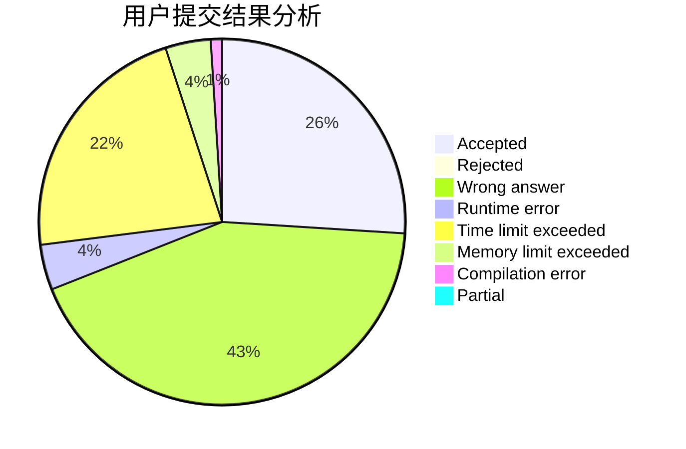
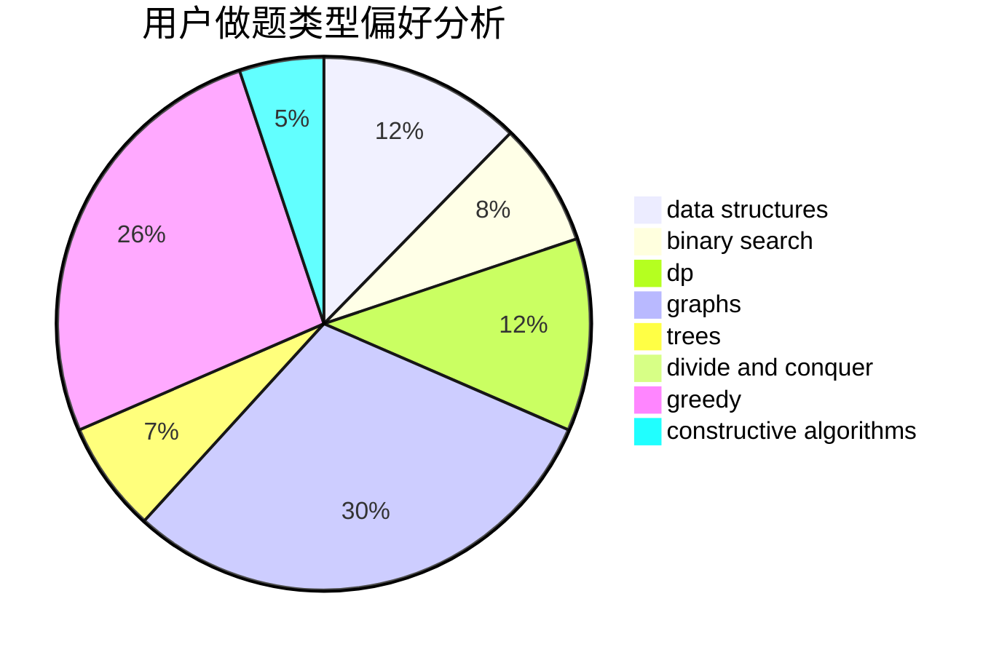

# Macaron_lin

<!-- tabs:start -->

#### **用户提交结果分析**

#### **用户做题类型偏好分析**

#### **用户错题知识点分析**

<!-- tabs:end -->
# 推荐题目
[1459E](https://codeforces.com/contest/1459/problem/E)		dsu,graphs,sortings,trees		  
[883C](https://codeforces.com/contest/883/problem/C)		binary search,
                        implementation		  
[220C](https://codeforces.com/contest/220/problem/C)		data structures		  
[908A](https://codeforces.com/contest/908/problem/A)		brute force,
                        implementation		  
[1314D](https://codeforces.com/contest/1314/problem/D)		dsu,graphs,sortings,trees		  
[181A](https://codeforces.com/contest/181/problem/A)		brute force,
                        geometry,
                        implementation		  
[356E](https://codeforces.com/contest/356/problem/E)		dp,
                        hashing,
                        implementation,
                        string suffix structures,
                        strings		  
[106B](https://codeforces.com/contest/106/problem/B)		brute force,
                        implementation		  
[1221F](https://codeforces.com/contest/1221/problem/F)		binary search,
                        data structures,
                        sortings		  
[1008A](https://codeforces.com/contest/1008/problem/A)		implementation,
                        strings		  
