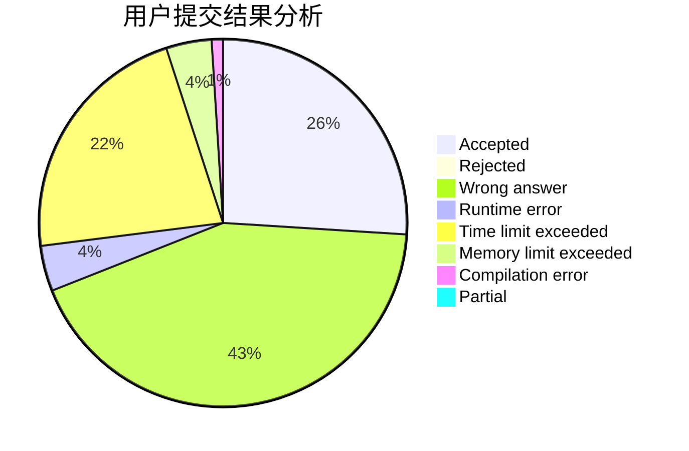
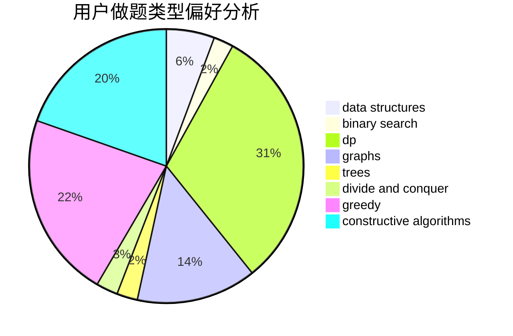
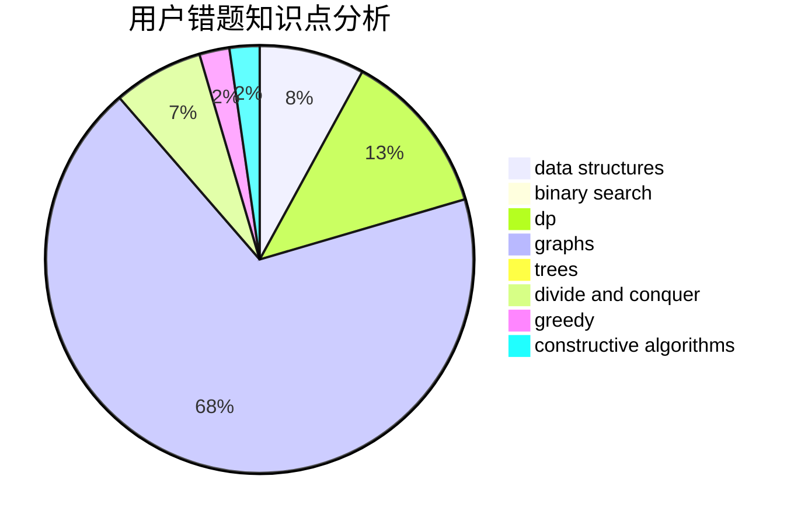

# Macaron_lin

<!-- tabs:start -->

#### **用户提交结果分析**

#### **用户做题类型偏好分析**

#### **用户错题知识点分析**

<!-- tabs:end -->
# 推荐题目
[1450H1](https://codeforces.com/contest/1450H/problem/1)		combinatorics,
                        fft,
                        math		  
[863A](https://codeforces.com/contest/863/problem/A)		brute force,
                        implementation		  
[199D](https://codeforces.com/contest/199/problem/D)		dsu,graphs,sortings,trees		  
[888C](https://codeforces.com/contest/888/problem/C)		binary search,
                        implementation,
                        two pointers		  
[1305E](https://codeforces.com/contest/1305/problem/E)		constructive algorithms,
                        greedy,
                        implementation,
                        math		  
[159D](https://codeforces.com/contest/159/problem/D)		*special problem,
                        brute force,
                        dp,
                        strings		  
[329B](https://codeforces.com/contest/329/problem/B)		dfs and similar,
                        shortest paths		  
[1068D](https://codeforces.com/contest/1068/problem/D)		dsu,graphs,sortings,trees		  
[1216B](https://codeforces.com/contest/1216/problem/B)		greedy,
                        implementation,
                        sortings		  
[1007C](https://codeforces.com/contest/1007/problem/C)		binary search,
                        interactive		  
