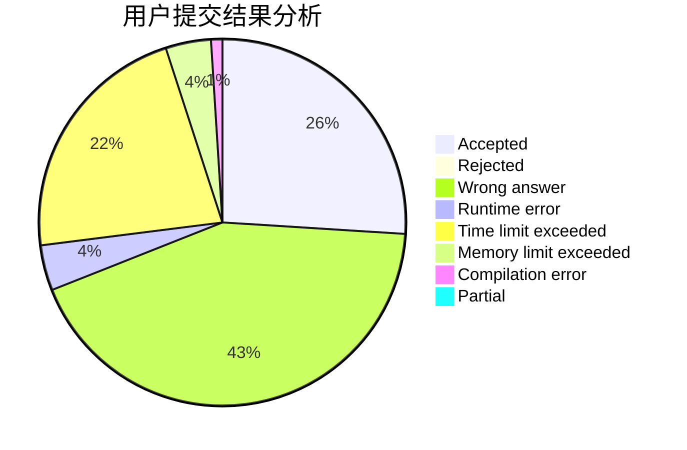
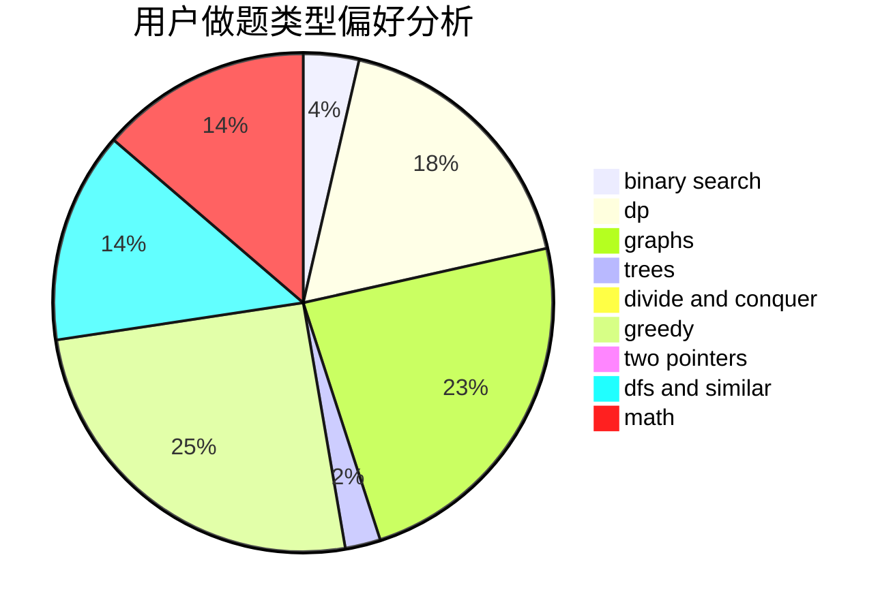

# Macaron_lin

<!-- tabs:start -->

#### **用户提交结果分析**

#### **用户做题类型偏好分析**

<!-- tabs:end -->
# 推荐题目
[1459E](https://codeforces.com/contest/1459/problem/E)
[883C](https://codeforces.com/contest/883/problem/C)
[220C](https://codeforces.com/contest/220/problem/C)
[908A](https://codeforces.com/contest/908/problem/A)
[1314D](https://codeforces.com/contest/1314/problem/D)
[181A](https://codeforces.com/contest/181/problem/A)
[356E](https://codeforces.com/contest/356/problem/E)
[106B](https://codeforces.com/contest/106/problem/B)
[1221F](https://codeforces.com/contest/1221/problem/F)
[1008A](https://codeforces.com/contest/1008/problem/A)
