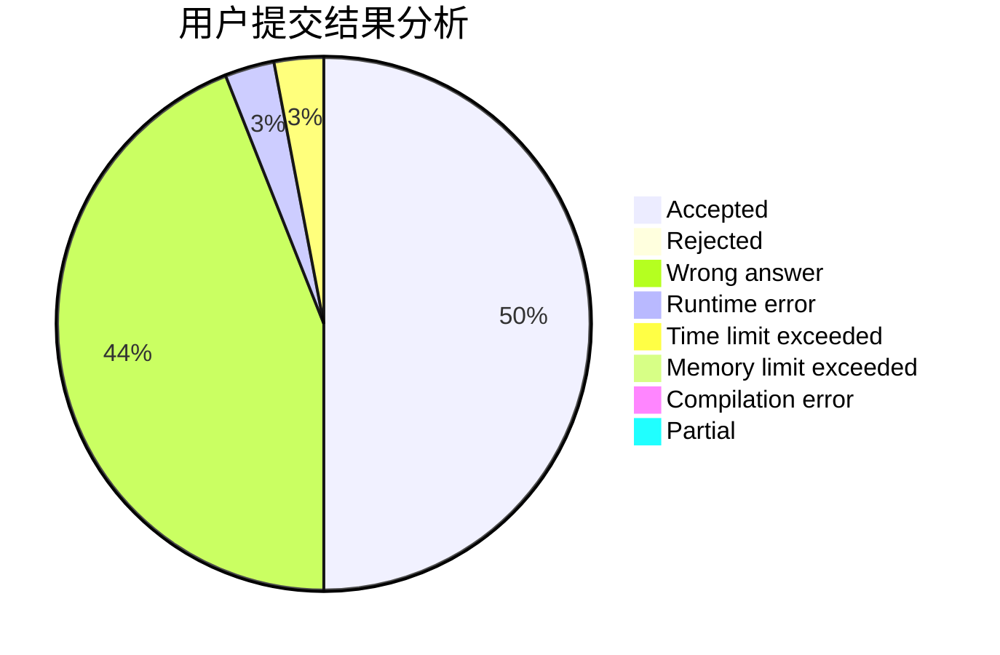
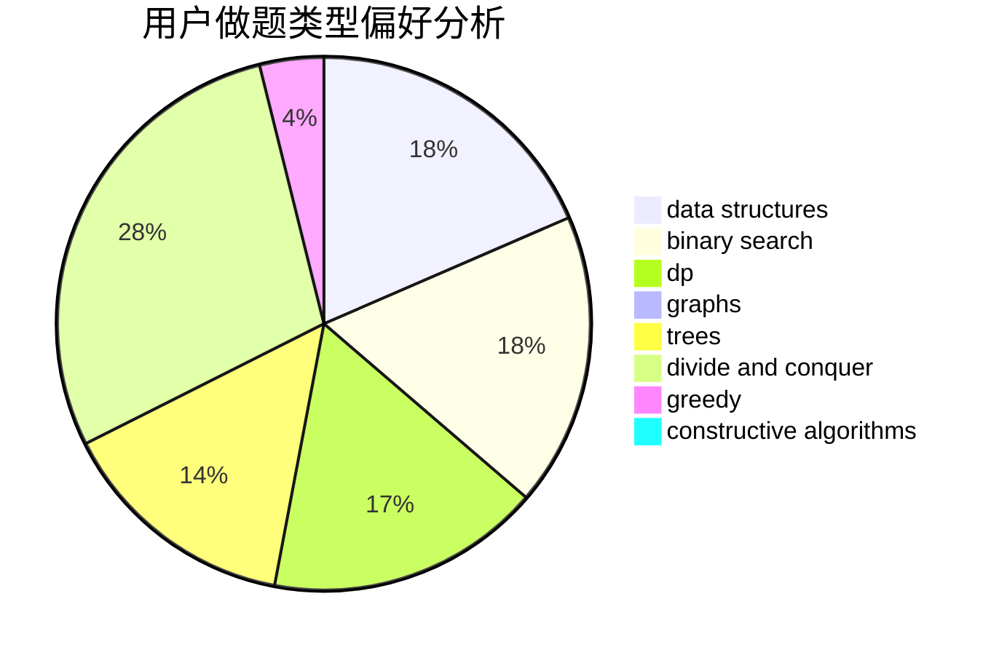
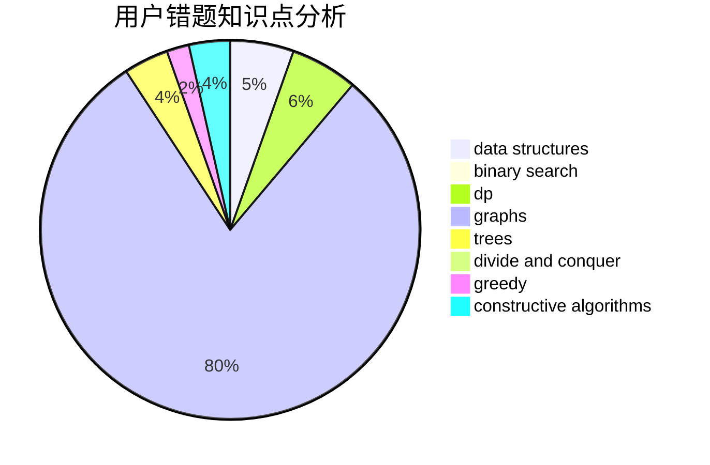

# Macesuted_AB

<!-- tabs:start -->

#### **用户提交结果分析**

#### **用户做题类型偏好分析**

#### **用户错题知识点分析**

<!-- tabs:end -->
# 推荐题目
[627E](https://codeforces.com/contest/627/problem/E)		two pointers		  
[569B](https://codeforces.com/contest/569/problem/B)		greedy,
                        math		  
[802N](https://codeforces.com/contest/802/problem/N)		binary search,
                        flows,
                        graphs		  
[139A](https://codeforces.com/contest/139/problem/A)		implementation		  
[1368F](https://codeforces.com/contest/1368/problem/F)		games,
                        implementation,
                        interactive,
                        math		  
[493D](https://codeforces.com/contest/493/problem/D)		constructive algorithms,
                        games,
                        math		  
[238A](https://codeforces.com/contest/238/problem/A)		constructive algorithms,
                        math		  
[323B](https://codeforces.com/contest/323/problem/B)		constructive algorithms,
                        graphs		  
[779D](https://codeforces.com/contest/779/problem/D)		dsu,graphs,sortings,trees		  
[1315D](https://codeforces.com/contest/1315/problem/D)		dsu,graphs,sortings,trees		  
