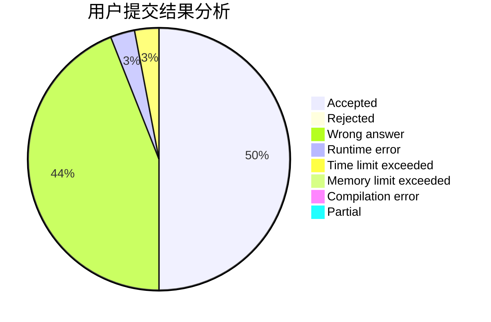
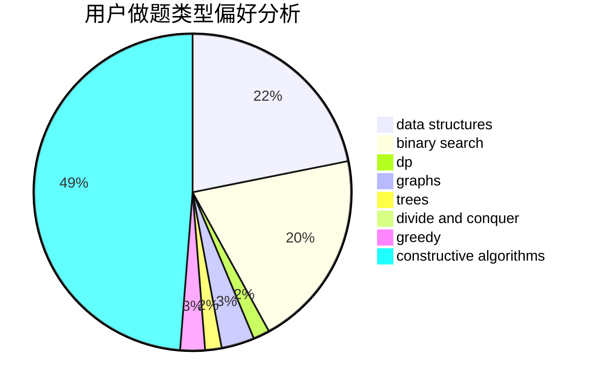

# Macesuted_AB

<!-- tabs:start -->

#### **用户提交结果分析**

#### **用户做题类型偏好分析**

#### **用户错题知识点分析**

<!-- tabs:end -->
# 推荐题目
[608D](https://codeforces.com/contest/608/problem/D)		dsu,graphs,sortings,trees		  
[544E](https://codeforces.com/contest/544/problem/E)		dsu,graphs,sortings,trees		  
[786C](https://codeforces.com/contest/786/problem/C)		data structures,
                        divide and conquer		  
[1391C](https://codeforces.com/contest/1391/problem/C)		combinatorics,
                        dp,
                        graphs,
                        math		  
[1360G](https://codeforces.com/contest/1360/problem/G)		constructive algorithms,
                        greedy,
                        math		  
[474E](https://codeforces.com/contest/474/problem/E)		binary search,
                        data structures,
                        dp,
                        sortings,
                        trees		  
[218D](https://codeforces.com/contest/218/problem/D)		dsu,graphs,sortings,trees		  
[303E](https://codeforces.com/contest/303/problem/E)		dp,
                        math,
                        probabilities		  
[75A](https://codeforces.com/contest/75/problem/A)		implementation		  
[1307C](https://codeforces.com/contest/1307/problem/C)		brute force,
                        dp,
                        math,
                        strings		  
