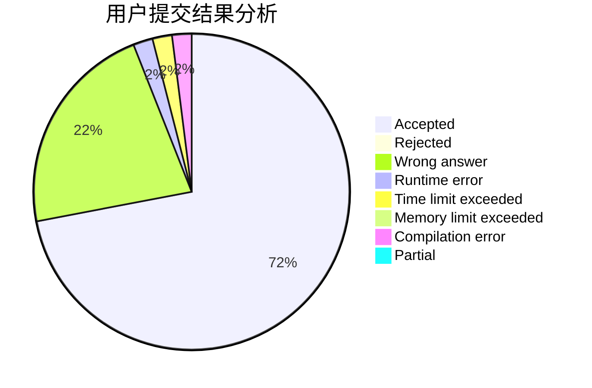
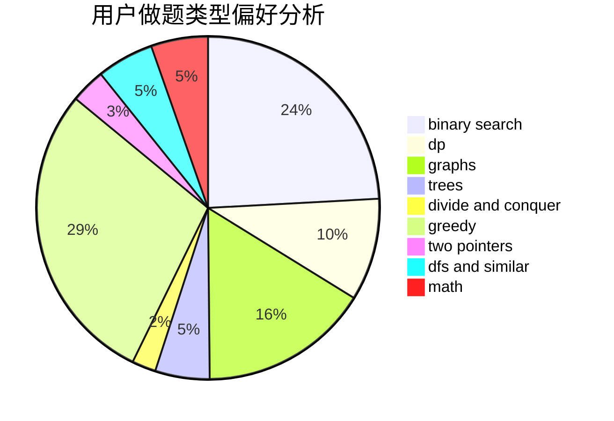

# MackereI_Pike

<!-- tabs:start -->

#### **用户提交结果分析**

#### **用户做题类型偏好分析**

<!-- tabs:end -->
# 推荐题目
[843A](https://codeforces.com/contest/843/problem/A)
[1509F](https://codeforces.com/contest/1509/problem/F)
[359C](https://codeforces.com/contest/359/problem/C)
[13352](https://codeforces.com/contest/1335/problem/2)
[449D](https://codeforces.com/contest/449/problem/D)
[788D](https://codeforces.com/contest/788/problem/D)
[150E](https://codeforces.com/contest/150/problem/E)
[854C](https://codeforces.com/contest/854/problem/C)
[1006A](https://codeforces.com/contest/1006/problem/A)
[1477F](https://codeforces.com/contest/1477/problem/F)
