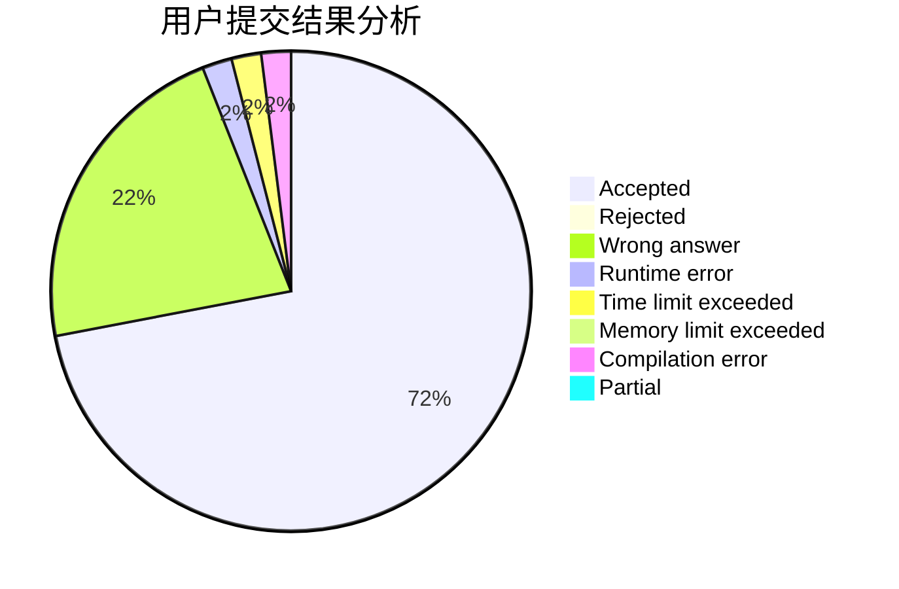
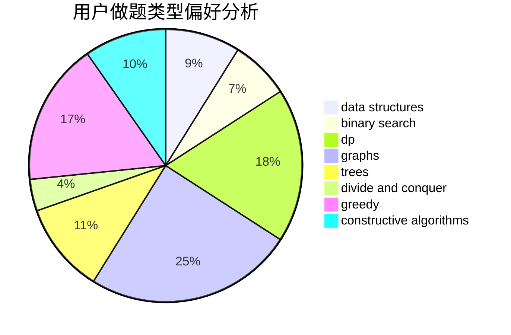
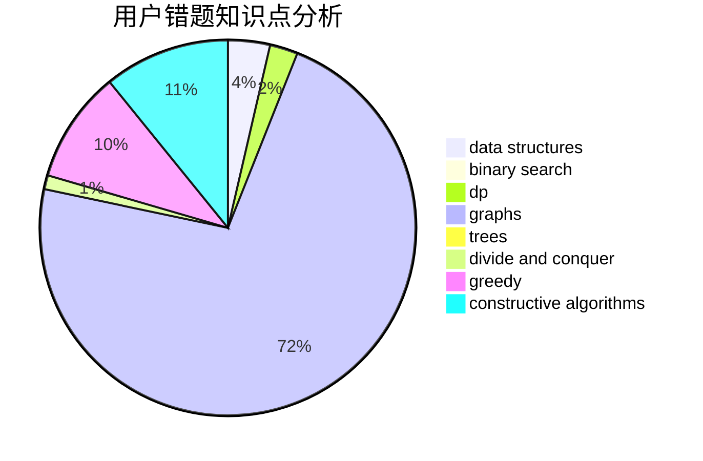

# MackereI_Pike

<!-- tabs:start -->

#### **用户提交结果分析**

#### **用户做题类型偏好分析**

#### **用户错题知识点分析**

<!-- tabs:end -->
# 推荐题目
[843A](https://codeforces.com/contest/843/problem/A)		dfs and similar,
                        dsu,
                        implementation,
                        math,
                        sortings		  
[1509F](https://codeforces.com/contest/1509/problem/F)		dsu,graphs,sortings,trees		  
[359C](https://codeforces.com/contest/359/problem/C)		math,
                        number theory		  
[13352](https://codeforces.com/contest/1335/problem/2)		dsu,graphs,sortings,trees		  
[449D](https://codeforces.com/contest/449/problem/D)		bitmasks,
                        combinatorics,
                        dp		  
[788D](https://codeforces.com/contest/788/problem/D)		constructive algorithms,
                        divide and conquer,
                        interactive		  
[150E](https://codeforces.com/contest/150/problem/E)		binary search,
                        data structures,
                        divide and conquer,
                        trees		  
[854C](https://codeforces.com/contest/854/problem/C)		dsu,graphs,sortings,trees		  
[1006A](https://codeforces.com/contest/1006/problem/A)		implementation		  
[1477F](https://codeforces.com/contest/1477/problem/F)		combinatorics,
                        fft,
                        math,
                        probabilities		  
