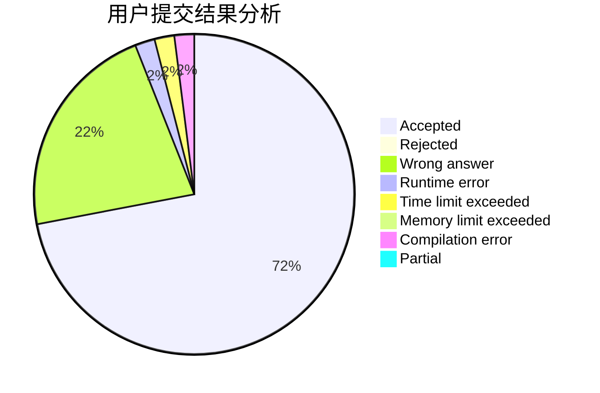
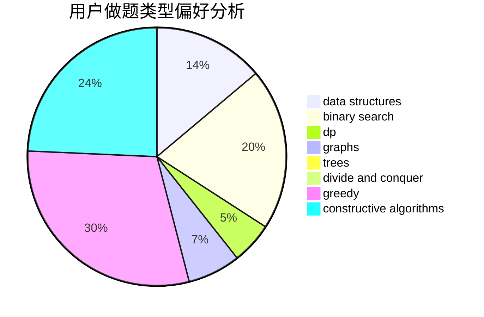
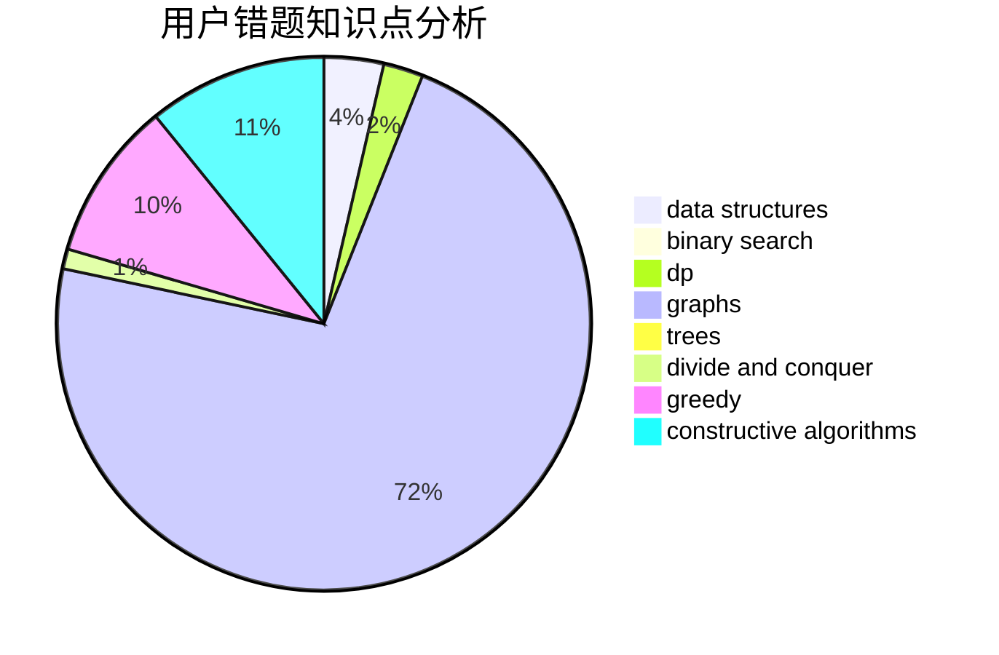

# MackereI_Pike

<!-- tabs:start -->

#### **用户提交结果分析**

#### **用户做题类型偏好分析**

#### **用户错题知识点分析**

<!-- tabs:end -->
# 推荐题目
[825A](https://codeforces.com/contest/825/problem/A)		implementation		  
[1499F](https://codeforces.com/contest/1499/problem/F)		combinatorics,
                        dfs and similar,
                        dp,
                        trees		  
[331C3](https://codeforces.com/contest/331C/problem/3)		dp		  
[1328F](https://codeforces.com/contest/1328/problem/F)		greedy		  
[426B](https://codeforces.com/contest/426/problem/B)		implementation		  
[768E](https://codeforces.com/contest/768/problem/E)		bitmasks,
                        dp,
                        games		  
[149D](https://codeforces.com/contest/149/problem/D)		dp		  
[837C](https://codeforces.com/contest/837/problem/C)		brute force,
                        implementation		  
[1005E1](https://codeforces.com/contest/1005E/problem/1)		sortings		  
[1469E](https://codeforces.com/contest/1469/problem/E)		bitmasks,
                        brute force,
                        hashing,
                        string suffix structures,
                        strings,
                        two pointers		  
