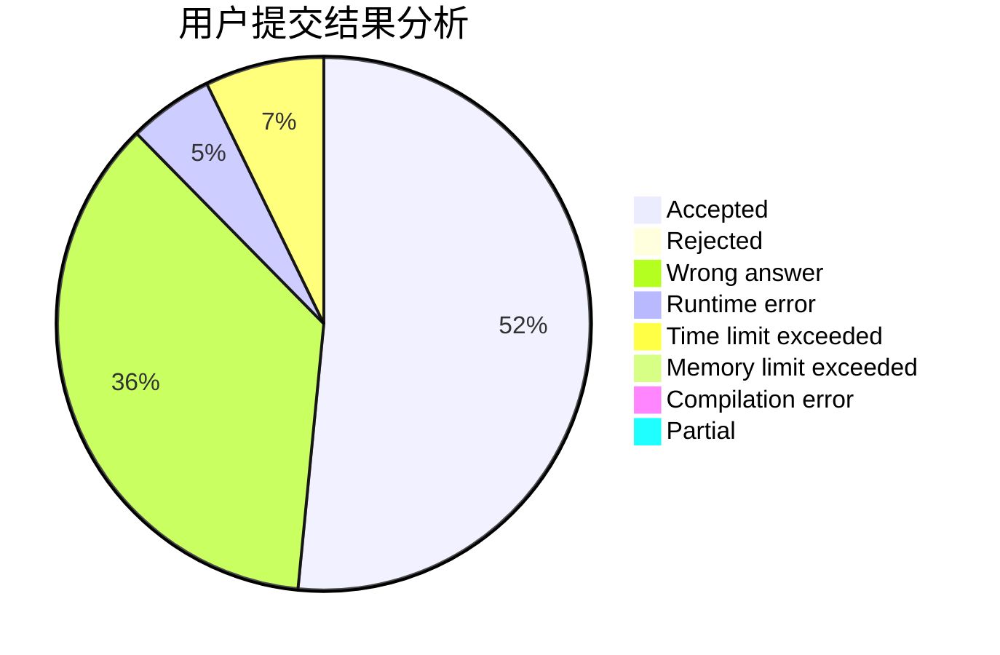
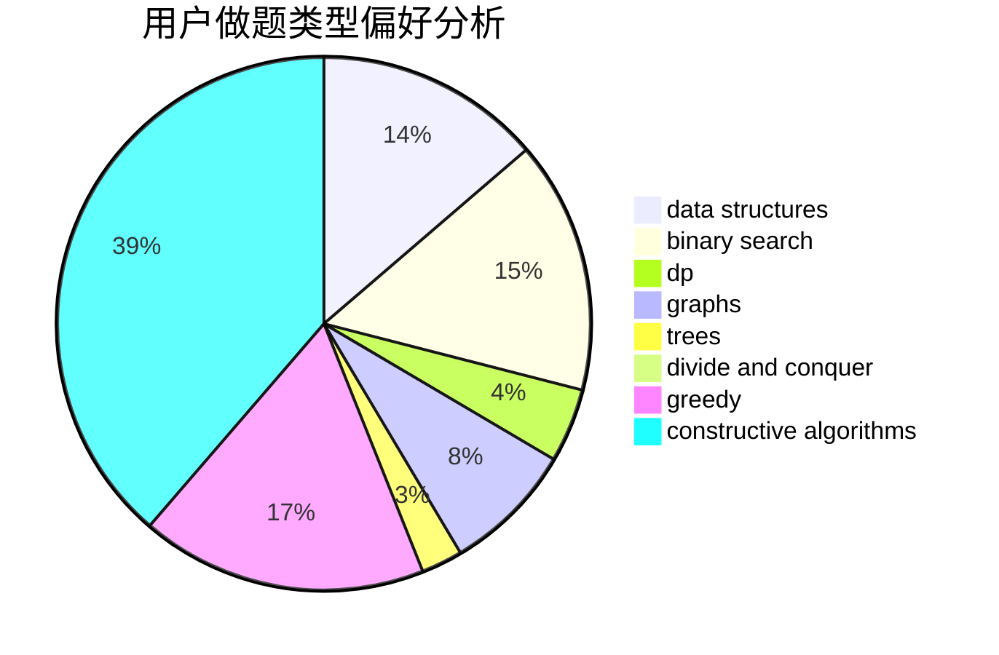
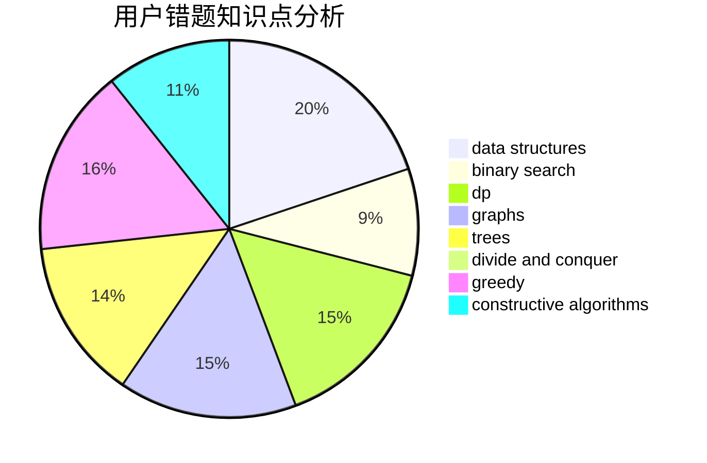

# 777777777Plus

<!-- tabs:start -->

#### **用户提交结果分析**

#### **用户做题类型偏好分析**

#### **用户错题知识点分析**

<!-- tabs:end -->
# 推荐题目
[1033D](https://codeforces.com/contest/1033/problem/D)		interactive,
                        math,
                        number theory		  
[1102B](https://codeforces.com/contest/1102/problem/B)		greedy,
                        sortings		  
[1424G](https://codeforces.com/contest/1424/problem/G)		data structures,
                        sortings		  
[1423I](https://codeforces.com/contest/1423/problem/I)		bitmasks		  
[1062E](https://codeforces.com/contest/1062/problem/E)		binary search,
                        data structures,
                        dfs and similar,
                        greedy,
                        trees		  
[1205E](https://codeforces.com/contest/1205/problem/E)		combinatorics,
                        strings		  
[1423F](https://codeforces.com/contest/1423/problem/F)		math		  
[1043A](https://codeforces.com/contest/1043/problem/A)		implementation,
                        math		  
[1349F2](https://codeforces.com/contest/1349F/problem/2)		dp,
                        fft,
                        math		  
[1385E](https://codeforces.com/contest/1385/problem/E)		constructive algorithms,
                        dfs and similar,
                        graphs		  
