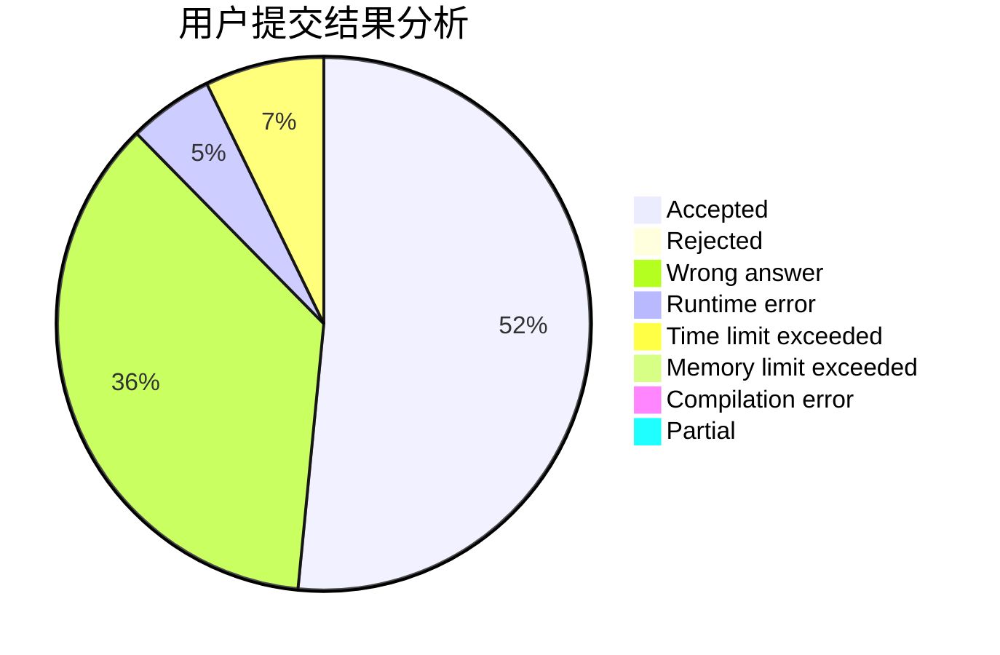
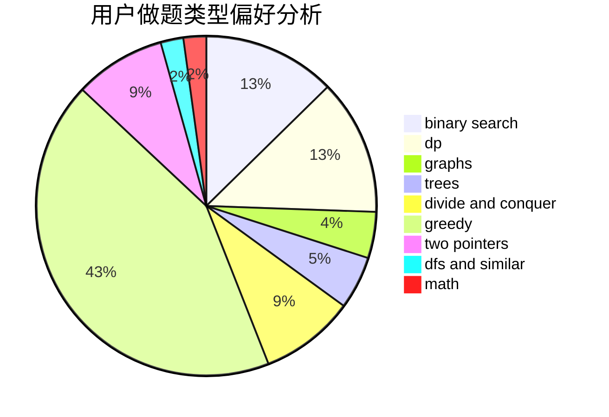

# 777777777Plus

<!-- tabs:start -->

#### **用户提交结果分析**

#### **用户做题类型偏好分析**

<!-- tabs:end -->
# 推荐题目
[1033G](https://codeforces.com/contest/1033/problem/G)
[1102E](https://codeforces.com/contest/1102/problem/E)
[1432F](https://codeforces.com/contest/1432/problem/F)
[1431D](https://codeforces.com/contest/1431/problem/D)
[1063B](https://codeforces.com/contest/1063/problem/B)
[120H](https://codeforces.com/contest/120/problem/H)
[1431A](https://codeforces.com/contest/1431/problem/A)
[1043D](https://codeforces.com/contest/1043/problem/D)
[13572](https://codeforces.com/contest/1357/problem/2)
[1395E](https://codeforces.com/contest/1395/problem/E)
