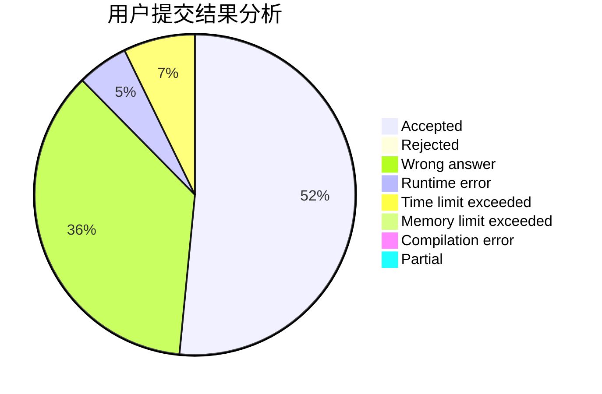
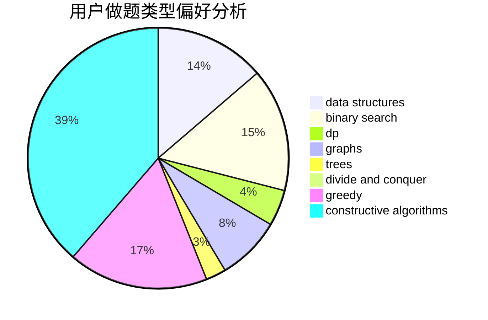
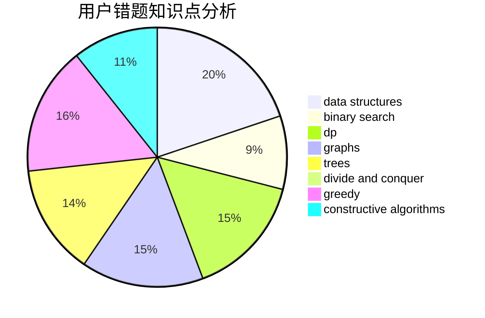

# 777777777Plus
<!-- tabs:start -->
#### **用户提交结果分析**

#### **用户做题类型偏好分析**

#### **用户错题知识点分析**

<!-- tabs:end -->
# 推荐题目
[Virus](http://codeforces.com/problemset/problem/1423/H)		data structures,
                        divide and conquer,
                        dsu,
                        graphs		  
[Vasya And The Mushrooms](http://codeforces.com/problemset/problem/1016/C)		dp,
                        implementation		  
[Swedish Heroes](http://codeforces.com/problemset/problem/1421/E)		brute force,
                        dp,
                        implementation		  
[Huawei Graph Mining Challenge](https://codeforces.com/contest/1378/problem/A3)		nan		  
[Lookup Tables](http://codeforces.com/problemset/problem/1423/I)		bitmasks		  
[Divisors](http://codeforces.com/problemset/problem/1033/D)		interactive,
                        math,
                        number theory		  
[Chemical table](https://codeforces.com/contest/1013/problem/D)		constructive algorithms,
                        dfs and similar,
                        dsu,
                        graphs,
                        matrices		  
[Dušan's Railway](http://codeforces.com/problemset/problem/1423/C)		divide and conquer,
                        graphs,
                        trees		  
[Sum Balance](https://codeforces.com/contest/1243/problem/E)		bitmasks,
                        dfs and similar,
                        dp,
                        graphs		  
[Elections](http://codeforces.com/problemset/problem/1043/A)		implementation,
                        math		  
<!-- tabs:start -->
#### **data structures**
[Virus](http://codeforces.com/problemset/problem/1423/H)		data structures,
                        divide and conquer,
                        dsu,
                        graphs		  
[Vasya And The Mushrooms](http://codeforces.com/problemset/problem/1062/E)		binary search,
                        data structures,
                        dfs and similar,
                        greedy,
                        trees		  
[Swedish Heroes](http://codeforces.com/problemset/problem/1423/G)		data structures		  
[Huawei Graph Mining Challenge](http://codeforces.com/problemset/problem/1424/G)		data structures,
                        sortings		  
[Lookup Tables](http://codeforces.com/problemset/problem/1422/F)		data structures,
                        math,
                        number theory		  
[Divisors](http://codeforces.com/problemset/problem/1217/E)		data structures,
                        greedy,
                        implementation,
                        math		  
[Chemical table](http://codeforces.com/problemset/problem/1492/C)		binary search,
                        data structures,
                        dp,
                        greedy,
                        two pointers		  
[Dušan's Railway](http://codeforces.com/problemset/problem/1490/G)		binary search,
                        data structures,
                        math		  
[Sum Balance](http://codeforces.com/problemset/problem/1479/D)		binary search,
                        bitmasks,
                        brute force,
                        data structures,
                        probabilities,
                        trees		  
[Elections](http://codeforces.com/problemset/problem/1497/A)		brute force,
                        data structures,
                        greedy,
                        sortings		  
#### **binary search**
[Virus](http://codeforces.com/problemset/problem/1062/E)		binary search,
                        data structures,
                        dfs and similar,
                        greedy,
                        trees		  
[Vasya And The Mushrooms](http://codeforces.com/problemset/problem/1315/B)		binary search,
                        dp,
                        greedy,
                        strings		  
[Swedish Heroes](https://codeforces.com/contest/1424/problem/J)		binary search,
                        math,
                        number theory,
                        two pointers		  
[Huawei Graph Mining Challenge](https://codeforces.com/contest/1424/problem/B)		binary search,
                        flows,
                        graph matchings,
                        graphs		  
[Lookup Tables](http://codeforces.com/problemset/problem/1423/B)		binary search,
                        flows,
                        graph matchings,
                        graphs		  
[Divisors](http://codeforces.com/problemset/problem/1423/K)		binary search,
                        math,
                        number theory,
                        two pointers		  
[Chemical table](http://codeforces.com/problemset/problem/1355/C)		binary search,
                        implementation,
                        math,
                        two pointers		  
[Dušan's Railway](http://codeforces.com/problemset/problem/1492/C)		binary search,
                        data structures,
                        dp,
                        greedy,
                        two pointers		  
[Sum Balance](http://codeforces.com/problemset/problem/1463/D)		binary search,
                        constructive algorithms,
                        greedy,
                        two pointers		  
[Elections](http://codeforces.com/problemset/problem/1490/G)		binary search,
                        data structures,
                        math		  
#### **dp**
[Virus](http://codeforces.com/problemset/problem/1016/C)		dp,
                        implementation		  
[Vasya And The Mushrooms](http://codeforces.com/problemset/problem/1421/E)		brute force,
                        dp,
                        implementation		  
[Swedish Heroes](https://codeforces.com/contest/1243/problem/E)		bitmasks,
                        dfs and similar,
                        dp,
                        graphs		  
[Huawei Graph Mining Challenge](http://codeforces.com/problemset/problem/1315/B)		binary search,
                        dp,
                        greedy,
                        strings		  
[Lookup Tables](http://codeforces.com/problemset/problem/1067/A)		dp		  
[Divisors](https://codeforces.com/contest/1424/problem/I)		bitmasks,
                        constructive algorithms,
                        dp,
                        math		  
[Chemical table](http://codeforces.com/problemset/problem/1349/F2)		dp,
                        fft,
                        math		  
[Dušan's Railway](http://codeforces.com/problemset/problem/1423/J)		bitmasks,
                        constructive algorithms,
                        dp,
                        math		  
[Sum Balance](http://codeforces.com/problemset/problem/1422/C)		combinatorics,
                        dp,
                        math		  
[Elections](http://codeforces.com/problemset/problem/1422/E)		dp,
                        greedy,
                        implementation,
                        strings		  
#### **graph**
[Virus](http://codeforces.com/problemset/problem/1423/H)		data structures,
                        divide and conquer,
                        dsu,
                        graphs		  
[Vasya And The Mushrooms](https://codeforces.com/contest/1013/problem/D)		constructive algorithms,
                        dfs and similar,
                        dsu,
                        graphs,
                        matrices		  
[Swedish Heroes](http://codeforces.com/problemset/problem/1423/C)		divide and conquer,
                        graphs,
                        trees		  
[Huawei Graph Mining Challenge](https://codeforces.com/contest/1243/problem/E)		bitmasks,
                        dfs and similar,
                        dp,
                        graphs		  
[Lookup Tables](http://codeforces.com/problemset/problem/1424/M)		graphs,
                        sortings		  
[Divisors](https://codeforces.com/contest/1424/problem/B)		binary search,
                        flows,
                        graph matchings,
                        graphs		  
[Chemical table](http://codeforces.com/problemset/problem/1385/E)		constructive algorithms,
                        dfs and similar,
                        graphs		  
[Dušan's Railway](http://codeforces.com/problemset/problem/1423/B)		binary search,
                        flows,
                        graph matchings,
                        graphs		  
[Sum Balance](http://codeforces.com/problemset/problem/1422/D)		graphs,
                        shortest paths,
                        sortings		  
[Elections](http://codeforces.com/problemset/problem/1487/C)		brute force,
                        constructive algorithms,
                        dfs and similar,
                        graphs,
                        greedy,
                        implementation,
                        math		  
#### **trees**
[Virus](http://codeforces.com/problemset/problem/1423/C)		divide and conquer,
                        graphs,
                        trees		  
[Vasya And The Mushrooms](http://codeforces.com/problemset/problem/1062/E)		binary search,
                        data structures,
                        dfs and similar,
                        greedy,
                        trees		  
[Swedish Heroes](http://codeforces.com/problemset/problem/1479/D)		binary search,
                        bitmasks,
                        brute force,
                        data structures,
                        probabilities,
                        trees		  
[Huawei Graph Mining Challenge](http://codeforces.com/problemset/problem/1511/C)		brute force,
                        data structures,
                        implementation,
                        trees		  
[Lookup Tables](http://codeforces.com/problemset/problem/1499/F)		combinatorics,
                        dfs and similar,
                        dp,
                        trees		  
[Divisors](http://codeforces.com/problemset/problem/1491/E)		brute force,
                        dfs and similar,
                        divide and conquer,
                        number theory,
                        trees		  
[Chemical table](http://codeforces.com/problemset/problem/1466/D)		data structures,
                        greedy,
                        sortings,
                        trees		  
[Dušan's Railway](http://codeforces.com/problemset/problem/1495/D)		combinatorics,
                        dfs and similar,
                        graphs,
                        math,
                        shortest paths,
                        trees		  
[Sum Balance](http://codeforces.com/problemset/problem/1303/G)		data structures,
                        divide and conquer,
                        geometry,
                        trees		  
[Elections](http://codeforces.com/problemset/problem/1454/E)		combinatorics,
                        dfs and similar,
                        graphs,
                        trees		  
#### **divide and conquer**
[Virus](http://codeforces.com/problemset/problem/1423/H)		data structures,
                        divide and conquer,
                        dsu,
                        graphs		  
[Vasya And The Mushrooms](http://codeforces.com/problemset/problem/1423/C)		divide and conquer,
                        graphs,
                        trees		  
[Swedish Heroes](http://codeforces.com/problemset/problem/1461/D)		binary search,
                        brute force,
                        data structures,
                        divide and conquer,
                        implementation,
                        sortings		  
[Huawei Graph Mining Challenge](http://codeforces.com/problemset/problem/1466/G)		combinatorics,
                        divide and conquer,
                        hashing,
                        math,
                        string suffix structures,
                        strings		  
[Lookup Tables](http://codeforces.com/problemset/problem/1490/D)		dfs and similar,
                        divide and conquer,
                        implementation		  
[Divisors](https://codeforces.com/contest/1483/problem/C)		data structures,
                        divide and conquer,
                        dp		  
[Chemical table](http://codeforces.com/problemset/problem/1491/E)		brute force,
                        dfs and similar,
                        divide and conquer,
                        number theory,
                        trees		  
[Dušan's Railway](http://codeforces.com/problemset/problem/1303/G)		data structures,
                        divide and conquer,
                        geometry,
                        trees		  
[Sum Balance](http://codeforces.com/problemset/problem/1494/D)		constructive algorithms,
                        data structures,
                        dfs and similar,
                        divide and conquer,
                        dsu,
                        greedy,
                        sortings,
                        trees		  
[Elections](http://codeforces.com/problemset/problem/1482/E)		data structures,
                        divide and conquer,
                        dp		  
#### **greedy**
[Virus](http://codeforces.com/problemset/problem/1062/E)		binary search,
                        data structures,
                        dfs and similar,
                        greedy,
                        trees		  
[Vasya And The Mushrooms](http://codeforces.com/problemset/problem/1315/B)		binary search,
                        dp,
                        greedy,
                        strings		  
[Swedish Heroes](http://codeforces.com/problemset/problem/1102/B)		greedy,
                        sortings		  
[Huawei Graph Mining Challenge](http://codeforces.com/problemset/problem/1422/B)		greedy,
                        implementation,
                        math		  
[Lookup Tables](http://codeforces.com/problemset/problem/1217/E)		data structures,
                        greedy,
                        implementation,
                        math		  
[Divisors](http://codeforces.com/problemset/problem/1361/B)		greedy,
                        implementation,
                        math,
                        sortings		  
[Chemical table](http://codeforces.com/problemset/problem/1422/E)		dp,
                        greedy,
                        implementation,
                        strings		  
[Dušan's Railway](http://codeforces.com/problemset/problem/1492/C)		binary search,
                        data structures,
                        dp,
                        greedy,
                        two pointers		  
[Sum Balance](https://codeforces.com/contest/1496/problem/C)		geometry,
                        greedy,
                        math,
                        sortings		  
[Elections](http://codeforces.com/problemset/problem/1493/A)		constructive algorithms,
                        greedy		  
#### **constructive algorithms**
[Virus](https://codeforces.com/contest/1013/problem/D)		constructive algorithms,
                        dfs and similar,
                        dsu,
                        graphs,
                        matrices		  
[Vasya And The Mushrooms](https://codeforces.com/contest/1424/problem/I)		bitmasks,
                        constructive algorithms,
                        dp,
                        math		  
[Swedish Heroes](http://codeforces.com/problemset/problem/1023/E)		constructive algorithms,
                        interactive,
                        matrices		  
[Huawei Graph Mining Challenge](http://codeforces.com/problemset/problem/1423/J)		bitmasks,
                        constructive algorithms,
                        dp,
                        math		  
[Lookup Tables](http://codeforces.com/problemset/problem/1385/E)		constructive algorithms,
                        dfs and similar,
                        graphs		  
[Divisors](http://codeforces.com/problemset/problem/1493/A)		constructive algorithms,
                        greedy		  
[Chemical table](http://codeforces.com/problemset/problem/1463/D)		binary search,
                        constructive algorithms,
                        greedy,
                        two pointers		  
[Dušan's Railway](https://codeforces.com/contest/1456/problem/B)		bitmasks,
                        brute force,
                        constructive algorithms		  
[Sum Balance](http://codeforces.com/problemset/problem/1492/D)		bitmasks,
                        constructive algorithms,
                        greedy,
                        math		  
[Elections](https://codeforces.com/contest/1504/problem/D)		constructive algorithms,
                        games,
                        interactive		  
#### **sortings**
[Virus](http://codeforces.com/problemset/problem/1424/M)		graphs,
                        sortings		  
[Vasya And The Mushrooms](http://codeforces.com/problemset/problem/1424/G)		data structures,
                        sortings		  
[Swedish Heroes](http://codeforces.com/problemset/problem/1102/B)		greedy,
                        sortings		  
[Huawei Graph Mining Challenge](http://codeforces.com/problemset/problem/1361/B)		greedy,
                        implementation,
                        math,
                        sortings		  
[Lookup Tables](http://codeforces.com/problemset/problem/1422/D)		graphs,
                        shortest paths,
                        sortings		  
[Divisors](https://codeforces.com/contest/1496/problem/C)		geometry,
                        greedy,
                        math,
                        sortings		  
[Chemical table](http://codeforces.com/problemset/problem/1495/A)		geometry,
                        greedy,
                        math,
                        sortings		  
[Dušan's Railway](http://codeforces.com/problemset/problem/1497/A)		brute force,
                        data structures,
                        greedy,
                        sortings		  
[Sum Balance](http://codeforces.com/problemset/problem/1427/A)		math,
                        sortings		  
[Elections](http://codeforces.com/problemset/problem/1461/D)		binary search,
                        brute force,
                        data structures,
                        divide and conquer,
                        implementation,
                        sortings		  
<!-- tabs:end -->
