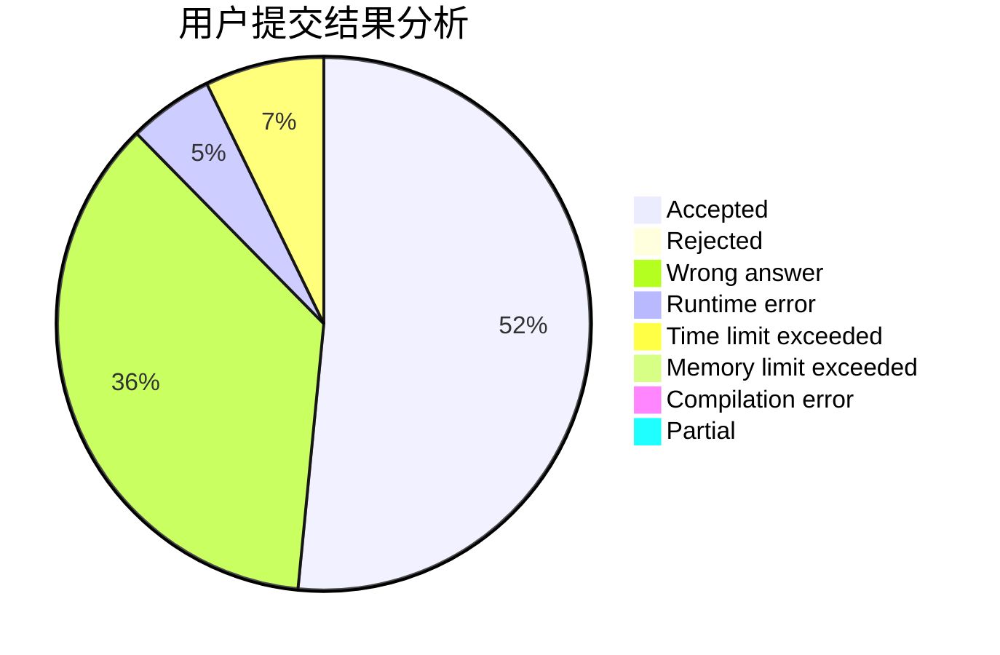
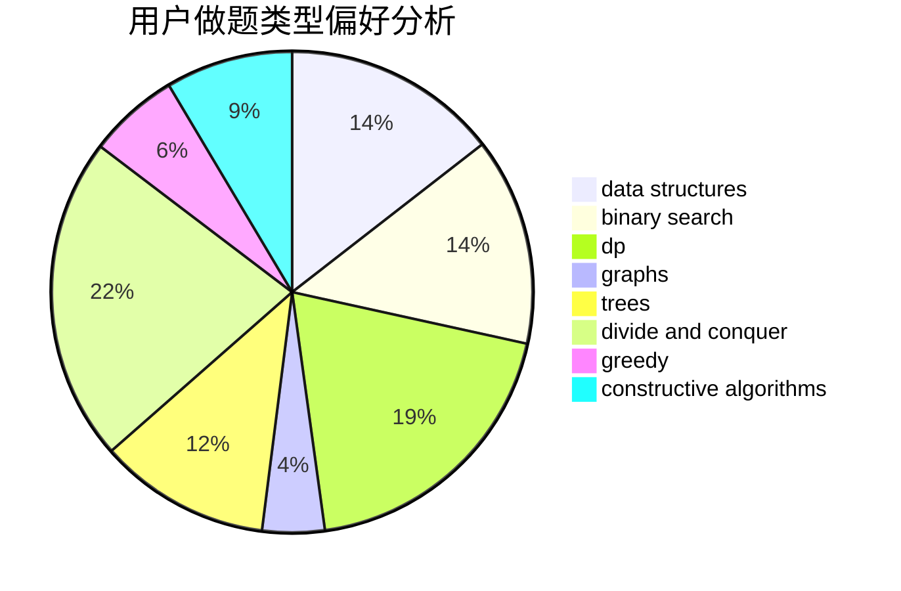
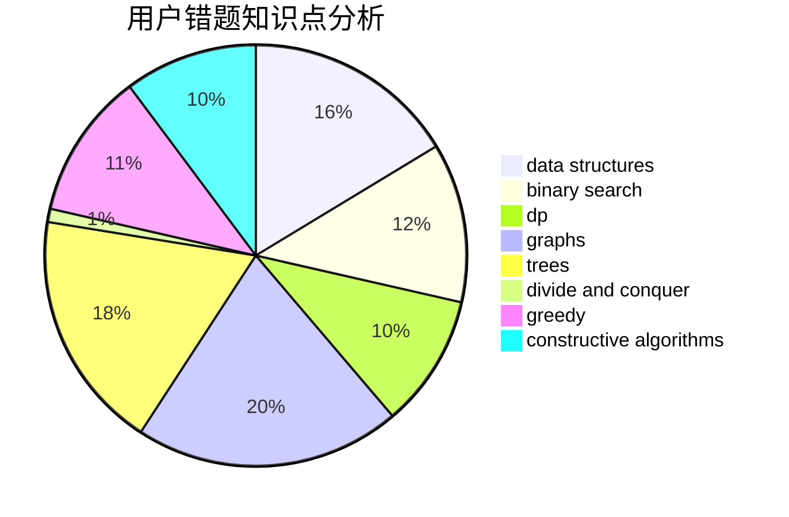

# 777777777Plus

<!-- tabs:start -->

#### **用户提交结果分析**

#### **用户做题类型偏好分析**

#### **用户错题知识点分析**

<!-- tabs:end -->
# 推荐题目
[1033G](https://codeforces.com/contest/1033/problem/G)		games		  
[1102E](https://codeforces.com/contest/1102/problem/E)		combinatorics,
                        sortings		  
[1432F](https://codeforces.com/contest/1432/problem/F)		dsu,graphs,sortings,trees		  
[1431D](https://codeforces.com/contest/1431/problem/D)		*special problem,
                        greedy		  
[1063B](https://codeforces.com/contest/1063/problem/B)		graphs,
                        shortest paths		  
[120H](https://codeforces.com/contest/120/problem/H)		graph matchings		  
[1431A](https://codeforces.com/contest/1431/problem/A)		*special problem		  
[1043D](https://codeforces.com/contest/1043/problem/D)		brute force,
                        combinatorics,
                        math,
                        meet-in-the-middle,
                        two pointers		  
[13572](https://codeforces.com/contest/1357/problem/2)		dsu,graphs,sortings,trees		  
[1395E](https://codeforces.com/contest/1395/problem/E)		dsu,graphs,sortings,trees		  
