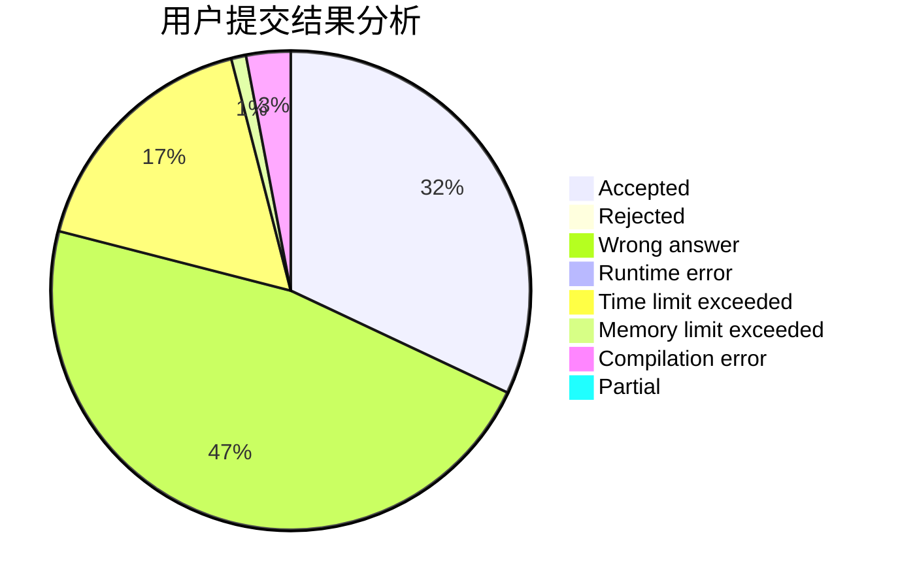
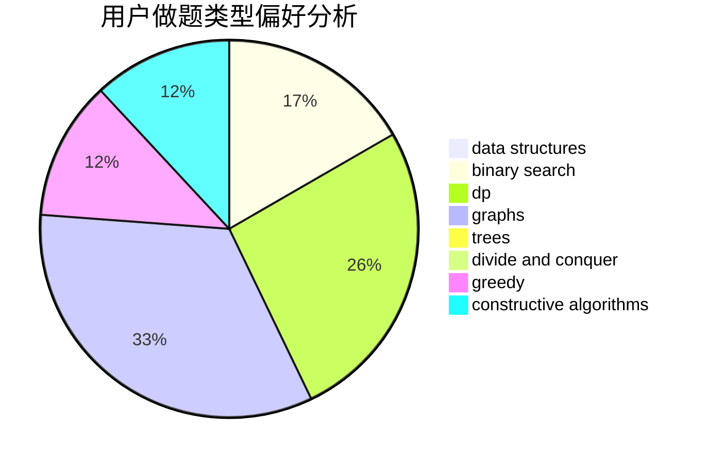
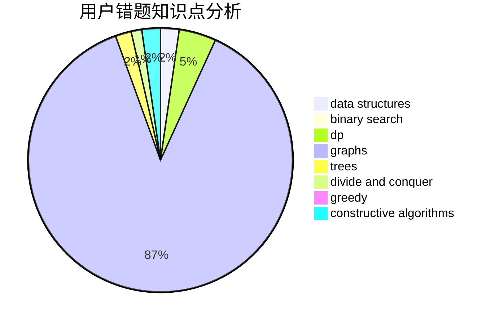

# Mackerel_Pike

<!-- tabs:start -->

#### **用户提交结果分析**

#### **用户做题类型偏好分析**

#### **用户错题知识点分析**

<!-- tabs:end -->
# 推荐题目
[808A](https://codeforces.com/contest/808/problem/A)		implementation		  
[755D](https://codeforces.com/contest/755/problem/D)		data structures		  
[1180C](https://codeforces.com/contest/1180/problem/C)		dsu,graphs,sortings,trees		  
[758F](https://codeforces.com/contest/758/problem/F)		brute force,
                        math,
                        number theory		  
[697C](https://codeforces.com/contest/697/problem/C)		dsu,graphs,sortings,trees		  
[356B](https://codeforces.com/contest/356/problem/B)		implementation,
                        math		  
[175B](https://codeforces.com/contest/175/problem/B)		implementation		  
[712E](https://codeforces.com/contest/712/problem/E)		data structures,
                        math,
                        probabilities		  
[171D](https://codeforces.com/contest/171/problem/D)		*special problem,
                        brute force		  
[746D](https://codeforces.com/contest/746/problem/D)		constructive algorithms,
                        greedy,
                        math		  
