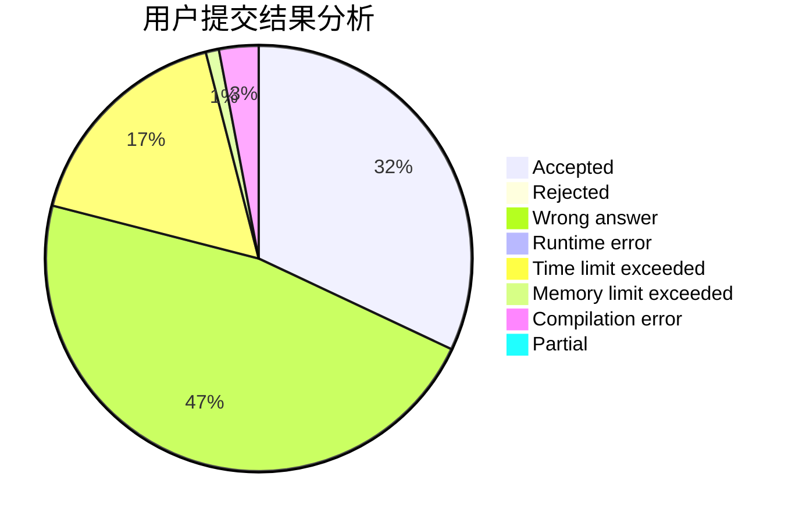
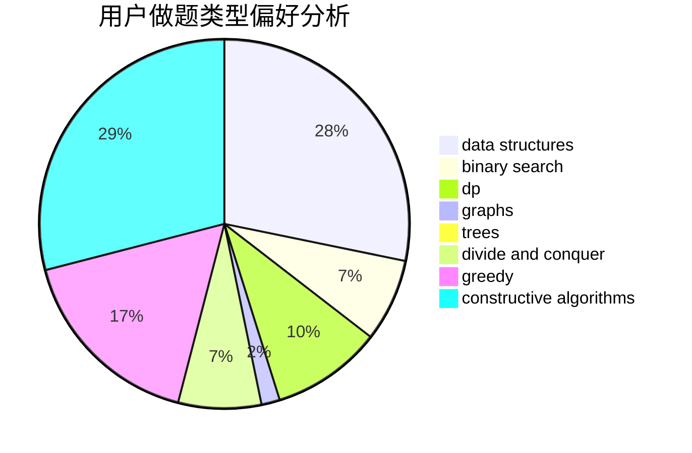

# Mackerel_Pike

<!-- tabs:start -->

#### **用户提交结果分析**

#### **用户做题类型偏好分析**

#### **用户错题知识点分析**

<!-- tabs:end -->
# 推荐题目
[792B](https://codeforces.com/contest/792/problem/B)		implementation		  
[734E](https://codeforces.com/contest/734/problem/E)		dfs and similar,
                        dp,
                        trees		  
[1178D](https://codeforces.com/contest/1178/problem/D)		constructive algorithms,
                        greedy,
                        math,
                        number theory		  
[737B](https://codeforces.com/contest/737/problem/B)		dsu,graphs,sortings,trees		  
[671D](https://codeforces.com/contest/671/problem/D)		data structures,
                        dp,
                        greedy		  
[327A](https://codeforces.com/contest/327/problem/A)		brute force,
                        dp,
                        implementation		  
[152E](https://codeforces.com/contest/152/problem/E)		bitmasks,
                        dp,
                        graphs,
                        trees		  
[696B](https://codeforces.com/contest/696/problem/B)		dfs and similar,
                        math,
                        probabilities,
                        trees		  
[1512D](https://codeforces.com/contest/1512/problem/D)		constructive algorithms,
                        data structures,
                        greedy		  
[729D](https://codeforces.com/contest/729/problem/D)		constructive algorithms,
                        greedy,
                        math		  
