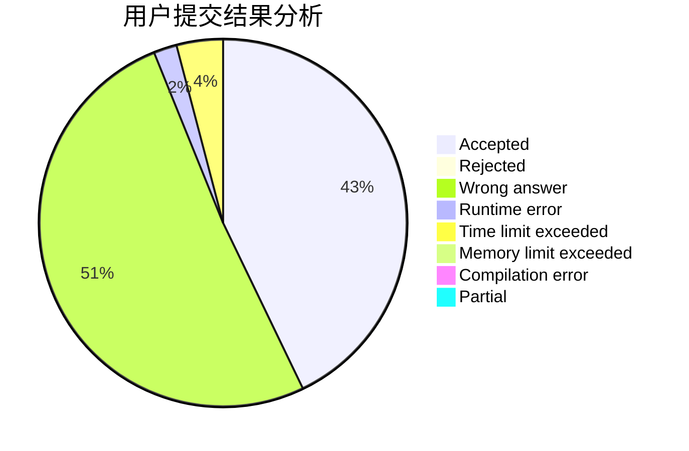
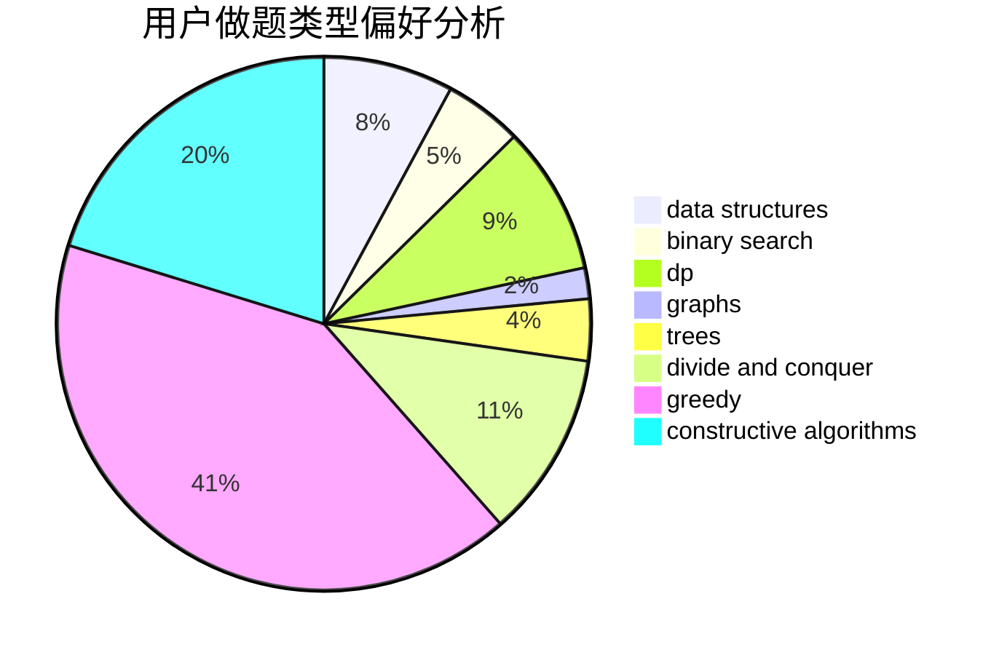
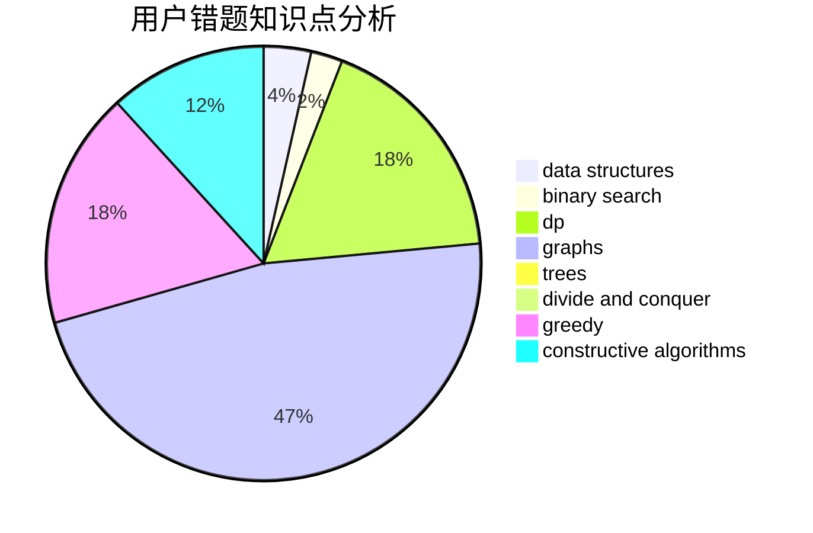

# Madeleine

<!-- tabs:start -->

#### **用户提交结果分析**

#### **用户做题类型偏好分析**

#### **用户错题知识点分析**

<!-- tabs:end -->
# 推荐题目
[1307D](https://codeforces.com/contest/1307/problem/D)		binary search,
                        data structures,
                        dfs and similar,
                        graphs,
                        greedy,
                        shortest paths,
                        sortings		  
[1175C](https://codeforces.com/contest/1175/problem/C)		binary search,
                        brute force,
                        greedy		  
[1061B](https://codeforces.com/contest/1061/problem/B)		greedy,
                        implementation,
                        sortings		  
[734A](https://codeforces.com/contest/734/problem/A)		implementation,
                        strings		  
[1417B](https://codeforces.com/contest/1417/problem/B)		greedy,
                        math,
                        sortings		  
[630F](https://codeforces.com/contest/630/problem/F)		combinatorics,
                        math		  
[754D](https://codeforces.com/contest/754/problem/D)		binary search,
                        data structures,
                        greedy,
                        sortings		  
[884B](https://codeforces.com/contest/884/problem/B)		implementation		  
[570E](https://codeforces.com/contest/570/problem/E)		combinatorics,
                        dp		  
[1030G](https://codeforces.com/contest/1030/problem/G)		number theory		  
