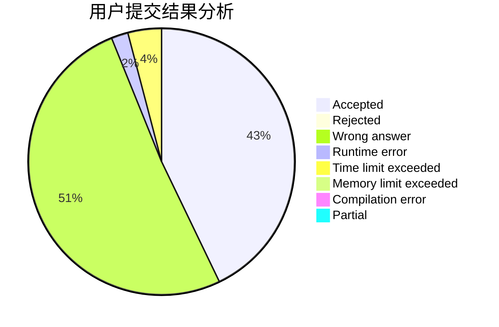
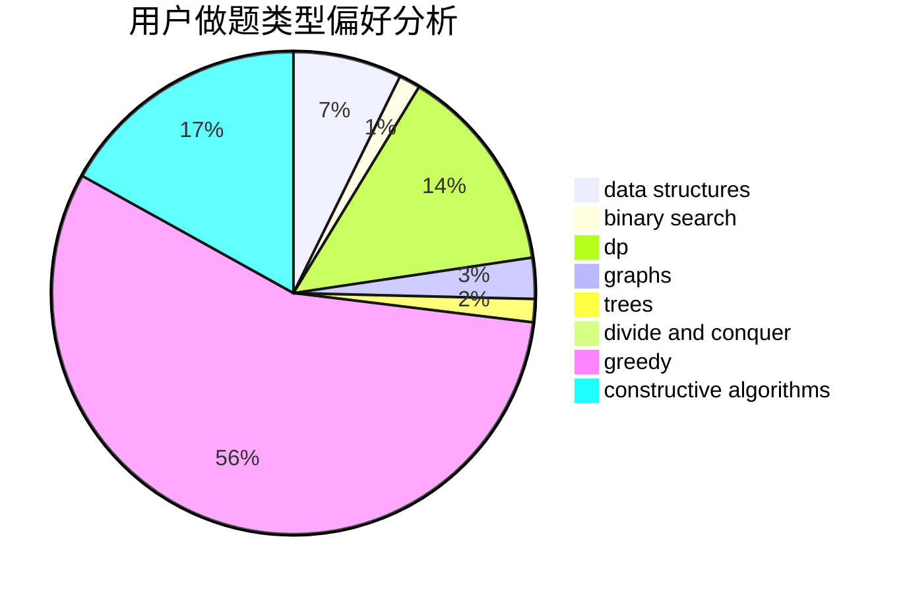
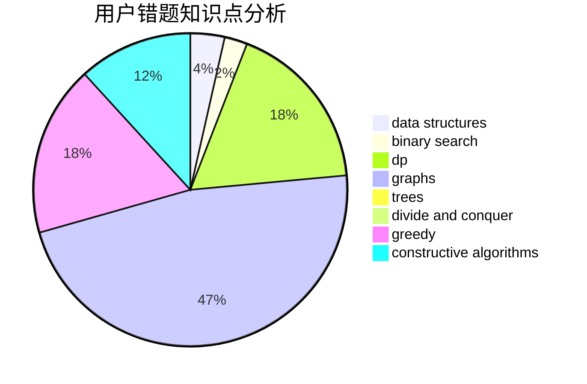

# Madeleine

<!-- tabs:start -->

#### **用户提交结果分析**

#### **用户做题类型偏好分析**

#### **用户错题知识点分析**

<!-- tabs:end -->
# 推荐题目
[1315F](https://codeforces.com/contest/1315/problem/F)		dsu,graphs,sortings,trees		  
[1178C](https://codeforces.com/contest/1178/problem/C)		combinatorics,
                        greedy,
                        math		  
[1061F](https://codeforces.com/contest/1061/problem/F)		interactive,
                        probabilities		  
[754C](https://codeforces.com/contest/754/problem/C)		brute force,
                        constructive algorithms,
                        dp,
                        implementation,
                        strings		  
[1424J](https://codeforces.com/contest/1424/problem/J)		dsu,graphs,sortings,trees		  
[660B](https://codeforces.com/contest/660/problem/B)		implementation		  
[772E](https://codeforces.com/contest/772/problem/E)		binary search,
                        divide and conquer,
                        interactive,
                        trees		  
[902C](https://codeforces.com/contest/902/problem/C)		dsu,graphs,sortings,trees		  
[591B](https://codeforces.com/contest/591/problem/B)		implementation,
                        strings		  
[1031C](https://codeforces.com/contest/1031/problem/C)		greedy		  
