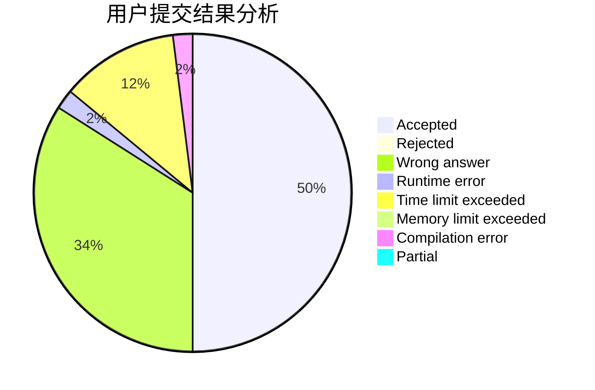
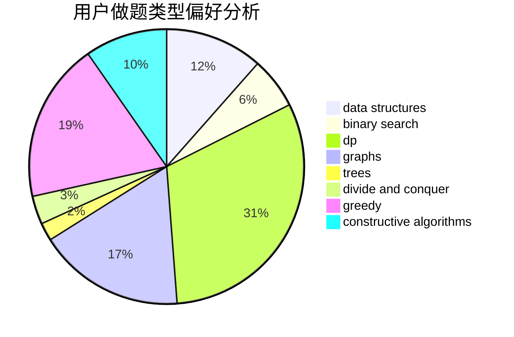
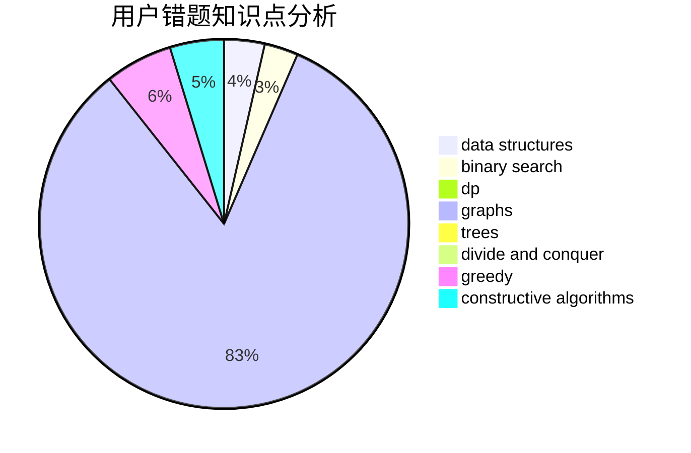

# Mamika_SplashFlare
<!-- tabs:start -->
#### **用户提交结果分析**

#### **用户做题类型偏好分析**

#### **用户错题知识点分析**

<!-- tabs:end -->
# 推荐题目
[Ebony and Ivory](http://codeforces.com/problemset/problem/633/A)		brute force,
                        math,
                        number theory		  
[Mike and Cellphone](http://codeforces.com/problemset/problem/689/A)		brute force,
                        constructive algorithms,
                        implementation		  
[Queries for Number of Palindromes](http://codeforces.com/problemset/problem/245/H)		dp,
                        hashing,
                        strings		  
[The Game Of Parity](http://codeforces.com/problemset/problem/549/C)		games		  
[The Best Vacation](http://codeforces.com/problemset/problem/1358/D)		binary search,
                        brute force,
                        greedy,
                        implementation,
                        two pointers		  
[Encryption (medium)](http://codeforces.com/problemset/problem/958/C2)		dp		  
[Where do I Turn?](http://codeforces.com/problemset/problem/227/A)		geometry		  
[String Compression](http://codeforces.com/problemset/problem/825/F)		dp,
                        hashing,
                        string suffix structures,
                        strings		  
[Wi-Fi](http://codeforces.com/problemset/problem/1216/F)		data structures,
                        dp,
                        greedy		  
[ZgukistringZ](http://codeforces.com/problemset/problem/551/B)		brute force,
                        constructive algorithms,
                        implementation,
                        strings		  
<!-- tabs:start -->
#### **data structures**
[Ebony and Ivory](http://codeforces.com/problemset/problem/1216/F)		data structures,
                        dp,
                        greedy		  
[Mike and Cellphone](http://codeforces.com/problemset/problem/958/B2)		data structures,
                        dfs and similar,
                        graphs,
                        greedy,
                        trees		  
[Queries for Number of Palindromes](http://codeforces.com/problemset/problem/653/F)		data structures,
                        string suffix structures,
                        strings		  
[The Game Of Parity](https://codeforces.com/contest/1053/problem/C)		data structures		  
[The Best Vacation](http://codeforces.com/problemset/problem/1263/F)		data structures,
                        dfs and similar,
                        dp,
                        flows,
                        graphs,
                        trees		  
[Encryption (medium)](http://codeforces.com/problemset/problem/958/C3)		data structures,
                        dp		  
[Where do I Turn?](http://codeforces.com/problemset/problem/827/F)		data structures,
                        dp,
                        graphs,
                        shortest paths		  
[String Compression](http://codeforces.com/problemset/problem/1202/C)		brute force,
                        data structures,
                        dp,
                        greedy,
                        implementation,
                        math,
                        strings		  
[Wi-Fi](http://codeforces.com/problemset/problem/319/B)		data structures,
                        implementation		  
[ZgukistringZ](http://codeforces.com/problemset/problem/1155/D)		brute force,
                        data structures,
                        divide and conquer,
                        dp,
                        greedy		  
#### **binary search**
[Ebony and Ivory](http://codeforces.com/problemset/problem/1358/D)		binary search,
                        brute force,
                        greedy,
                        implementation,
                        two pointers		  
[Mike and Cellphone](http://codeforces.com/problemset/problem/802/N)		binary search,
                        flows,
                        graphs		  
[Queries for Number of Palindromes](http://codeforces.com/problemset/problem/1488/C)		*special problem,
                        binary search,
                        brute force,
                        math		  
[The Game Of Parity](http://codeforces.com/problemset/problem/817/C)		binary search,
                        brute force,
                        dp,
                        math		  
[The Best Vacation](http://codeforces.com/problemset/problem/896/A)		binary search,
                        dfs and similar		  
[Encryption (medium)](http://codeforces.com/problemset/problem/1492/C)		binary search,
                        data structures,
                        dp,
                        greedy,
                        two pointers		  
[Where do I Turn?](http://codeforces.com/problemset/problem/1463/D)		binary search,
                        constructive algorithms,
                        greedy,
                        two pointers		  
[String Compression](http://codeforces.com/problemset/problem/1490/G)		binary search,
                        data structures,
                        math		  
[Wi-Fi](http://codeforces.com/problemset/problem/1479/D)		binary search,
                        bitmasks,
                        brute force,
                        data structures,
                        probabilities,
                        trees		  
[ZgukistringZ](http://codeforces.com/problemset/problem/1436/E)		binary search,
                        data structures,
                        two pointers		  
#### **dp**
[Ebony and Ivory](http://codeforces.com/problemset/problem/245/H)		dp,
                        hashing,
                        strings		  
[Mike and Cellphone](http://codeforces.com/problemset/problem/958/C2)		dp		  
[Queries for Number of Palindromes](http://codeforces.com/problemset/problem/825/F)		dp,
                        hashing,
                        string suffix structures,
                        strings		  
[The Game Of Parity](http://codeforces.com/problemset/problem/1216/F)		data structures,
                        dp,
                        greedy		  
[The Best Vacation](http://codeforces.com/problemset/problem/1407/E)		constructive algorithms,
                        dfs and similar,
                        dp,
                        graphs,
                        greedy,
                        shortest paths		  
[Encryption (medium)](http://codeforces.com/problemset/problem/1263/F)		data structures,
                        dfs and similar,
                        dp,
                        flows,
                        graphs,
                        trees		  
[Where do I Turn?](http://codeforces.com/problemset/problem/958/C3)		data structures,
                        dp		  
[String Compression](http://codeforces.com/problemset/problem/827/F)		data structures,
                        dp,
                        graphs,
                        shortest paths		  
[Wi-Fi](http://codeforces.com/problemset/problem/1202/C)		brute force,
                        data structures,
                        dp,
                        greedy,
                        implementation,
                        math,
                        strings		  
[ZgukistringZ](https://codeforces.com/contest/116/problem/C)		bitmasks,
                        brute force,
                        dp,
                        graphs		  
#### **graph**
[Ebony and Ivory](http://codeforces.com/problemset/problem/802/N)		binary search,
                        flows,
                        graphs		  
[Mike and Cellphone](http://codeforces.com/problemset/problem/958/B2)		data structures,
                        dfs and similar,
                        graphs,
                        greedy,
                        trees		  
[Queries for Number of Palindromes](http://codeforces.com/problemset/problem/1407/E)		constructive algorithms,
                        dfs and similar,
                        dp,
                        graphs,
                        greedy,
                        shortest paths		  
[The Game Of Parity](http://codeforces.com/problemset/problem/1263/F)		data structures,
                        dfs and similar,
                        dp,
                        flows,
                        graphs,
                        trees		  
[The Best Vacation](http://codeforces.com/problemset/problem/827/F)		data structures,
                        dp,
                        graphs,
                        shortest paths		  
[Encryption (medium)](https://codeforces.com/contest/116/problem/C)		bitmasks,
                        brute force,
                        dp,
                        graphs		  
[Where do I Turn?](http://codeforces.com/problemset/problem/598/D)		dfs and similar,
                        graphs,
                        shortest paths		  
[String Compression](http://codeforces.com/problemset/problem/1487/C)		brute force,
                        constructive algorithms,
                        dfs and similar,
                        graphs,
                        greedy,
                        implementation,
                        math		  
[Wi-Fi](http://codeforces.com/problemset/problem/1437/C)		dp,
                        flows,
                        graph matchings,
                        greedy,
                        math,
                        sortings		  
[ZgukistringZ](http://codeforces.com/problemset/problem/1470/D)		constructive algorithms,
                        dfs and similar,
                        graph matchings,
                        graphs,
                        greedy		  
#### **trees**
[Ebony and Ivory](http://codeforces.com/problemset/problem/958/B2)		data structures,
                        dfs and similar,
                        graphs,
                        greedy,
                        trees		  
[Mike and Cellphone](http://codeforces.com/problemset/problem/1263/F)		data structures,
                        dfs and similar,
                        dp,
                        flows,
                        graphs,
                        trees		  
[Queries for Number of Palindromes](http://codeforces.com/problemset/problem/1491/E)		brute force,
                        dfs and similar,
                        divide and conquer,
                        number theory,
                        trees		  
[The Game Of Parity](http://codeforces.com/problemset/problem/1479/D)		binary search,
                        bitmasks,
                        brute force,
                        data structures,
                        probabilities,
                        trees		  
[The Best Vacation](http://codeforces.com/problemset/problem/1511/C)		brute force,
                        data structures,
                        implementation,
                        trees		  
[Encryption (medium)](http://codeforces.com/problemset/problem/1499/F)		combinatorics,
                        dfs and similar,
                        dp,
                        trees		  
[Where do I Turn?](http://codeforces.com/problemset/problem/1491/E)		brute force,
                        dfs and similar,
                        divide and conquer,
                        number theory,
                        trees		  
[String Compression](http://codeforces.com/problemset/problem/1466/D)		data structures,
                        greedy,
                        sortings,
                        trees		  
[Wi-Fi](http://codeforces.com/problemset/problem/1495/D)		combinatorics,
                        dfs and similar,
                        graphs,
                        math,
                        shortest paths,
                        trees		  
[ZgukistringZ](http://codeforces.com/problemset/problem/1303/G)		data structures,
                        divide and conquer,
                        geometry,
                        trees		  
#### **divide and conquer**
[Ebony and Ivory](http://codeforces.com/problemset/problem/1155/D)		brute force,
                        data structures,
                        divide and conquer,
                        dp,
                        greedy		  
[Mike and Cellphone](http://codeforces.com/problemset/problem/1491/E)		brute force,
                        dfs and similar,
                        divide and conquer,
                        number theory,
                        trees		  
[Queries for Number of Palindromes](http://codeforces.com/problemset/problem/1461/D)		binary search,
                        brute force,
                        data structures,
                        divide and conquer,
                        implementation,
                        sortings		  
[The Game Of Parity](http://codeforces.com/problemset/problem/1466/G)		combinatorics,
                        divide and conquer,
                        hashing,
                        math,
                        string suffix structures,
                        strings		  
[The Best Vacation](http://codeforces.com/problemset/problem/1490/D)		dfs and similar,
                        divide and conquer,
                        implementation		  
[Encryption (medium)](https://codeforces.com/contest/1483/problem/C)		data structures,
                        divide and conquer,
                        dp		  
[Where do I Turn?](http://codeforces.com/problemset/problem/1491/E)		brute force,
                        dfs and similar,
                        divide and conquer,
                        number theory,
                        trees		  
[String Compression](http://codeforces.com/problemset/problem/1303/G)		data structures,
                        divide and conquer,
                        geometry,
                        trees		  
[Wi-Fi](http://codeforces.com/problemset/problem/1494/D)		constructive algorithms,
                        data structures,
                        dfs and similar,
                        divide and conquer,
                        dsu,
                        greedy,
                        sortings,
                        trees		  
[ZgukistringZ](http://codeforces.com/problemset/problem/1482/E)		data structures,
                        divide and conquer,
                        dp		  
#### **greedy**
[Ebony and Ivory](http://codeforces.com/problemset/problem/1358/D)		binary search,
                        brute force,
                        greedy,
                        implementation,
                        two pointers		  
[Mike and Cellphone](http://codeforces.com/problemset/problem/1216/F)		data structures,
                        dp,
                        greedy		  
[Queries for Number of Palindromes](http://codeforces.com/problemset/problem/958/B2)		data structures,
                        dfs and similar,
                        graphs,
                        greedy,
                        trees		  
[The Game Of Parity](http://codeforces.com/problemset/problem/4/B)		constructive algorithms,
                        greedy		  
[The Best Vacation](http://codeforces.com/problemset/problem/1065/C)		greedy		  
[Encryption (medium)](http://codeforces.com/problemset/problem/1407/E)		constructive algorithms,
                        dfs and similar,
                        dp,
                        graphs,
                        greedy,
                        shortest paths		  
[Where do I Turn?](http://codeforces.com/problemset/problem/442/B)		greedy,
                        math,
                        probabilities		  
[String Compression](http://codeforces.com/problemset/problem/1041/A)		greedy,
                        implementation,
                        sortings		  
[Wi-Fi](http://codeforces.com/problemset/problem/1202/C)		brute force,
                        data structures,
                        dp,
                        greedy,
                        implementation,
                        math,
                        strings		  
[ZgukistringZ](http://codeforces.com/problemset/problem/1172/A)		greedy,
                        implementation		  
#### **constructive algorithms**
[Ebony and Ivory](http://codeforces.com/problemset/problem/689/A)		brute force,
                        constructive algorithms,
                        implementation		  
[Mike and Cellphone](http://codeforces.com/problemset/problem/551/B)		brute force,
                        constructive algorithms,
                        implementation,
                        strings		  
[Queries for Number of Palindromes](http://codeforces.com/problemset/problem/4/B)		constructive algorithms,
                        greedy		  
[The Game Of Parity](http://codeforces.com/problemset/problem/848/A)		constructive algorithms		  
[The Best Vacation](http://codeforces.com/problemset/problem/1407/E)		constructive algorithms,
                        dfs and similar,
                        dp,
                        graphs,
                        greedy,
                        shortest paths		  
[Encryption (medium)](http://codeforces.com/problemset/problem/1090/F)		constructive algorithms,
                        interactive		  
[Where do I Turn?](http://codeforces.com/problemset/problem/357/B)		constructive algorithms,
                        implementation		  
[String Compression](http://codeforces.com/problemset/problem/1407/C)		constructive algorithms,
                        interactive,
                        math,
                        two pointers		  
[Wi-Fi](http://codeforces.com/problemset/problem/1493/A)		constructive algorithms,
                        greedy		  
[ZgukistringZ](http://codeforces.com/problemset/problem/1463/D)		binary search,
                        constructive algorithms,
                        greedy,
                        two pointers		  
#### **sortings**
[Ebony and Ivory](http://codeforces.com/problemset/problem/1041/A)		greedy,
                        implementation,
                        sortings		  
[Mike and Cellphone](https://codeforces.com/contest/1496/problem/C)		geometry,
                        greedy,
                        math,
                        sortings		  
[Queries for Number of Palindromes](http://codeforces.com/problemset/problem/1495/A)		geometry,
                        greedy,
                        math,
                        sortings		  
[The Game Of Parity](http://codeforces.com/problemset/problem/1497/A)		brute force,
                        data structures,
                        greedy,
                        sortings		  
[The Best Vacation](http://codeforces.com/problemset/problem/1427/A)		math,
                        sortings		  
[Encryption (medium)](http://codeforces.com/problemset/problem/1461/D)		binary search,
                        brute force,
                        data structures,
                        divide and conquer,
                        implementation,
                        sortings		  
[Where do I Turn?](http://codeforces.com/problemset/problem/1437/C)		dp,
                        flows,
                        graph matchings,
                        greedy,
                        math,
                        sortings		  
[String Compression](http://codeforces.com/problemset/problem/1473/A)		greedy,
                        implementation,
                        math,
                        sortings		  
[Wi-Fi](http://codeforces.com/problemset/problem/1486/B)		binary search,
                        geometry,
                        shortest paths,
                        sortings		  
[ZgukistringZ](http://codeforces.com/problemset/problem/1480/B)		greedy,
                        implementation,
                        sortings		  
<!-- tabs:end -->
