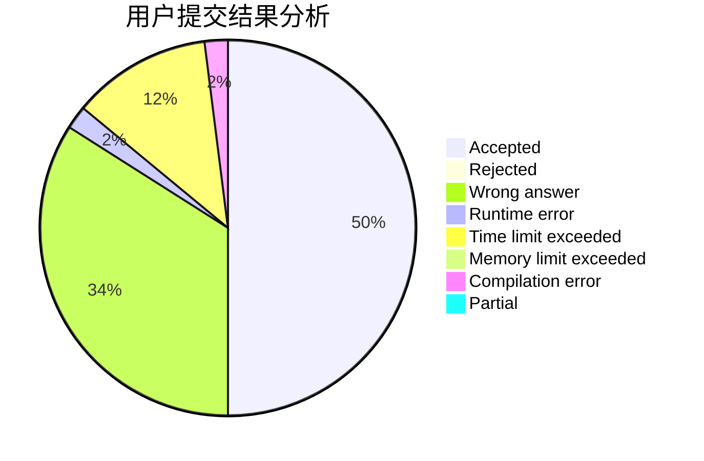
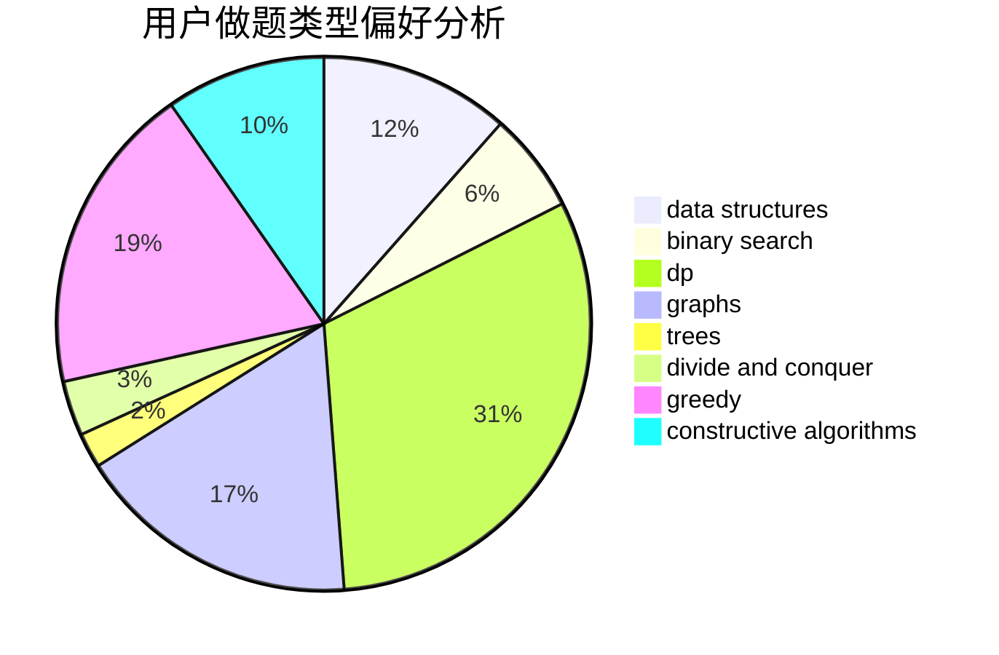
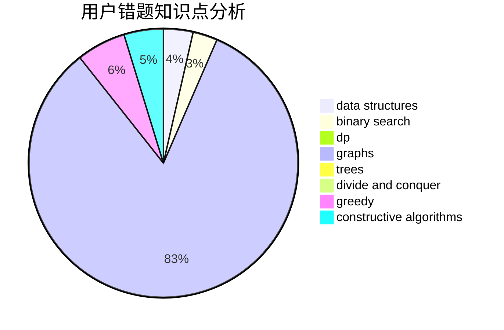

# Mamika_SplashFlare

<!-- tabs:start -->

#### **用户提交结果分析**

#### **用户做题类型偏好分析**

#### **用户错题知识点分析**

<!-- tabs:end -->
# 推荐题目
[1358D](https://codeforces.com/contest/1358/problem/D)		binary search,
                        brute force,
                        greedy,
                        implementation,
                        two pointers		  
[633A](https://codeforces.com/contest/633/problem/A)		brute force,
                        math,
                        number theory		  
[1065C](https://codeforces.com/contest/1065/problem/C)		greedy		  
[551B](https://codeforces.com/contest/551/problem/B)		brute force,
                        constructive algorithms,
                        implementation,
                        strings		  
[442B](https://codeforces.com/contest/442/problem/B)		greedy,
                        math,
                        probabilities		  
[653F](https://codeforces.com/contest/653/problem/F)		data structures,
                        string suffix structures,
                        strings		  
[245H](https://codeforces.com/contest/245/problem/H)		dp,
                        hashing,
                        strings		  
[567B](https://codeforces.com/contest/567/problem/B)		implementation		  
[848A](https://codeforces.com/contest/848/problem/A)		constructive algorithms		  
[549C](https://codeforces.com/contest/549/problem/C)		games		  
