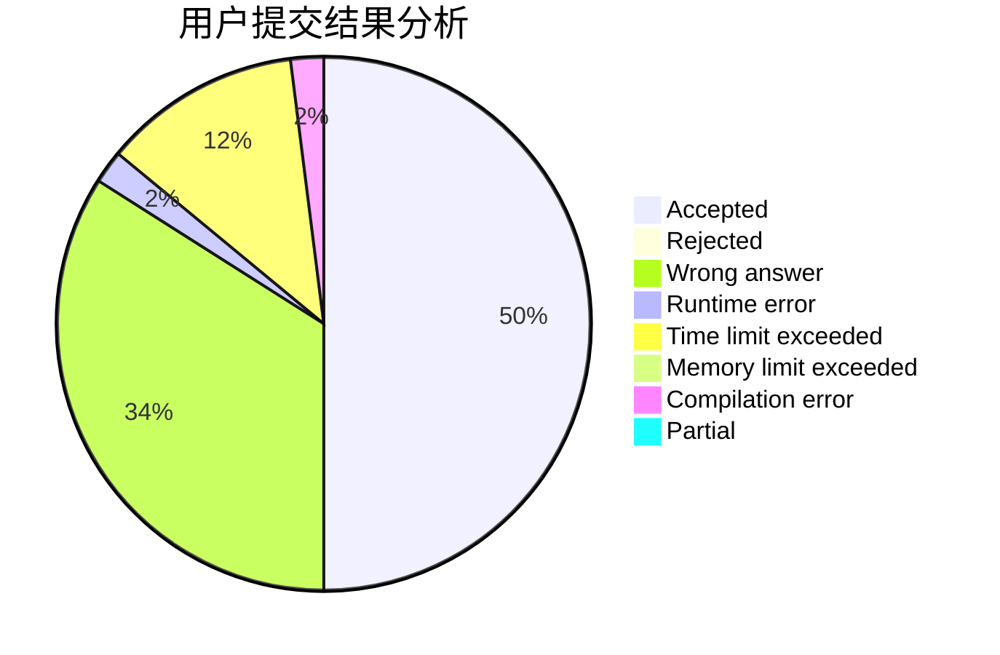
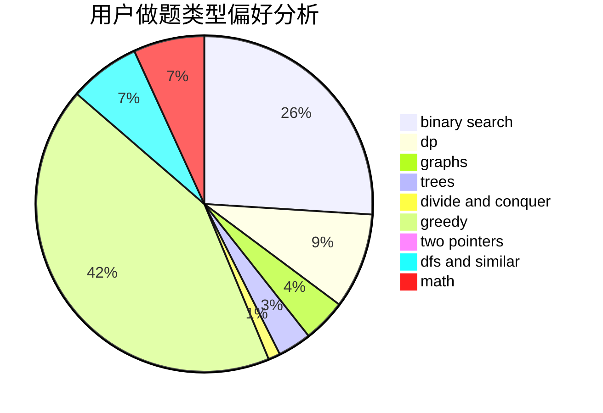

# Mamika_SplashFlare

<!-- tabs:start -->

#### **用户提交结果分析**

#### **用户做题类型偏好分析**

<!-- tabs:end -->
# 推荐题目
[1366F](https://codeforces.com/contest/1366/problem/F)
[665C](https://codeforces.com/contest/665/problem/C)
[1065G](https://codeforces.com/contest/1065/problem/G)
[576C](https://codeforces.com/contest/576/problem/C)
[462E](https://codeforces.com/contest/462/problem/E)
[678B](https://codeforces.com/contest/678/problem/B)
[266B](https://codeforces.com/contest/266/problem/B)
[586F](https://codeforces.com/contest/586/problem/F)
[866D](https://codeforces.com/contest/866/problem/D)
[574B](https://codeforces.com/contest/574/problem/B)
