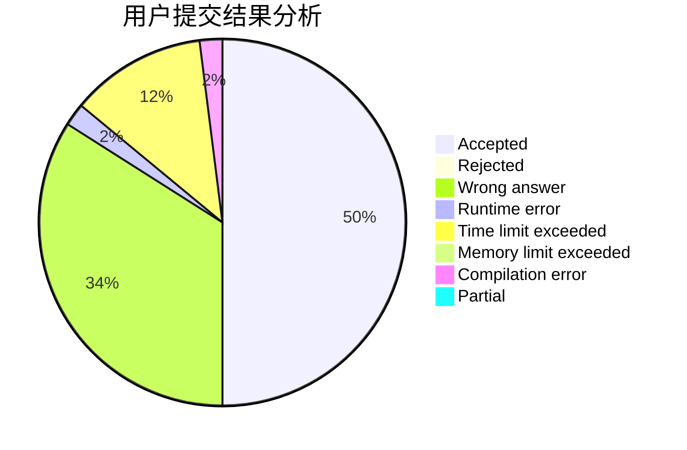
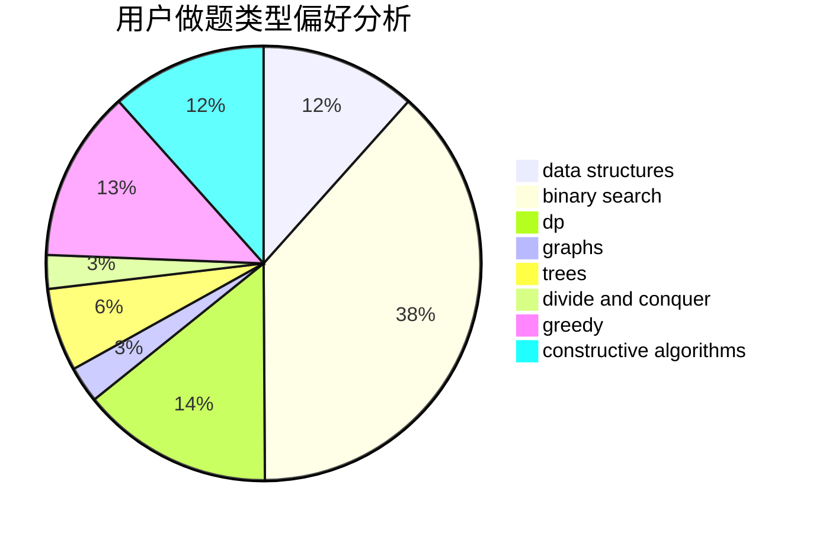
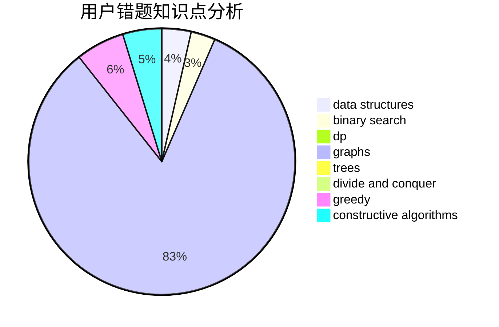

# Mamika_SplashFlare

<!-- tabs:start -->

#### **用户提交结果分析**

#### **用户做题类型偏好分析**

#### **用户错题知识点分析**

<!-- tabs:end -->
# 推荐题目
[1366F](https://codeforces.com/contest/1366/problem/F)		binary search,
                        dp,
                        geometry,
                        graphs		  
[665C](https://codeforces.com/contest/665/problem/C)		dp,
                        greedy,
                        strings		  
[1065G](https://codeforces.com/contest/1065/problem/G)		strings		  
[576C](https://codeforces.com/contest/576/problem/C)		constructive algorithms,
                        divide and conquer,
                        geometry,
                        greedy,
                        sortings		  
[462E](https://codeforces.com/contest/462/problem/E)		dsu,graphs,sortings,trees		  
[678B](https://codeforces.com/contest/678/problem/B)		implementation		  
[266B](https://codeforces.com/contest/266/problem/B)		constructive algorithms,
                        graph matchings,
                        implementation,
                        shortest paths		  
[586F](https://codeforces.com/contest/586/problem/F)		dsu,graphs,sortings,trees		  
[866D](https://codeforces.com/contest/866/problem/D)		dsu,graphs,sortings,trees		  
[574B](https://codeforces.com/contest/574/problem/B)		brute force,
                        dfs and similar,
                        graphs,
                        hashing		  
