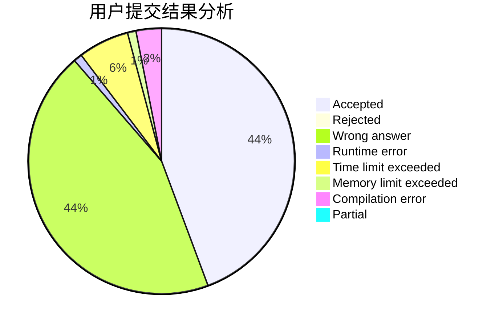
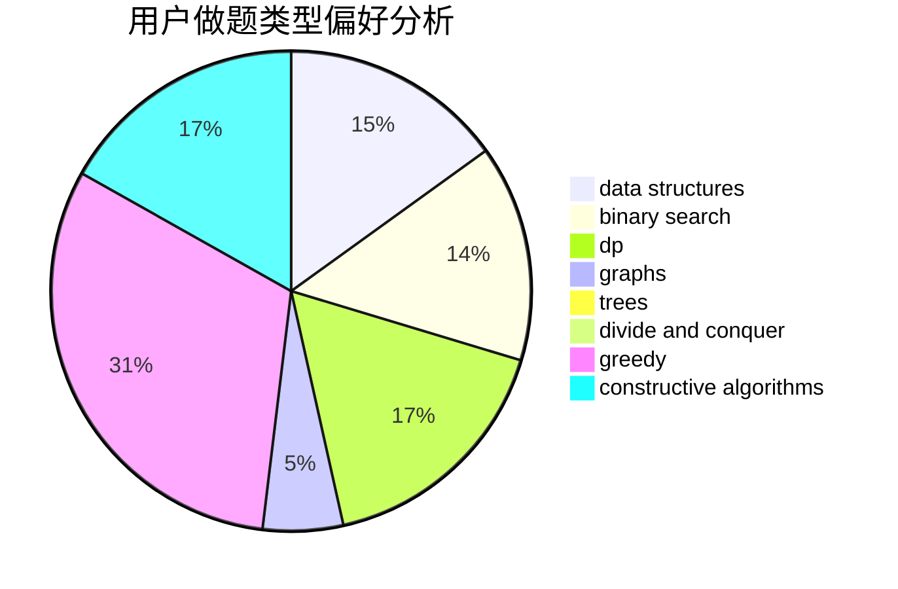

# Maniac_Wallnut

<!-- tabs:start -->

#### **用户提交结果分析**

#### **用户做题类型偏好分析**

#### **用户错题知识点分析**

<!-- tabs:end -->
# 推荐题目
[1349E](https://codeforces.com/contest/1349/problem/E)		constructive algorithms,
                        dp,
                        greedy		  
[662D](https://codeforces.com/contest/662/problem/D)		constructive algorithms,
                        greedy,
                        implementation,
                        math		  
[850F](https://codeforces.com/contest/850/problem/F)		math		  
[958D1](https://codeforces.com/contest/958D/problem/1)		expression parsing,
                        math		  
[1058B](https://codeforces.com/contest/1058/problem/B)		dsu,graphs,sortings,trees		  
[1143F](https://codeforces.com/contest/1143/problem/F)		dsu,graphs,sortings,trees		  
[1098B](https://codeforces.com/contest/1098/problem/B)		brute force,
                        constructive algorithms,
                        greedy,
                        math		  
[627D](https://codeforces.com/contest/627/problem/D)		binary search,
                        dfs and similar,
                        dp,
                        graphs,
                        greedy,
                        trees		  
[498E](https://codeforces.com/contest/498/problem/E)		dp,
                        matrices		  
[1280A](https://codeforces.com/contest/1280/problem/A)		implementation,
                        math		  
