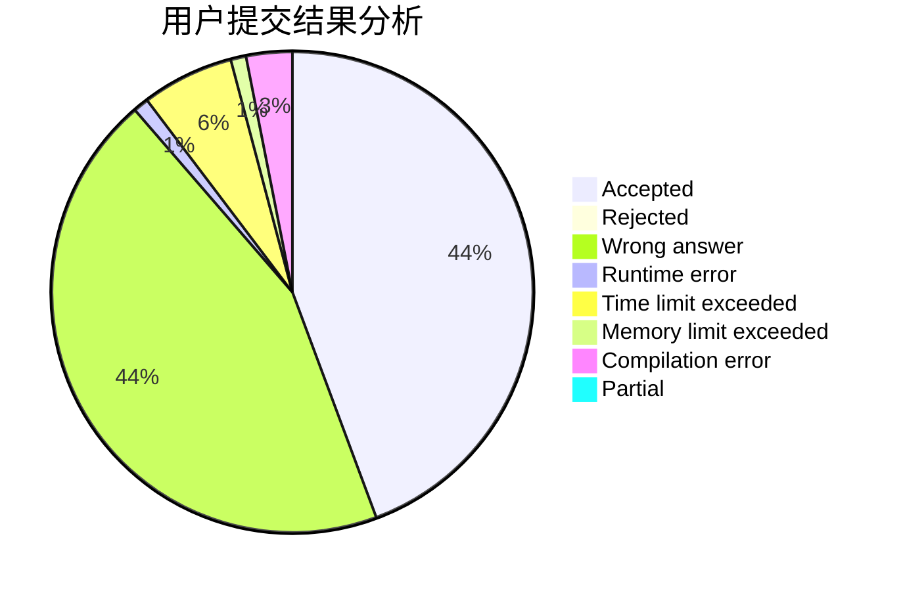
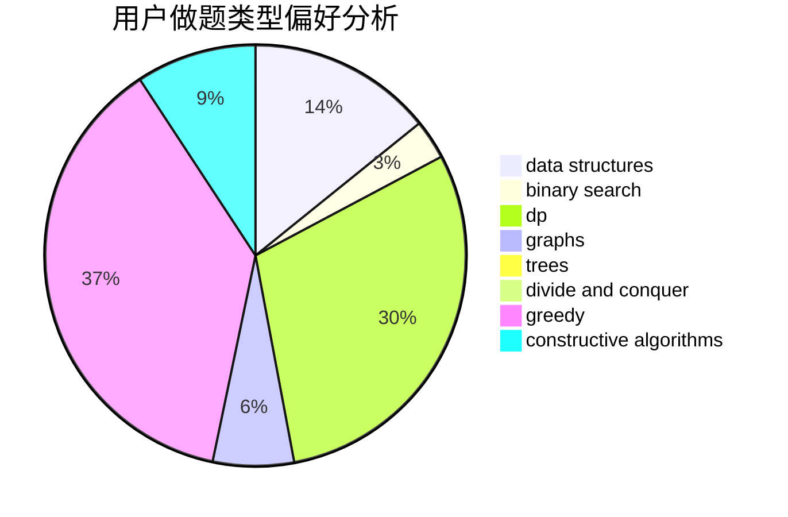

# Maniac_Wallnut

<!-- tabs:start -->

#### **用户提交结果分析**

#### **用户做题类型偏好分析**

#### **用户错题知识点分析**

<!-- tabs:end -->
# 推荐题目
[13563](https://codeforces.com/contest/1356/problem/3)		dsu,graphs,sortings,trees		  
[682D](https://codeforces.com/contest/682/problem/D)		dp,
                        strings		  
[869E](https://codeforces.com/contest/869/problem/E)		data structures,
                        hashing		  
[97D](https://codeforces.com/contest/97/problem/D)		bitmasks,
                        brute force,
                        implementation		  
[1058E](https://codeforces.com/contest/1058/problem/E)		dsu,graphs,sortings,trees		  
[1146A](https://codeforces.com/contest/1146/problem/A)		implementation,
                        strings		  
[1098E](https://codeforces.com/contest/1098/problem/E)		binary search,
                        implementation,
                        math,
                        number theory		  
[653D](https://codeforces.com/contest/653/problem/D)		binary search,
                        flows,
                        graphs		  
[519E](https://codeforces.com/contest/519/problem/E)		binary search,
                        data structures,
                        dfs and similar,
                        dp,
                        trees		  
[1286A](https://codeforces.com/contest/1286/problem/A)		dp,
                        greedy,
                        sortings		  
