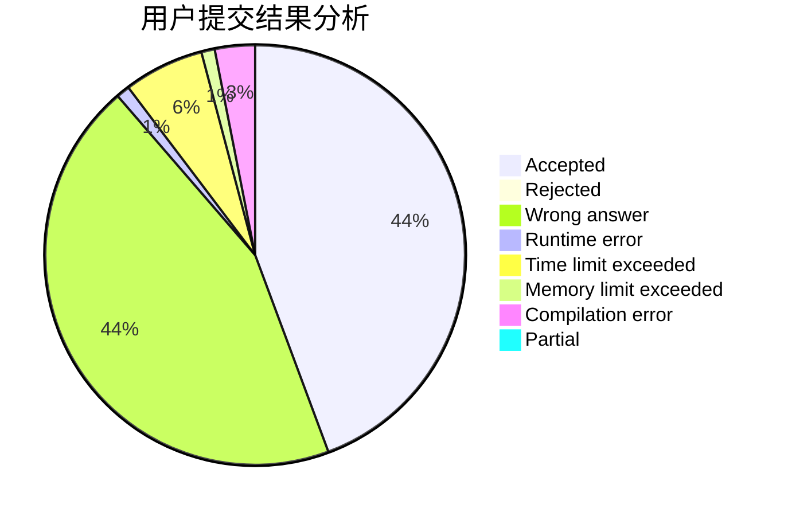
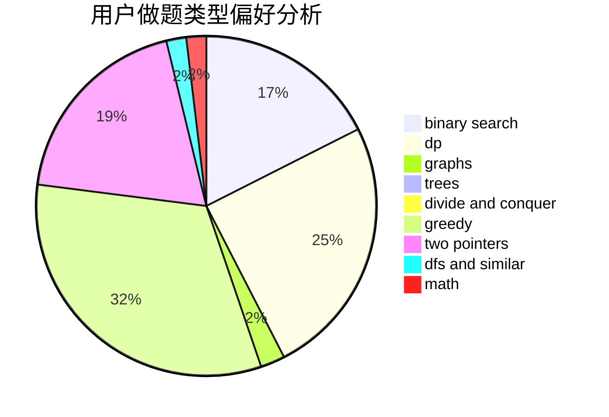

# Maniac_Wallnut

<!-- tabs:start -->

#### **用户提交结果分析**

#### **用户做题类型偏好分析**

<!-- tabs:end -->
# 推荐题目
[13563](https://codeforces.com/contest/1356/problem/3)
[682D](https://codeforces.com/contest/682/problem/D)
[869E](https://codeforces.com/contest/869/problem/E)
[97D](https://codeforces.com/contest/97/problem/D)
[1058E](https://codeforces.com/contest/1058/problem/E)
[1146A](https://codeforces.com/contest/1146/problem/A)
[1098E](https://codeforces.com/contest/1098/problem/E)
[653D](https://codeforces.com/contest/653/problem/D)
[519E](https://codeforces.com/contest/519/problem/E)
[1286A](https://codeforces.com/contest/1286/problem/A)
