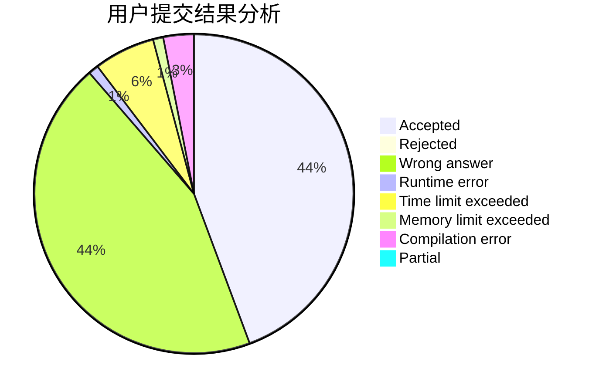
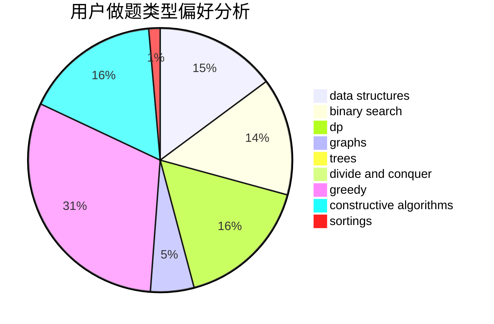

# Maniac_Wallnut
<!-- tabs:start -->
#### **用户提交结果分析**

#### **用户做题类型偏好分析**

#### **用户错题知识点分析**

<!-- tabs:end -->
# 推荐题目
[662D](http://codeforces.com/problemset/problem/662/D)		constructive algorithms,
                        greedy,
                        implementation,
                        math		  
[1294E](http://codeforces.com/problemset/problem/1294/E)		greedy,
                        implementation,
                        math		  
[1349E](http://codeforces.com/problemset/problem/1349/E)		constructive algorithms,
                        dp,
                        greedy		  
[498E](http://codeforces.com/problemset/problem/498/E)		dp,
                        matrices		  
[850F](http://codeforces.com/problemset/problem/850/F)		math		  
[1098B](http://codeforces.com/problemset/problem/1098/B)		brute force,
                        constructive algorithms,
                        greedy,
                        math		  
[958D1](http://codeforces.com/problemset/problem/958/D1)		expression parsing,
                        math		  
[1054A](http://codeforces.com/problemset/problem/1054/A)		implementation		  
[1251E1](http://codeforces.com/problemset/problem/1251/E1)		data structures,
                        dp,
                        greedy		  
[358B](http://codeforces.com/problemset/problem/358/B)		brute force,
                        strings		  
<!-- tabs:start -->
#### **data structures**
[1251E1](http://codeforces.com/problemset/problem/1251/E1)		data structures,
                        dp,
                        greedy		  
[834B](http://codeforces.com/problemset/problem/834/B)		data structures,
                        implementation		  
[733F](http://codeforces.com/problemset/problem/733/F)		data structures,
                        dsu,
                        graphs,
                        trees		  
[1196D2](http://codeforces.com/problemset/problem/1196/D2)		data structures,
                        dp,
                        implementation,
                        two pointers		  
[958C3](http://codeforces.com/problemset/problem/958/C3)		data structures,
                        dp		  
[718C](http://codeforces.com/problemset/problem/718/C)		data structures,
                        math,
                        matrices		  
[1480D1](https://codeforces.com/contest/1480/problem/D1)		constructive algorithms,
                        data structures,
                        dp,
                        greedy,
                        implementation		  
[1492C](http://codeforces.com/problemset/problem/1492/C)		binary search,
                        data structures,
                        dp,
                        greedy,
                        two pointers		  
[1490G](http://codeforces.com/problemset/problem/1490/G)		binary search,
                        data structures,
                        math		  
[1479D](http://codeforces.com/problemset/problem/1479/D)		binary search,
                        bitmasks,
                        brute force,
                        data structures,
                        probabilities,
                        trees		  
#### **binary search**
[1315F](https://codeforces.com/contest/1315/problem/F)		binary search,
                        dp,
                        strings		  
[627D](http://codeforces.com/problemset/problem/627/D)		binary search,
                        dfs and similar,
                        dp,
                        graphs,
                        greedy,
                        trees		  
[1492C](http://codeforces.com/problemset/problem/1492/C)		binary search,
                        data structures,
                        dp,
                        greedy,
                        two pointers		  
[1463D](http://codeforces.com/problemset/problem/1463/D)		binary search,
                        constructive algorithms,
                        greedy,
                        two pointers		  
[1490G](http://codeforces.com/problemset/problem/1490/G)		binary search,
                        data structures,
                        math		  
[1479D](http://codeforces.com/problemset/problem/1479/D)		binary search,
                        bitmasks,
                        brute force,
                        data structures,
                        probabilities,
                        trees		  
[1436E](http://codeforces.com/problemset/problem/1436/E)		binary search,
                        data structures,
                        two pointers		  
[1461D](http://codeforces.com/problemset/problem/1461/D)		binary search,
                        brute force,
                        data structures,
                        divide and conquer,
                        implementation,
                        sortings		  
[1493C](http://codeforces.com/problemset/problem/1493/C)		binary search,
                        brute force,
                        constructive algorithms,
                        greedy,
                        strings		  
[1487D](http://codeforces.com/problemset/problem/1487/D)		binary search,
                        brute force,
                        math,
                        number theory		  
#### **dp**
[1349E](http://codeforces.com/problemset/problem/1349/E)		constructive algorithms,
                        dp,
                        greedy		  
[498E](http://codeforces.com/problemset/problem/498/E)		dp,
                        matrices		  
[1251E1](http://codeforces.com/problemset/problem/1251/E1)		data structures,
                        dp,
                        greedy		  
[1315F](https://codeforces.com/contest/1315/problem/F)		binary search,
                        dp,
                        strings		  
[1196D2](http://codeforces.com/problemset/problem/1196/D2)		data structures,
                        dp,
                        implementation,
                        two pointers		  
[914H](http://codeforces.com/problemset/problem/914/H)		combinatorics,
                        dp,
                        games,
                        trees		  
[958C3](http://codeforces.com/problemset/problem/958/C3)		data structures,
                        dp		  
[627D](http://codeforces.com/problemset/problem/627/D)		binary search,
                        dfs and similar,
                        dp,
                        graphs,
                        greedy,
                        trees		  
[1005D](http://codeforces.com/problemset/problem/1005/D)		dp,
                        greedy,
                        number theory		  
[1067A](http://codeforces.com/problemset/problem/1067/A)		dp		  
#### **graph**
[369C](http://codeforces.com/problemset/problem/369/C)		dfs and similar,
                        graphs,
                        trees		  
[733F](http://codeforces.com/problemset/problem/733/F)		data structures,
                        dsu,
                        graphs,
                        trees		  
[627D](http://codeforces.com/problemset/problem/627/D)		binary search,
                        dfs and similar,
                        dp,
                        graphs,
                        greedy,
                        trees		  
[1382E](https://codeforces.com/contest/1382/problem/E)		constructive algorithms,
                        graph matchings,
                        greedy,
                        implementation,
                        sortings,
                        two pointers		  
[1361E](http://codeforces.com/problemset/problem/1361/E)		dfs and similar,
                        graphs,
                        probabilities,
                        trees		  
[453C](http://codeforces.com/problemset/problem/453/C)		constructive algorithms,
                        dfs and similar,
                        graphs		  
[1487C](http://codeforces.com/problemset/problem/1487/C)		brute force,
                        constructive algorithms,
                        dfs and similar,
                        graphs,
                        greedy,
                        implementation,
                        math		  
[1437C](http://codeforces.com/problemset/problem/1437/C)		dp,
                        flows,
                        graph matchings,
                        greedy,
                        math,
                        sortings		  
[1470D](http://codeforces.com/problemset/problem/1470/D)		constructive algorithms,
                        dfs and similar,
                        graph matchings,
                        graphs,
                        greedy		  
[1476C](http://codeforces.com/problemset/problem/1476/C)		dp,
                        graphs,
                        greedy		  
#### **trees**
[754E](http://codeforces.com/problemset/problem/754/E)		bitmasks,
                        brute force,
                        fft,
                        strings,
                        trees		  
[369C](http://codeforces.com/problemset/problem/369/C)		dfs and similar,
                        graphs,
                        trees		  
[733F](http://codeforces.com/problemset/problem/733/F)		data structures,
                        dsu,
                        graphs,
                        trees		  
[914H](http://codeforces.com/problemset/problem/914/H)		combinatorics,
                        dp,
                        games,
                        trees		  
[627D](http://codeforces.com/problemset/problem/627/D)		binary search,
                        dfs and similar,
                        dp,
                        graphs,
                        greedy,
                        trees		  
[1361E](http://codeforces.com/problemset/problem/1361/E)		dfs and similar,
                        graphs,
                        probabilities,
                        trees		  
[1479D](http://codeforces.com/problemset/problem/1479/D)		binary search,
                        bitmasks,
                        brute force,
                        data structures,
                        probabilities,
                        trees		  
[1511C](http://codeforces.com/problemset/problem/1511/C)		brute force,
                        data structures,
                        implementation,
                        trees		  
[1499F](http://codeforces.com/problemset/problem/1499/F)		combinatorics,
                        dfs and similar,
                        dp,
                        trees		  
[1491E](http://codeforces.com/problemset/problem/1491/E)		brute force,
                        dfs and similar,
                        divide and conquer,
                        number theory,
                        trees		  
#### **divide and conquer**
[1461D](http://codeforces.com/problemset/problem/1461/D)		binary search,
                        brute force,
                        data structures,
                        divide and conquer,
                        implementation,
                        sortings		  
[1466G](http://codeforces.com/problemset/problem/1466/G)		combinatorics,
                        divide and conquer,
                        hashing,
                        math,
                        string suffix structures,
                        strings		  
[1490D](http://codeforces.com/problemset/problem/1490/D)		dfs and similar,
                        divide and conquer,
                        implementation		  
[1483C](https://codeforces.com/contest/1483/problem/C)		data structures,
                        divide and conquer,
                        dp		  
[1491E](http://codeforces.com/problemset/problem/1491/E)		brute force,
                        dfs and similar,
                        divide and conquer,
                        number theory,
                        trees		  
[1303G](http://codeforces.com/problemset/problem/1303/G)		data structures,
                        divide and conquer,
                        geometry,
                        trees		  
[1494D](http://codeforces.com/problemset/problem/1494/D)		constructive algorithms,
                        data structures,
                        dfs and similar,
                        divide and conquer,
                        dsu,
                        greedy,
                        sortings,
                        trees		  
[1482E](http://codeforces.com/problemset/problem/1482/E)		data structures,
                        divide and conquer,
                        dp		  
[566C](http://codeforces.com/problemset/problem/566/C)		dfs and similar,
                        divide and conquer,
                        trees		  
[1428F](http://codeforces.com/problemset/problem/1428/F)		binary search,
                        data structures,
                        divide and conquer,
                        dp,
                        two pointers		  
#### **greedy**
[662D](http://codeforces.com/problemset/problem/662/D)		constructive algorithms,
                        greedy,
                        implementation,
                        math		  
[1294E](http://codeforces.com/problemset/problem/1294/E)		greedy,
                        implementation,
                        math		  
[1349E](http://codeforces.com/problemset/problem/1349/E)		constructive algorithms,
                        dp,
                        greedy		  
[1098B](http://codeforces.com/problemset/problem/1098/B)		brute force,
                        constructive algorithms,
                        greedy,
                        math		  
[1251E1](http://codeforces.com/problemset/problem/1251/E1)		data structures,
                        dp,
                        greedy		  
[1307B](http://codeforces.com/problemset/problem/1307/B)		geometry,
                        greedy,
                        math		  
[596B](http://codeforces.com/problemset/problem/596/B)		greedy,
                        implementation		  
[436A](http://codeforces.com/problemset/problem/436/A)		greedy		  
[802A](http://codeforces.com/problemset/problem/802/A)		greedy		  
[627D](http://codeforces.com/problemset/problem/627/D)		binary search,
                        dfs and similar,
                        dp,
                        graphs,
                        greedy,
                        trees		  
#### **constructive algorithms**
[662D](http://codeforces.com/problemset/problem/662/D)		constructive algorithms,
                        greedy,
                        implementation,
                        math		  
[1349E](http://codeforces.com/problemset/problem/1349/E)		constructive algorithms,
                        dp,
                        greedy		  
[1098B](http://codeforces.com/problemset/problem/1098/B)		brute force,
                        constructive algorithms,
                        greedy,
                        math		  
[1382E](https://codeforces.com/contest/1382/problem/E)		constructive algorithms,
                        graph matchings,
                        greedy,
                        implementation,
                        sortings,
                        two pointers		  
[453C](http://codeforces.com/problemset/problem/453/C)		constructive algorithms,
                        dfs and similar,
                        graphs		  
[286E](http://codeforces.com/problemset/problem/286/E)		constructive algorithms,
                        fft,
                        math		  
[1480D1](https://codeforces.com/contest/1480/problem/D1)		constructive algorithms,
                        data structures,
                        dp,
                        greedy,
                        implementation		  
[1493A](http://codeforces.com/problemset/problem/1493/A)		constructive algorithms,
                        greedy		  
[1463D](http://codeforces.com/problemset/problem/1463/D)		binary search,
                        constructive algorithms,
                        greedy,
                        two pointers		  
[1456B](https://codeforces.com/contest/1456/problem/B)		bitmasks,
                        brute force,
                        constructive algorithms		  
#### **sortings**
[1382E](https://codeforces.com/contest/1382/problem/E)		constructive algorithms,
                        graph matchings,
                        greedy,
                        implementation,
                        sortings,
                        two pointers		  
[1496C](https://codeforces.com/contest/1496/problem/C)		geometry,
                        greedy,
                        math,
                        sortings		  
[1495A](http://codeforces.com/problemset/problem/1495/A)		geometry,
                        greedy,
                        math,
                        sortings		  
[1497A](http://codeforces.com/problemset/problem/1497/A)		brute force,
                        data structures,
                        greedy,
                        sortings		  
[1427A](http://codeforces.com/problemset/problem/1427/A)		math,
                        sortings		  
[1461D](http://codeforces.com/problemset/problem/1461/D)		binary search,
                        brute force,
                        data structures,
                        divide and conquer,
                        implementation,
                        sortings		  
[1437C](http://codeforces.com/problemset/problem/1437/C)		dp,
                        flows,
                        graph matchings,
                        greedy,
                        math,
                        sortings		  
[1473A](http://codeforces.com/problemset/problem/1473/A)		greedy,
                        implementation,
                        math,
                        sortings		  
[1486B](http://codeforces.com/problemset/problem/1486/B)		binary search,
                        geometry,
                        shortest paths,
                        sortings		  
[1480B](http://codeforces.com/problemset/problem/1480/B)		greedy,
                        implementation,
                        sortings		  
<!-- tabs:end -->
