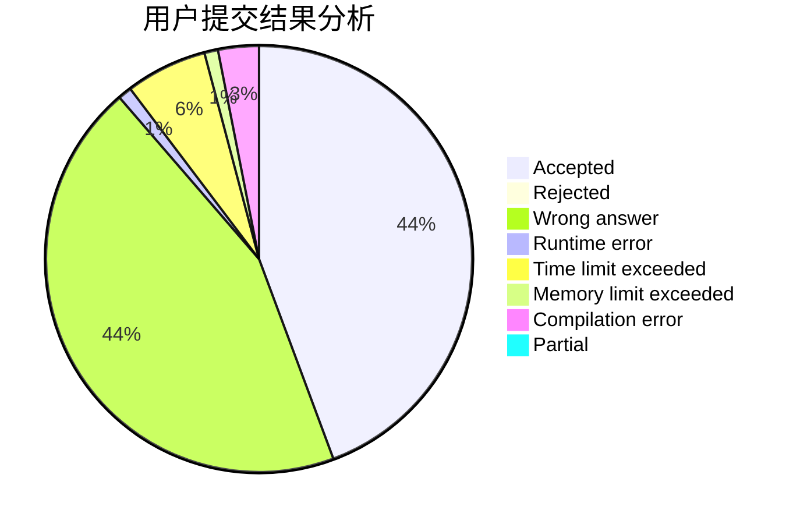
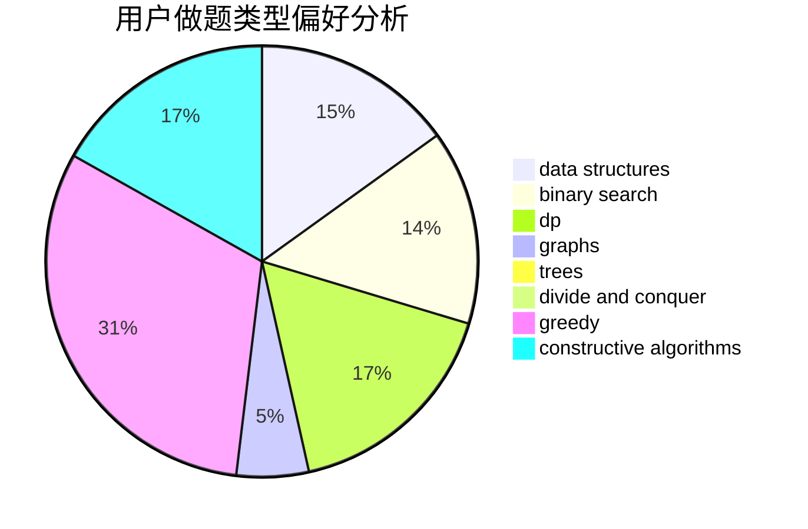

# Maniac_Wallnut
<!-- tabs:start -->
#### **用户提交结果分析**

#### **用户做题类型偏好分析**

#### **用户错题知识点分析**

<!-- tabs:end -->
# 推荐题目
[International Olympiad](http://codeforces.com/problemset/problem/662/D)		constructive algorithms,
                        greedy,
                        implementation,
                        math		  
[Obtain a Permutation](http://codeforces.com/problemset/problem/1294/E)		greedy,
                        implementation,
                        math		  
[Slime and Hats](http://codeforces.com/problemset/problem/1349/E)		constructive algorithms,
                        dp,
                        greedy		  
[Stairs and Lines](http://codeforces.com/problemset/problem/498/E)		dp,
                        matrices		  
[Rainbow Balls](http://codeforces.com/problemset/problem/850/F)		math		  
[Nice table](http://codeforces.com/problemset/problem/1098/B)		brute force,
                        constructive algorithms,
                        greedy,
                        math		  
[Hyperspace Jump (easy)](http://codeforces.com/problemset/problem/958/D1)		expression parsing,
                        math		  
[Elevator or Stairs?](http://codeforces.com/problemset/problem/1054/A)		implementation		  
[Voting (Easy Version)](http://codeforces.com/problemset/problem/1251/E1)		data structures,
                        dp,
                        greedy		  
[Dima and Text Messages](http://codeforces.com/problemset/problem/358/B)		brute force,
                        strings		  
<!-- tabs:start -->
#### **data structures**
[International Olympiad](http://codeforces.com/problemset/problem/1251/E1)		data structures,
                        dp,
                        greedy		  
[Obtain a Permutation](http://codeforces.com/problemset/problem/834/B)		data structures,
                        implementation		  
[Slime and Hats](http://codeforces.com/problemset/problem/733/F)		data structures,
                        dsu,
                        graphs,
                        trees		  
[Stairs and Lines](http://codeforces.com/problemset/problem/1196/D2)		data structures,
                        dp,
                        implementation,
                        two pointers		  
[Rainbow Balls](http://codeforces.com/problemset/problem/958/C3)		data structures,
                        dp		  
[Nice table](http://codeforces.com/problemset/problem/718/C)		data structures,
                        math,
                        matrices		  
[Hyperspace Jump (easy)](https://codeforces.com/contest/1480/problem/D1)		constructive algorithms,
                        data structures,
                        dp,
                        greedy,
                        implementation		  
[Elevator or Stairs?](http://codeforces.com/problemset/problem/1492/C)		binary search,
                        data structures,
                        dp,
                        greedy,
                        two pointers		  
[Voting (Easy Version)](http://codeforces.com/problemset/problem/1490/G)		binary search,
                        data structures,
                        math		  
[Dima and Text Messages](http://codeforces.com/problemset/problem/1479/D)		binary search,
                        bitmasks,
                        brute force,
                        data structures,
                        probabilities,
                        trees		  
#### **binary search**
[International Olympiad](https://codeforces.com/contest/1315/problem/F)		binary search,
                        dp,
                        strings		  
[Obtain a Permutation](http://codeforces.com/problemset/problem/627/D)		binary search,
                        dfs and similar,
                        dp,
                        graphs,
                        greedy,
                        trees		  
[Slime and Hats](http://codeforces.com/problemset/problem/1492/C)		binary search,
                        data structures,
                        dp,
                        greedy,
                        two pointers		  
[Stairs and Lines](http://codeforces.com/problemset/problem/1463/D)		binary search,
                        constructive algorithms,
                        greedy,
                        two pointers		  
[Rainbow Balls](http://codeforces.com/problemset/problem/1490/G)		binary search,
                        data structures,
                        math		  
[Nice table](http://codeforces.com/problemset/problem/1479/D)		binary search,
                        bitmasks,
                        brute force,
                        data structures,
                        probabilities,
                        trees		  
[Hyperspace Jump (easy)](http://codeforces.com/problemset/problem/1436/E)		binary search,
                        data structures,
                        two pointers		  
[Elevator or Stairs?](http://codeforces.com/problemset/problem/1461/D)		binary search,
                        brute force,
                        data structures,
                        divide and conquer,
                        implementation,
                        sortings		  
[Voting (Easy Version)](http://codeforces.com/problemset/problem/1493/C)		binary search,
                        brute force,
                        constructive algorithms,
                        greedy,
                        strings		  
[Dima and Text Messages](http://codeforces.com/problemset/problem/1487/D)		binary search,
                        brute force,
                        math,
                        number theory		  
#### **dp**
[International Olympiad](http://codeforces.com/problemset/problem/1349/E)		constructive algorithms,
                        dp,
                        greedy		  
[Obtain a Permutation](http://codeforces.com/problemset/problem/498/E)		dp,
                        matrices		  
[Slime and Hats](http://codeforces.com/problemset/problem/1251/E1)		data structures,
                        dp,
                        greedy		  
[Stairs and Lines](https://codeforces.com/contest/1315/problem/F)		binary search,
                        dp,
                        strings		  
[Rainbow Balls](http://codeforces.com/problemset/problem/1196/D2)		data structures,
                        dp,
                        implementation,
                        two pointers		  
[Nice table](http://codeforces.com/problemset/problem/914/H)		combinatorics,
                        dp,
                        games,
                        trees		  
[Hyperspace Jump (easy)](http://codeforces.com/problemset/problem/958/C3)		data structures,
                        dp		  
[Elevator or Stairs?](http://codeforces.com/problemset/problem/627/D)		binary search,
                        dfs and similar,
                        dp,
                        graphs,
                        greedy,
                        trees		  
[Voting (Easy Version)](http://codeforces.com/problemset/problem/1005/D)		dp,
                        greedy,
                        number theory		  
[Dima and Text Messages](http://codeforces.com/problemset/problem/1067/A)		dp		  
#### **graph**
[International Olympiad](http://codeforces.com/problemset/problem/369/C)		dfs and similar,
                        graphs,
                        trees		  
[Obtain a Permutation](http://codeforces.com/problemset/problem/733/F)		data structures,
                        dsu,
                        graphs,
                        trees		  
[Slime and Hats](http://codeforces.com/problemset/problem/627/D)		binary search,
                        dfs and similar,
                        dp,
                        graphs,
                        greedy,
                        trees		  
[Stairs and Lines](https://codeforces.com/contest/1382/problem/E)		constructive algorithms,
                        graph matchings,
                        greedy,
                        implementation,
                        sortings,
                        two pointers		  
[Rainbow Balls](http://codeforces.com/problemset/problem/1361/E)		dfs and similar,
                        graphs,
                        probabilities,
                        trees		  
[Nice table](http://codeforces.com/problemset/problem/453/C)		constructive algorithms,
                        dfs and similar,
                        graphs		  
[Hyperspace Jump (easy)](http://codeforces.com/problemset/problem/1487/C)		brute force,
                        constructive algorithms,
                        dfs and similar,
                        graphs,
                        greedy,
                        implementation,
                        math		  
[Elevator or Stairs?](http://codeforces.com/problemset/problem/1437/C)		dp,
                        flows,
                        graph matchings,
                        greedy,
                        math,
                        sortings		  
[Voting (Easy Version)](http://codeforces.com/problemset/problem/1470/D)		constructive algorithms,
                        dfs and similar,
                        graph matchings,
                        graphs,
                        greedy		  
[Dima and Text Messages](http://codeforces.com/problemset/problem/1476/C)		dp,
                        graphs,
                        greedy		  
#### **trees**
[International Olympiad](http://codeforces.com/problemset/problem/754/E)		bitmasks,
                        brute force,
                        fft,
                        strings,
                        trees		  
[Obtain a Permutation](http://codeforces.com/problemset/problem/369/C)		dfs and similar,
                        graphs,
                        trees		  
[Slime and Hats](http://codeforces.com/problemset/problem/733/F)		data structures,
                        dsu,
                        graphs,
                        trees		  
[Stairs and Lines](http://codeforces.com/problemset/problem/914/H)		combinatorics,
                        dp,
                        games,
                        trees		  
[Rainbow Balls](http://codeforces.com/problemset/problem/627/D)		binary search,
                        dfs and similar,
                        dp,
                        graphs,
                        greedy,
                        trees		  
[Nice table](http://codeforces.com/problemset/problem/1361/E)		dfs and similar,
                        graphs,
                        probabilities,
                        trees		  
[Hyperspace Jump (easy)](http://codeforces.com/problemset/problem/1479/D)		binary search,
                        bitmasks,
                        brute force,
                        data structures,
                        probabilities,
                        trees		  
[Elevator or Stairs?](http://codeforces.com/problemset/problem/1511/C)		brute force,
                        data structures,
                        implementation,
                        trees		  
[Voting (Easy Version)](http://codeforces.com/problemset/problem/1499/F)		combinatorics,
                        dfs and similar,
                        dp,
                        trees		  
[Dima and Text Messages](http://codeforces.com/problemset/problem/1491/E)		brute force,
                        dfs and similar,
                        divide and conquer,
                        number theory,
                        trees		  
#### **divide and conquer**
[International Olympiad](http://codeforces.com/problemset/problem/1461/D)		binary search,
                        brute force,
                        data structures,
                        divide and conquer,
                        implementation,
                        sortings		  
[Obtain a Permutation](http://codeforces.com/problemset/problem/1466/G)		combinatorics,
                        divide and conquer,
                        hashing,
                        math,
                        string suffix structures,
                        strings		  
[Slime and Hats](http://codeforces.com/problemset/problem/1490/D)		dfs and similar,
                        divide and conquer,
                        implementation		  
[Stairs and Lines](https://codeforces.com/contest/1483/problem/C)		data structures,
                        divide and conquer,
                        dp		  
[Rainbow Balls](http://codeforces.com/problemset/problem/1491/E)		brute force,
                        dfs and similar,
                        divide and conquer,
                        number theory,
                        trees		  
[Nice table](http://codeforces.com/problemset/problem/1303/G)		data structures,
                        divide and conquer,
                        geometry,
                        trees		  
[Hyperspace Jump (easy)](http://codeforces.com/problemset/problem/1494/D)		constructive algorithms,
                        data structures,
                        dfs and similar,
                        divide and conquer,
                        dsu,
                        greedy,
                        sortings,
                        trees		  
[Elevator or Stairs?](http://codeforces.com/problemset/problem/1482/E)		data structures,
                        divide and conquer,
                        dp		  
[Voting (Easy Version)](http://codeforces.com/problemset/problem/566/C)		dfs and similar,
                        divide and conquer,
                        trees		  
[Dima and Text Messages](http://codeforces.com/problemset/problem/1428/F)		binary search,
                        data structures,
                        divide and conquer,
                        dp,
                        two pointers		  
#### **greedy**
[International Olympiad](http://codeforces.com/problemset/problem/662/D)		constructive algorithms,
                        greedy,
                        implementation,
                        math		  
[Obtain a Permutation](http://codeforces.com/problemset/problem/1294/E)		greedy,
                        implementation,
                        math		  
[Slime and Hats](http://codeforces.com/problemset/problem/1349/E)		constructive algorithms,
                        dp,
                        greedy		  
[Stairs and Lines](http://codeforces.com/problemset/problem/1098/B)		brute force,
                        constructive algorithms,
                        greedy,
                        math		  
[Rainbow Balls](http://codeforces.com/problemset/problem/1251/E1)		data structures,
                        dp,
                        greedy		  
[Nice table](http://codeforces.com/problemset/problem/1307/B)		geometry,
                        greedy,
                        math		  
[Hyperspace Jump (easy)](http://codeforces.com/problemset/problem/596/B)		greedy,
                        implementation		  
[Elevator or Stairs?](http://codeforces.com/problemset/problem/436/A)		greedy		  
[Voting (Easy Version)](http://codeforces.com/problemset/problem/802/A)		greedy		  
[Dima and Text Messages](http://codeforces.com/problemset/problem/627/D)		binary search,
                        dfs and similar,
                        dp,
                        graphs,
                        greedy,
                        trees		  
#### **constructive algorithms**
[International Olympiad](http://codeforces.com/problemset/problem/662/D)		constructive algorithms,
                        greedy,
                        implementation,
                        math		  
[Obtain a Permutation](http://codeforces.com/problemset/problem/1349/E)		constructive algorithms,
                        dp,
                        greedy		  
[Slime and Hats](http://codeforces.com/problemset/problem/1098/B)		brute force,
                        constructive algorithms,
                        greedy,
                        math		  
[Stairs and Lines](https://codeforces.com/contest/1382/problem/E)		constructive algorithms,
                        graph matchings,
                        greedy,
                        implementation,
                        sortings,
                        two pointers		  
[Rainbow Balls](http://codeforces.com/problemset/problem/453/C)		constructive algorithms,
                        dfs and similar,
                        graphs		  
[Nice table](http://codeforces.com/problemset/problem/286/E)		constructive algorithms,
                        fft,
                        math		  
[Hyperspace Jump (easy)](https://codeforces.com/contest/1480/problem/D1)		constructive algorithms,
                        data structures,
                        dp,
                        greedy,
                        implementation		  
[Elevator or Stairs?](http://codeforces.com/problemset/problem/1493/A)		constructive algorithms,
                        greedy		  
[Voting (Easy Version)](http://codeforces.com/problemset/problem/1463/D)		binary search,
                        constructive algorithms,
                        greedy,
                        two pointers		  
[Dima and Text Messages](https://codeforces.com/contest/1456/problem/B)		bitmasks,
                        brute force,
                        constructive algorithms		  
#### **sortings**
[International Olympiad](https://codeforces.com/contest/1382/problem/E)		constructive algorithms,
                        graph matchings,
                        greedy,
                        implementation,
                        sortings,
                        two pointers		  
[Obtain a Permutation](https://codeforces.com/contest/1496/problem/C)		geometry,
                        greedy,
                        math,
                        sortings		  
[Slime and Hats](http://codeforces.com/problemset/problem/1495/A)		geometry,
                        greedy,
                        math,
                        sortings		  
[Stairs and Lines](http://codeforces.com/problemset/problem/1497/A)		brute force,
                        data structures,
                        greedy,
                        sortings		  
[Rainbow Balls](http://codeforces.com/problemset/problem/1427/A)		math,
                        sortings		  
[Nice table](http://codeforces.com/problemset/problem/1461/D)		binary search,
                        brute force,
                        data structures,
                        divide and conquer,
                        implementation,
                        sortings		  
[Hyperspace Jump (easy)](http://codeforces.com/problemset/problem/1437/C)		dp,
                        flows,
                        graph matchings,
                        greedy,
                        math,
                        sortings		  
[Elevator or Stairs?](http://codeforces.com/problemset/problem/1473/A)		greedy,
                        implementation,
                        math,
                        sortings		  
[Voting (Easy Version)](http://codeforces.com/problemset/problem/1486/B)		binary search,
                        geometry,
                        shortest paths,
                        sortings		  
[Dima and Text Messages](http://codeforces.com/problemset/problem/1480/B)		greedy,
                        implementation,
                        sortings		  
<!-- tabs:end -->
